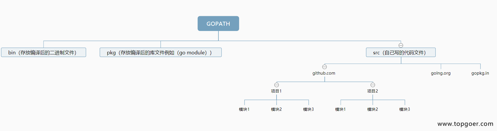

# MacOS 配置 Golang 环境

*资料来源*

[简书/Mac安装Golang和vscode](https://www.jianshu.com/p/7f9f73327fd8)

## 1、检查 golang 的安装位置

### 1.1、直接安装到系统的

```bash
➜  ~ whereis go
go: /usr/local/go
```

### 1.2、通过 brew 安装的（推荐）

```bash
➜  ~ whereis go
go: /opt/homebrew/bin/go
```

## 2、安装 Golang 环境

### 2.1、Golang API

#### 2.1.1、直接安装到系统的

*根据自我具体机型进行选择安装方案*

`open https://go.dev/dl/`

#### 2.1.2、通过 brew 安装的（推荐）

`brew install go`

### 2.2、vscode 中 Go 的相关插件安装

#### 2.2.1、进入 golang 目录

`cd $GOPATH/src/github.com/golang`，如果没有目录就手动创建

#### 2.2.2、下载插件

`git clone https://github.com/golang/tools.git tools`

## 3、查询 Golang 环境变量

*以 GOPATH 为例*

```bash
go env | grep GOPATH
```

## 4、配置 GOPATH

*资料来源*

[topgoer/开发环境配置gopath](https://www.topgoer.com/%E5%BC%80%E5%8F%91%E7%8E%AF%E5%A2%83/%E9%85%8D%E7%BD%AEgopath.html)

[go语言中文网/golang环境配置for mac](https://studygolang.com/articles/28913)

```
1、编辑 ~/.bash_profile
open ~/.bash_profile 

2、文末加上
export GOPATH=/usr/local/go
export GOBIN=$GOPATH/bin
export PATH=$PATH:$GOBIN

3、使得配置生效
source ~/.bash_profile

4、查看最新的 GOPATH 配置
go env | grep GOPATH
```

### 4.1、GOPATH 目录说明


### 4.2、GOPATH目前流行的项目结构



### 4.3、适合个人开发者的目录结构


### 4.4、适合企业开发者的目录结构


## 5、删除 Golang 环境

*资料来源*

[CSDN/Mac 下 Go 的安装和卸载](https://blog.csdn.net/weixin_36908494/article/details/126096277)

### 5.1、【删除】直接安装到系统的

#### 5.1.1、删除 go 目录，通常为目录 /usr/local/go

`sudo rm -rf /usr/local/go`

`sudo rm -rf ${HOME}/go`

#### 5.1.2、从 PATH 环境变量中移除 Go 的 bin 目录

PATH 配置在 `$~/.bash_profile` 或者` /etc/profile`，根据实际情况删除

#### 5.1.3、如果是通过Mac OS X 包安装的 Go，还需要移除` /etc/paths.d/go` 文件

`sudo rm -rf /etc/paths.d/go`

#### 5.1.4 、使得配置文件生效

`source ~/.bash_profile`

#### 5.1.5、删除GOPATH目录

### 5.2、【删除】通过 brew 安装的

`brew uninstall go`

