# 区块链

[toc]

## 1、前言摘要

*资料来源*

[CSDN/公钥/私钥/数字签名/数字证书及 RSA加解密数学原理](https://blog.csdn.net/wteruiycbqqvwt/article/details/106121134)

[稀土掘金/关于公钥与私钥的理解](https://juejin.cn/post/6978872809388769287)

[博客园/公钥与私钥](https://www.cnblogs.com/igoodful/p/9646095.html)

[RSA 算法介绍与演示](https://www.quchao.net/RSA.html)

[知乎/理解公钥和私钥](https://zhuanlan.zhihu.com/p/113522792)

[阿里云/什么是公钥和私钥？](https://help.aliyun.com/document_detail/42216.html)

[理解公钥与私钥](https://songlee24.github.io/2015/05/03/public-key-and-private-key/)

[华为云/公钥、私钥、数字证书的关系是什么？](https://support.huaweicloud.com/intl/zh-cn/ccm_faq/ccm_01_0122.html)

[知乎/密码学浅谈（1）：非对称加密与 RSA 算法](https://zhuanlan.zhihu.com/p/543705396)

[小菜学编程/非对称加密算法简介及编程实践](https://fasionchan.com/network/cryptography/asymmetric-encryption/)

[稀土掘金/RSA 数学原理](https://juejin.cn/post/6844903729397760013)

[腾讯云/开发者社区/公钥可以解密吗?](https://cloud.tencent.com/developer/article/1415048)

[进入币圈必学干货！名词解释100条！](https://zhuanlan.zhihu.com/p/465671414)

```
1、以太坊是交易所平台，交易所平台可以有多个链;
2、ETH、BTC、USDT 这些是加密数字货币，币依托于链而存在;
3、交易所平台的存在允许不同币之间的兑换;
4、通过链和 ID 可以找到这个 ID 历史相关的所有交易记录，但是因为不是实名制，所以你并不知道参与者是谁，只会知道存在这笔交易;
5、共识原则:满足51%的节点承认你这笔交易，即成功！如果当时的你这个节点离线，那么上线的时候会进行同步历史区块数据;
6、每一个加密货币的共识机制都可能不一样，但是最底层的数学逻辑都是一致的。
    6.1、关键词：质数、密码学、非对称加密（公钥私钥）、非对称加密有很多算法，常用椭圆函数，等...
7、目前 Tron 是唯一的能开商户的合约平台，商户内互转不要手续费，但是上公链就需要;
8、汇旺用的就是 Tron ，但是汇旺可能有多个商户;
9、在欧洲区块链合法化受到法律监管，有些 USDT 来路不正，称之为"黑U"，市面上有人收黑U的;
10、最关键的是助记词和私钥，可以转化为离线的死数据文本文件进行存储，俗称冷钱包。
    10.1、汇旺没有私钥和助记词，有一定风险，但是他盘子做的大，中间层有人维护，对不专业人士来讲友好，但是对专业人士来讲不可靠。市面上对冷钱包有开发出来类似U盘一样的东西对其进行存储;
11、各种币到最后都是越用越少的，因为有一部分人会忘记私钥和助记词;
12、加密分对称加密和非对称加密;
		12.1、对称效率高安全性低，非对称安全性高效率低。这里的效率主要体现在算力，能耗，耗时。
		12.2、区块链主打去中心化，但是汇旺这种就是中心化，归集为一个点再去中心，那么汇旺本身就是中心化的产品，效率高但是不公平（随时可以封你），
		12.3、所以效率和安全永远是辩证关系;
13、私钥能推出公钥，公钥无法反推私钥;
14、公钥和私钥通常有可以互相加解密的特性:
	  14.1、将原始信息用公钥加密后，可以使用私钥解密;
	  14.2、将原始信息用私钥加密后，通常可以使用公钥解密;(比如CA数字证书)
15、区块链类似于数据库，只不过准备写入的数据通过验证进行写入以后，数据不能进行修改;
16、区块链上不仅仅可以存文字，同样可以存视频图像语音等二进制数据;
```

## 2、底层的数学依托

### 2.1、对称加密 vs 非对称加密「核心算法」

#### 2.1.1、对称加密

**用同一把钥匙加密和解密**

```
优势:传统、性能高效、低耗能
劣势:不安全

常用算法:DES、3DES、AES
```

#### 2.1.2、「核心算法」非对称加密

*资料来源*

[维基百科/哥德巴赫猜想](https://zh.wikipedia.org/wiki/%E5%93%A5%E5%BE%B7%E5%B7%B4%E8%B5%AB%E7%8C%9C%E6%83%B3)

[维基百科/后量子密码学](https://zh.wikipedia.org/wiki/%E5%90%8E%E9%87%8F%E5%AD%90%E5%AF%86%E7%A0%81%E5%AD%A6)

[百度百科/哥德巴赫猜想](https://baike.baidu.com/item/%E5%93%A5%E5%BE%B7%E5%B7%B4%E8%B5%AB%E7%8C%9C%E6%83%B3/72364)

[陈景润研究的“1+1”是什么，他又是如何证明“1+2”的](https://www.sohu.com/a/470304343_121116754)

[CSDN/ssh用私钥生成公钥](https://blog.csdn.net/lxfHaHaHa/article/details/86619714)

[知乎/图文彻底搞懂非对称加密（公钥密钥）](https://zhuanlan.zhihu.com/p/436455172)

##### 2.1.2.1、非对称加密的相关数论基础

```
1、RSA算法的原理是基于这样的数学事实：两个大质数相乘得到的大数难以被因式分解。即一个大数很难被因式分解;
2、虽然现在有大量的数据事实作为依据，但是底层尚未完全证明，而非定理，所以目前仅仅是猜想;
3、哥德巴赫猜想（尚未证明）:任一大于2的偶数，都可表示成两个素数之和;

针对哥德巴赫猜想相关著名的数论研究发展历史:
1966年陈景润证明了"1+2"成立。即，任一充分大的偶数都可以表示成二个素数的和，或是一个素数和一个半素数的和。
```

```
研究偶数的哥德巴赫猜想的四个途径:
1、殆素数:
殆素数就是素因子个数不多的正整数。现设 N 是偶数，虽然不能证明N是两个素数之和，但足以证明它能够写成两个殆素数的和，即: N=A+B，其中 A 和 B 的素因子个数都不太多，譬如说素因子个数不超过10。用"a+b"来表示如下命题：每个大偶数 N 都可表为 A+B，其中A和B的素因子个数分别不超过a和b。显然，哥德巴赫猜想就可以写成"1+1"。在这一方向上的进展都是用所谓的筛法得到的。
"a + b"问题的推进
1920年，挪威的布朗证明了"9 + 9"。
1924年，德国的拉特马赫证明了"7 + 7"。
1932年，英国的埃斯特曼证明了"6 + 6"。
1937年，意大利的蕾西先后证明了"5 + 7", "4 + 9", "3 + 15" 和 "2 + 366"。
1938年，苏联的布赫夕太勃证明了"5 + 5"。
1940年，苏联的布赫夕太勃证明了"4 + 4"。
1956年，中国的王元证明了"3 + 4"。稍后证明了"3 + 3"和"2 + 3"。
1948年，匈牙利的瑞尼证明了"1 + c"，其中 c 是一很大的自然数。
1962年，中国的潘承洞和苏联的巴尔巴恩证明了"1 + 5"， 中国的王元证明了"1 + 4"。
1965年，苏联的布赫夕太勃和小维诺格拉多夫，及意大利的朋比利证明了"1 + 3"。
1966年，中国的陈景润证明了"1 + 2" 。

2、例外集合:
在数轴上取定大整数 x，再从x往前看，寻找使得哥德巴赫猜想不成立的那些偶数，即例外偶数。x之前所有例外偶数的个数记为 E(x)。我们希望，无论 x 多大，x 之前只有一个例外偶数，那就是2，即只有2使得猜想是错的。这样一来，哥德巴赫猜想就等价于 E(x) 永远等于1。当然，还不能证明 E(x) = 1；但是能够证明 E(x) 远比 x 小。在 x 前面的偶数个数大概是 x/2;如果当x趋于无穷大时，E(x) 与 x 的比值趋于零，那就说明这些例外偶数密度是零，即哥德巴赫猜想对于几乎所有的偶数成立。这就是例外集合的思路。
维诺格拉多夫的三素数定理发表于1937年。第二年，在例外集合这一途径上，就同时出现了四个证明，其中包括华罗庚先生的著名定理。
业余搞哥德巴赫猜想的人中不乏有人声称"证明"了哥德巴赫猜想在概率意义下是对的。实际上他们就是“证明”了例外偶数是零密度。这个结论华罗庚早在60年前就已真正证明出来。

3、小变量的三素数定理:
我们可以把这个问题反过来思:如果偶数的哥德巴赫猜想正确，那么奇数的猜想也正确。已知奇数 N 可以表成三个素数之和，假如又能证明这三个素数中有一个非常小，譬如说第一个素数可以总取3，那么我们也就证明了偶数的哥德巴赫猜想。这个思想促使潘承洞先生在1959年，25岁时，研究有一个小素变数的三素数定理。这个小素变数不超过 N 的 θ 次方。我们的目标是要证明 θ 可以取0，即这个小素变数有界，从而推出偶数的哥德巴赫猜想。潘承洞先生首先证明 θ 可取1/4。后来的很长一段时间内，这方面的工作一直没有进展，直到1995年展涛教授把潘老师的定理推进到7/120。这个数已经比较小了，但是仍然大于0。

4、哥德巴赫问题:
1953年，林尼克发表了一篇长达70页的论文。在文中，他率先研究了几乎哥德巴赫问题，证明了，存在一个固定的非负整数 k ，使得任何大偶数都能写成两个素数与 k 个2的方幂之和。这个定理，看起来好像丑化了哥德巴赫猜想，实际上它是非常深刻的。我们注意，能写成 k 个2的方幂之和的整数构成一个非常稀疏的集合；事实上，对任意取定的x，x前面这种整数的个数不会超过 log x 的 k 次方。因此，林尼克定理指出，虽然我们还不能证明哥德巴赫猜想，但是我们能在整数集合中找到一个非常稀疏的子集，每次从这个稀疏子集里面拿一个元素贴到这两个素数的表达式中去，这个表达式就成立。这里的 k 用来衡量几乎哥德巴赫问题向哥德巴赫猜想逼近的程度，数值较小的k表示更好的逼近度。显然，如果 k 等于0，几乎哥德巴赫问题中2的方幂就不再出现，从而，林尼克的定理就是哥德巴赫猜想。
林尼克1953年的论文并没有具体定出k的可容许数值，此后四十多年间，人们还是不知道一个多大的k才能使林尼克定理成立。但是按照林尼克的论证，这个 k 应该很大。1999年，作者与廖明哲及王天泽两位教授合作，首次定出k的可容许值54000。这第一个可容许值后来被不断改进。其中有两个结果必须提到，即李红泽、王天泽独立地得到 k = 2000。最好的结果 k = 13 是英国数学家希思-布朗(D. R. Heath-Brown)和德国数学家普赫塔(Puchta)合作取得的，这是一个很大的突破。
```

##### 2.1.2.2、公钥和私钥

*用不同的钥匙进行加密和解密*

```
优势:目前软硬件条件下的相对安全（在以目前2进制为基础的计算机构架上，很难去进行破解。除非量子计算机技术进行有效的突破。但是量子计算机目前尚又处于研发阶段，暂不能适用于商用，为了保证量子态也需要极高的物理环境，比如极低温，所以去进行正向暴力破解是一件高耗时耗能的操作）

劣势:高耗能、高耗时
```

*公钥密码体制根据其所依据的难题一般分为三类：*

```
1、大素数分解问题类、
2、离散对数问题类、
3、椭圆曲线类。有时也把椭圆曲线类归为离散对数类。
```

*特点:*

```
1、通过私钥生成公钥，但是公钥不能生成私钥;类似于发光二极管，正向电阻极小，逆向电阻极大。
2、公钥私钥总是成对出现;
3、公钥和私钥通常有可以互相加解密的特性：
	3.1、将原始信息用公钥加密后，可以使用私钥解密；
  3.2、将原始信息用私钥加密后，通常可以使用公钥解密。
```

*数学依据:质数*

```
质数是指只能被1和自身整除的正整数，也称为素数。
质数在数学中有着重要的地位，因为它们是构成其他整数的基本元素，任何一个正整数都可以唯一地分解成若干个质数的乘积。质数在密码学中也有着广泛的应用，例如: RSA 加密算法就是基于质数的乘积分解难题而设计的。
```

**非对称加密算法是一类型加密算法的统称。主要算法：RAS（使用最广泛）、Elgamal（比较常用）、背包算法、Rabin、D-H、Ecc**

##### 2.1.2.3、非对称加密的相关算法

###### 2.1.2.3.1、引入一个基础算法

```
看一个小时候经常在《趣味数学》这类书里的一个数学小魔术：

让对方任意想一个3位数，
并把这个数和91相乘，
然后告诉我积的最后三位数，
我就可以猜出对方想的是什么数字啦！

比如：
对方想的是123，那么对方就计算出123 * 91等于11193，并把结果的末三位193告诉我。

看起来，这么做似乎损失了不少信息，让我没法反推出原来的数。不过，我仍然有办法：只需要把对方告诉我的结果再乘以11，乘积的末三位就是对方刚开始想的数了。

可以验证一下，193 * 11 = 2123，末三位正是对方所想的秘密数字！

其实道理很简单，91乘以11等于1001，而任何一个三位数乘以1001后，末三位显然都不变（例如123乘以1001就等于123123）。

知道原理后，我们可以构造一个定义域和值域更大的加密解密系统：
比方说，任意一个数乘以400000001后，末8位都不变，而400000001 = 19801 * 20201，于是你来乘以19801，我来乘以20201，又一个加密解密不对称的系统就构造好了。甚至可以构造得更大一些：4000000000000000000000000000001 = 1199481995446957 * 3334772856269093，这样我们就成功构造了一个30位的加密系统。

这是一件非常酷的事情，任何人都可以按照我公布的方法加密一个数，但是只有我才知道怎么把所得的密文变回去。其安全性就建立在算乘积非常容易，但是要把4000000000000000000000000000001分解成后面两个数相乘，在没有计算机的时代几乎不可能成功！但如果仅仅按照上面的思路，如果对方知道原理，知道我要构造出带很多0的数，根据19801和8位算法这2个条件非常容易穷举出400000001这个目标值。要解决这个问题，真实世界就不是使用乘法了，比如RSA算法使用的是指数和取模运算，但本质上就是上面这套思想。
```

###### 2.1.2.3.2、`RSA`算法

```
假设有两个人，Alice 和 Bob，他们想要进行加密通信。他们可以使用非对称加密算法来保护他们的通信内容。
首先，Alice 需要生成一对公钥和私钥。她可以使用 RSA 算法来生成这对密钥。RSA 算法是一种非对称加密算法，它基于两个大质数的乘积难以分解的数学原理。
 Alice 生成公钥和私钥的过程如下：
随机选择两个大质数 p 和 q 。
计算它们的乘积 n = p * q。
计算欧拉函数 φ(n) = (p-1) * (q-1)。
随机选择一个整数 e，使得 1 < e < φ(n)，且 e 与 φ(n) 互质。
计算e关于φ(n)的模反元素d，即满足ed ≡ 1 (mod φ(n))的整数d。
公钥为(n, e)，私钥为(n, d)。
现在，Alice 已经生成了公钥和私钥。她将公钥发送给 Bob ，以便 Bob 可以使用它来加密他的消息。
Bob 想要向Alice发送一条消息m。他可以使用 Alice 的公钥来加密这条消息。加密的过程如下：
将消息 m 转换为一个整数 M。
计算 C ≡ M^e (mod n)。
C 就是加密后的密文。
Bob 将密文C发送给 Alice。 Alice 可以使用她的私钥来解密这个密文。
解密的过程如下:
计算 M ≡ C^d (mod n)。
M 就是解密后的明文。
将 M 转换回原始的消息 m。
这样，Alice 和 Bob 就可以安全地进行加密通信了。由于只有 Alice 拥有私钥，所以只有她能够解密 Bob 发送的消息。这就保证了通信的机密性。
```

###### 2.1.2.3.3、`ECC`椭圆加密算法

*资料来源*

[维基百科/椭圆函数](https://zh.wikipedia.org/wiki/%E6%A9%A2%E5%9C%93%E5%87%BD%E6%95%B8)

[百度百科/椭圆函数](https://baike.baidu.com/item/%E6%A4%AD%E5%9C%86%E5%87%BD%E6%95%B0/7529829)

```
椭圆加密算法（ECC）是一种公钥加密体制，最初由 Koblitz 和 Miller 两人于1985年提出。
其数学基础是利用椭圆曲线上的有理点构成Abel加法群上椭圆离散对数的计算困难性。
```

*优势*

```
1、安全性高:有研究表示160位的椭圆密钥与1024位的RSA密钥安全性相同
2、处理速度快:
	2.1、在私钥的加密解密速度上，ecc算法比RSA、DSA速度更快;
	2.2、存储空间占用小;
	2.3、带宽要求低;
```

*`ECC`与`RSA`对比*

```
1、RSA 算法的特点之一是数学原理简单、在工程应用中比较易于实现，但它的单位安全强度相对较低。
用国际上公认的对于 RSA 算法最有效的攻击方法--一般数域筛 (NFS) 方法去破译和攻击RSA算法，它的破译或求解难度是亚指数级的;
2、ECC 算法的数学理论非常深奥和复杂，在工程应用中比较难于实现，但它的单位安全强度相对较高。
用国际上公认的对于ECC算法最有效的攻击方法--Pollard rho方法去破译和攻击ECC算法，它的破译或求解难度基本上是指数级的。

也就是说，要达到同样的安全强度，ECC 算法所需的密钥长度远比RSA算法低。
这就有效地解决了为了提高安全强度必须增加密钥长度所带来的工程实现难度的问题。
```

###### 2.1.2.3.4、`Diffie-Hellman`密钥协议算法（简称DH算法）

*资料来源*

[百度百科/Diffie-Hellman密钥协议算法](https://baike.baidu.com/item/Diffie-Hellman%E5%AF%86%E9%92%A5%E5%8D%8F%E8%AE%AE%E7%AE%97%E6%B3%95/20837131)

[廖雪峰的官方网站/密钥交换算法](https://www.liaoxuefeng.com/wiki/1252599548343744/1304227905273889)

```
1、一种确保共享密钥 KEY 安全穿越不安全网络的方法；
2、它是 OAKLEY 的一个组成部分；
3、由 Whitefield 与 Martin Hellman 在1976年提出;

简而言之：可以如下定义离散对数：首先定义一个素数p的原根，为其各次幂产生从1 到 p-1 的所有整数根，也就是说，如果 a 是素数 p 的一个原根，那么数值 a mod p,a2 mod p,...,ap-1 mod p 是各不相同的整数，并且以某种排列方式组成了从1到 p-1 的所有整数。对于一个整数 b 和素数 p 的一个原根 a ，可以找到惟一的指数 i，使得 b = a^i mod p 其中0 ≤ i ≤ (p-1)指数i称为b的以a为基数的模p的离散对数或者指数。

基于原根的定义及性质，可以定义Diffie-Hellman密钥交换算法。该算法描述如下:
1、有两个全局公开的参数，一个素数q和一个整数a，a是q的一个原根;
2、假设用户A和B希望交换一个密钥，用户A选择一个作为私有密钥的随机数 XA(XA<q)，并计算公开密钥 YA = a^XA mod q。A对XA的值保密存放而使YA能被B公开获得。类似地，用户B选择一个私有的随机数XB<q，并计算公开密钥YB=a^XB mod q。B对XB的值保密存放而使YB能被A公开获得;
3、用户A产生共享秘密密钥的计算方式是K = (YB)^XA mod q.同样，用户B产生共享秘密密钥的计算是K = (YA)^XB mod q。这两个计算产生相同的结果： K = (YB)^XA mod q = (a^XB mod q)^XA mod q = (a^XB)^XA mod q （根据取模运算规则得到） = a^(XBXA) mod q = (a^XA)^XB mod q = (a^XA mod q)^XB mod q = (YA)^XB mod q 因此相当于双方已经交换了一个相同的秘密密钥;
4，因为XA和XB是保密的，一个敌对方可以利用的参数只有 q , a , YA 和 YB 。因而敌对方被迫取离散对数来确定密钥。例如，要获取用户B的秘密密钥，敌对方必须先计算 XB = inda , q(YB) 然后再使用用户B采用的同样方法计算其秘密密钥K。Diffie-Hellman 密钥交换算法的安全性依赖于这样一个事实:虽然计算以一个素数为模的指数相对容易，但计算离散对数却很困难。对于大的素数，计算出离散对数几乎是不可能的;
下面给出例子：密钥交换基于素数 q = 97 和 97 的一个原根 a = 5。A 和 B 分别选择私有密钥 XA = 36 和 XB = 58。每人计算其公开密钥 YA = 5^36 = 50 mod 97 YB = 5^58 = 44 mod 97 在他们相互获取了公开密钥之后，各自通过计算得到双方共享的秘密密钥如下:K = (YB)^XA mod 97 = 44^36 = 75 mod 97 K = (YA)^XB mod 97 = 50^58 = 75 mod 97 从|50,44|出发，攻击者要计算出75很不容易。

优势:
1、仅当需要时才生成密钥，减小了将密钥存储很长一段时间而致使遭受攻击的机会;
2、除对全局参数的约定外，密钥交换不需要事先存在的基础结构;

劣势:
1、没有提供双方身份的任何信息;
2、它是计算密集性的，因此容易遭受阻塞性攻击，即对手请求大量的密钥。受攻击者花费了相对多的计算资源来求解无用的幂系数而不是在做真正的工作;
3、没办法防止重演攻击;
4、容易遭受中间人的攻击：
	第三方 C 在和 A 通信时扮演 B ;和 B 通信时扮演 A 。A 和 B 都与 C 协商了一个密钥，然后 C 就可以监听和传递通信量。中间人的攻击按如下进行：
	4.1、B 在给 A 的报文中发送他的公开密钥;
	4.2、C 截获并解析该报文。C将B的公开密钥保存下来并给A发送报文，该报文具有 B 的用户 ID 但使用 C 的公开密钥 YC，仍按照好像是来自B的样子被发送出去。A 收到 C 的报文后，将 YC 和 B 的用户 ID 存储在一块。类似地，C 使用 YC 向 B 发送好像来自 A 的报文;
	4.3、B 基于私有密钥 XB 和 YC 计算秘密密钥 K1。A 基于私有密钥 XA 和 YC 计算秘密密钥 K2。C 使用私有密钥 XC 和 YB 计算 K1，并使用 XC 和 YA 计算 K2;
	4.4、从现在开始，C 就可以转发 A 发给 B 的报文或转发 B 发给 A 的报文，在途中根据需要修改它们的密文。使得A和B都不知道他们在和C共享通信。
```

###### 2.1.2.3.5、背包加密算法

```
由 Ralph Merkle 和 Martin Hellman 在1978年提出

背包加密算法的基本思想是利用背包问题中的0/1背包问题，将明文转换为一个01序列，然后使用一个特殊的背包作为私钥，将01序列加密成一个大整数，再使用一个公钥对其进行解密。

背包加密算法的加密过程如下:
选择一个超递增背包作为私钥，即满足 w1 < w2 < … < wn，且对于任意的 i，都有 wi = w1 + w2 + … + wi-1。
将明文转换为一个01序列，即将明文中的每个字符转换为其对应的二进制数，并将二进制数的每一位作为01序列的一个元素。
将01序列与超递增背包进行加密，即将01序列中的每个元素与超递增背包中的每个元素相乘，然后将它们的和作为密文。

背包加密算法的解密过程如下:
使用私钥中的逆元素计算出一个新的背包，即将私钥中的每个元素乘以其逆元素。
将密文进行解密，即将密文与新的背包进行点积运算，得到一个01序列。
将01序列转换为明文，即将01序列中的每8个元素组成一个字节，然后将字节转换为对应的字符。

背包加密算法的安全性基于超递增背包的困难性问题，即在已知超递增背包的情况下，求解其逆元素的问题是一个NP完全问题。
```

###### 2.1.2.3.6、`ElGamal`加密算法

*资料来源*

[维基百科/ElGamal加密算法](https://zh.wikipedia.org/wiki/ElGamal%E5%8A%A0%E5%AF%86%E7%AE%97%E6%B3%95)

###### 2.1.2.3.7、`Rabin`算法

*资料来源*

[RSA衍生算法—RABIN算法](https://co5mos.github.io/2018/09/14/rsa-rabin/)

[CSDN/Rabin加密算法](https://blog.csdn.net/qq_43698421/article/details/107452334)

[简书/RSA 衍生算法——Rabin 算法](https://www.jianshu.com/p/c18ee34058ed)

[夏冰软件/简述Rabin加密算法](https://www.jiamisoft.com/blog/28727-rabin.html)

##### 2.1.2.4、对（非对称）算法体系的潜在威胁：量子计算机

*资料来源*

[百度百科/量子计算](https://baike.baidu.com/item/%E9%87%8F%E5%AD%90%E8%AE%A1%E7%AE%97/11035661)

[一种量子计算机](https://patents.google.com/patent/CN106529681A/zh)

[维基百科/量子计算机](https://zh.wikipedia.org/zh-my/%E9%87%8F%E5%AD%90%E8%AE%A1%E7%AE%97%E6%9C%BA)

[百度百科/量子计算机](https://baike.baidu.com/item/%E9%87%8F%E5%AD%90%E8%AE%A1%E7%AE%97%E6%9C%BA/363335#3_1)

[微软官网/量子计算中的量子比特](https://learn.microsoft.com/zh-cn/azure/quantum/concepts-the-qubit)

**量子计算机和普通计算机**

```
普通计算机处理数据，是将一切数据翻译成2进制进行输入处理。2进制即每一位由0和1进行表达。
例如：32位电脑，他的 CPU 的数据宽度为32位，也就是它一次最多可以处理32位数据，即：由0或者1组成的一个基础命令或者数据;
其内存寻址空间在2^32 = 4294967296Byte = 4G左右。(大于4G内存，无法识别，即便能识别，高位地址永远无法用到);
因为，内存地址越多，所需要的电压越高。在设计主板之初或者在操作系统的驱动层面，对电压进行了核定，也就是超过标准的内存，可能出现无法识别、不稳定等兼容性问题。所以，32位电脑只能安装32位系统，不能安装64位的操作系统
64位电脑，由此顺理推演。
所以，64位计算机的数据处理能力＞32位计算机的数据处理能力
但不管如何，一个数据位仅有2种状态表示，即：0或者1

因为量子计算机的芯片架构，量子比特存在多个量子位。
所以，量子计算机的算力＞＞普通计算机

非对称加密在普通计算机的层面上，正向破解非对称加密，会消耗大量时间，导致即便正确求解以后，也毫无意义。但是在量子计算机层面，因为超高算力，会打破非对称加密的平衡
```

### 2.2、「核心算法」Hash哈希算法（亦称：散列算法、摘要算法）

*资料来源*

[华为云/什么是Hash哈希算法](https://www.huaweicloud.com/zhishi/bcs9.html)

[廖雪峰的官方网站/Hash哈希算法](https://www.liaoxuefeng.com/wiki/1252599548343744/1304227729113121)

[MBA智库百科/Hash哈希算法](https://wiki.mbalib.com/wiki/%E5%93%88%E5%B8%8C%E7%AE%97%E6%B3%95)

[CSDN/什么是hash？什么是Hash哈希碰撞？怎么处理Hash哈希碰撞？](https://blog.csdn.net/YOUYOU0710/article/details/108761052)

[阮一峰的网络日志/Hash哈希碰撞与生日攻击](https://www.ruanyifeng.com/blog/2018/09/hash-collision-and-birthday-attack.html)

[百度百科/彩虹表](https://baike.baidu.com/item/%E5%BD%A9%E8%99%B9%E8%A1%A8/689313)

[简书/安全防护 — Hash算法与碰撞](https://www.jianshu.com/p/9e9832006108)

[简书/iOS逆向一：数字签名&苹果应用双重签名原理&应用重签名](https://www.jianshu.com/p/120abb45dfea)

[百度百科/SHA家族-密码散列函数家族](https://baike.baidu.com/item/SHA%E5%AE%B6%E6%97%8F/9849595)

#### 2.2.1、Hash哈希简介

*核心是求得文件指纹*

```
Hash哈希算法的作用:对任意一组输入数据进行计算，得到一个固定长度的输出摘要。
Hash哈希算法的目的:为了验证原始数据是否被篡改。
Hash哈希算法是一类型加密算法的统称，主要算法：MD4、MD5 和 SHA
```

*Hash哈希算法最重要的特点就是*

```
1、单向性:单向函数，不可反推;
    Hash哈希函数必须是不可逆的，所以不存在从散列值到原始输入的破解（这里不包括暴力穷举破解，使用彩虹表是暴力穷举破解的最佳方式，但是仍然无法保证破解到的数据是原始数据）。注：彩虹表是一个用于加密散列函数逆运算的预先计算好的表, 为破解密码的散列值（或称哈希值、微缩图、摘要、指纹、哈希密文）而准备。
2、抗篡改:一个小改动会引起哈希指纹的大面积波动;
3、抗碰撞:
    3.1、相同的输入一定得到相同的输出;
    3.2、不同的输入大概率（因为存在Hash哈希碰撞）得到不同的输出; 
```

*Hash哈希算法的应用*

```
1、用户密码的加密
2、搜索引擎
3、版权/云盘秒传功能
4、数字签名
```

#### 2.2.2、Hash哈希算法的危机:Hash哈希碰撞

```
如果不同的输入得到了同一个哈希值，就发生了"Hash哈希碰撞"

哈希碰撞的本质是把无限的集合映射到有限的集合时必然会产生碰撞。我们需要计算的是碰撞的概率。
很显然，碰撞的概率和输出的集合大小相关。
输出位数越多，输出集合就越大，碰撞率就越低。
```

#### 2.2.3、如何防止Hash哈希碰撞:扩大哈希值的取值空间

```
16个二进制位的Hash哈希值，产生碰撞的可能性是 65536 分之一，
也就是说，如果有65537个用户，就一定会产生碰撞，
哈希值的长度扩大到32个二进制位，碰撞的可能性就会下降到 4,294,967,296 分之一。

更长的哈希值意味着更大的存储空间、更多的计算，将影响性能和成本。
开发者必须做出抉择，在安全与成本之间找到平衡。
```

#### 2.2.4、Hash算法之`SHA算法`家族

```
由美国国家安全局（NSA）所设计，并由美国国家标准与技术研究院（NIST）发布；是美国的政府标准。

1.1、SHA-0:1993年发布，当时称做安全散列标准（Secure Hash Standard），发布之后很快就被NSA撤回，是SHA-1的前身。
1.2、SHA-1:1995年发布，在许多安全协定中广为使用，包括 TLS 和 SSL、GnuPG、PGP、SSH、S/MIME 和 IPsec
曾被视为是 MD5（更早之前被广为使用的杂凑函数）的后继者
2017年荷兰密码学研究小组 CWI 和 Google 正式宣布攻破了 SHA-1

以下算法并称 SHA-2
2001年发布
SHA-2目前没有出现明显的弱点，尚未出现对 SHA-2 有效的攻击
SHA-2 它的算法跟 SHA-1 基本上仍然相似;
因此有些人开始发展其他替代的杂凑算法。
2、SHA-224;
3、SHA-256;
4、SHA-384;
5、SHA-512;
6、SHA-512/224;
7、SHA-512/256;

SHA-3:
2015年正式发布
由于对MD5出现成功的破解，以及对SHA-0和SHA-1出现理论上破解的方法，NIST感觉需要一个与之前算法不同的，可替换的加密散列算法，也就是现在的SHA-3;
```

*SHA函数对比*


#### 2.2.5、Hash算法之 `MD4` 和 `MD5`(均不可靠，已被淘汰)

*资料来源*

[维基百科/MD4](https://zh.wikipedia.org/wiki/MD4)

[维基百科/MD5](https://zh.wikipedia.org/wiki/MD5)

***MD4（不可靠，被淘汰）***

```
1、麻省理工学院教授 Ronald Rivest 于1990年设计的一种信息摘要算法;
2、是一种用来测试信息完整性的密码散列函数的实行。
3、一般128位长的 MD4 散列被表示为32位的十六进制数字;
4、这个算法影响了后来的算法如 MD5、SHA 家族和 RIPEMD 等;
5、空文的散列:MD4("") = 31d6cfe0d16ae931b73c59d7e0c089c0

不可靠:
1、1991年 Den Boer 和 Bosselaers 发表了一篇文章指出MD4的短处;
2、2004年8月王小云（🇨🇳中国密码学家）报告在计算MD4时可能发生杂凑冲撞;
```

***MD5（不可靠，被淘汰）***

```
1、MD5 由🇺🇸美国密码学家 罗纳德·李维斯特（Ronald Linn Rivest）设计，于1992年公开，用以取代 MD4 算法。这套算法的程序在 RFC 1321 中被加以规范;
2、MD5 由 MD4、MD3、MD2 改进而来，曾被用于文件校验、SSL/TLS、IPsec、SSH，主要增强算法复杂度和不可逆性。
3、产生出一个128位（16个字符）的散列值;
4、一般128位的 MD5 散列被表示为32位十六进制数字;
5、空文的散列:MD5("") = d41d8cd98f00b204e9800998ecf8427e

不可靠:
1、1996年后被证实存在弱点，可以被加以破解，对于需要高度安全性的资料，专家一般建议改用其他算法，如 SHA-2;
2、2004年，证实 MD5 算法无法防止碰撞攻击，因此不适用于安全性认证，如SSL公开密钥认证或是数字签名等用途;
		2.1、2004年的国际密码讨论年会（CRYPTO）尾声，王小云及其研究同事展示了寻找 MD5、SHA-0 及其他相关散列函数的散列冲撞的新方法;
		2.2、所谓散列冲撞指两个完全不同的消息经散列函数计算得出完全相同的散列值;
		2.3、根据鸽巢原理，以有长度限制的散列函数计算没有长度限制的消息是必然会有冲撞情况出现的;
		2.4、在此之前，已有一些研究者在有约束条件下找到多对哈希冲撞
3、2009年，中国科学院的谢涛和冯登国仅用了220.96的碰撞算法复杂度，破解了 MD5 的碰撞抵抗，该攻击在普通计算机上运行只需要数秒钟。

逐步禁止使用并淘汰:
2011年，RFC 6151 禁止MD5用作密钥散列消息认证码。
```

#### 2.2.6、安全哈希算法

```
还需要满足一个条件，就是输出无规律。
输入数据任意一个bit（某个字节的某一个二进制位）的改动，会导致输出完全不同。
从而让攻击者无法逐步猜测输入，只能依赖暴力穷举来破解;
```

#### 2.2.7、应用场景举例

##### 2.2.7.1、文件指纹

```
当我们从网站上下载一个非常大的文件时，我们如何确定下载到本地的文件和官方网站发布的原始文件是完全相同，没有经过修改的呢？
哈希算法就体现出了作用:我们只需要计算下载到本地的文件哈希，再和官方网站给出的哈希对比;
如果一致，说明下载文件是正确的，没有经过篡改，如果不一致，则说明下载的文件肯定被篡改过。

大多数软件的官方下载页面会同时给出该文件的哈希值，以便让用户下载后验证文件是否被篡改。
```

##### 2.2.7.2、在区块链当中的应用之`Merkle Hash`

*区块链首先要保证任何交易数据都不可修改*

```
1、在区块的头部，有一个 Merkle Hash 字段，它记录了本区块所有交易的 Merkle Hash;
2、Merkle Hash 是把一系列数据的哈希根据一个简单算法变成一个汇总的哈希;
```

*假设一个区块有4个交易，我们对每个交易数据做 dhash，得到4个哈希值`a1`、`a2`、`a3`、`a4`*

```
a1 = dhash(tx1)
a2 = dhash(tx2)
a3 = dhash(tx3)
a4 = dhash(tx4)
```

*注意到哈希值也可以看做数据，所以可以把`a1`和`a2`拼起来，`a3`和`a4`拼起来，再计算出两个哈希值`b1`和`b2`*

```ascii
       ┌───────────────┐               ┌───────────────┐
       │b1=dhash(a1+a2)│               │b2=dhash(a3+a4)│
       └───────────────┘               └───────────────┘
               ▲                               ▲
       ┌───────┴───────┐               ┌───────┴───────┐
       │               │               │               │
┌─────────────┐ ┌─────────────┐ ┌─────────────┐ ┌─────────────┐
│a1=dhash(tx1)│ │a2=dhash(tx2)│ │a3=dhash(tx3)│ │a4=dhash(tx4)│
└─────────────┘ └─────────────┘ └─────────────┘ └─────────────┘
```

*最后，把`b1`和`b2`这两个哈希值拼起来，计算出最终的哈希值，这个哈希就是`Merkle Hash`*

```ascii
                     ┌───────────────────┐
                     │merkle=dhash(b1+b2)│
                     └───────────────────┘
                               ▲
               ┌───────────────┴───────────────┐
               │                               │
       ┌───────────────┐               ┌───────────────┐
       │b1=dhash(a1+a2)│               │b2=dhash(a3+a4)│
       └───────────────┘               └───────────────┘
               ▲                               ▲
       ┌───────┴───────┐               ┌───────┴───────┐
       │               │               │               │
┌─────────────┐ ┌─────────────┐ ┌─────────────┐ ┌─────────────┐
│a1=dhash(tx1)│ │a2=dhash(tx2)│ │a3=dhash(tx3)│ │a4=dhash(tx4)│
└─────────────┘ └─────────────┘ └─────────────┘ └─────────────┘
```

*如果交易的数量不恰好是4个怎么办？*

例如，只有3个交易时，第一个和第二个交易的哈希`a1`和`a2`可以拼起来算出`b1`，第三个交易只能算出一个哈希`a3`，这个时候，就把a3直接复制一份，算出`b2`，这样，我们也能最终计算出`Merkle Hash`

```ascii
                     ┌───────────────────┐
                     │merkle=dhash(b1+b2)│
                     └───────────────────┘
                               ▲
               ┌───────────────┴───────────────┐
               │                               │
       ┌───────────────┐               ┌───────────────┐
       │b1=dhash(a1+a2)│               │b2=dhash(a3+a3)│
       └───────────────┘               └───────────────┘
               ▲                               ▲
       ┌───────┴───────┐               ┌───────┴───────┐
       │               │               │               │
┌─────────────┐ ┌─────────────┐ ┌─────────────┐ ┌ ─ ─ ─ ─ ─ ─ ┐
│a1=dhash(tx1)│ │a2=dhash(tx2)│ │a3=dhash(tx3)│
└─────────────┘ └─────────────┘ └─────────────┘ └ ─ ─ ─ ─ ─ ─ ┘
```

如果有5个交易，我们可以看到，`a5`被复制了一份，以便计算出`b3`，随后`b3`也被复制了一份，以便计算出`c2`。

总之，在每一层计算中，如果有单数，就把最后一份数据复制，最后一定能计算出`Merkle Hash`

```ascii
                  ┌─────────┐
                  │ merkle  │
                  └─────────┘
                       ▲
           ┌───────────┴───────────┐
           │                       │
         ┌───┐                   ┌───┐
         │c1 │                   │c2 │
         └───┘                   └───┘
           ▲                       ▲
     ┌─────┴─────┐           ┌─────┴─────┐
     │           │           │           │
   ┌───┐       ┌───┐       ┌───┐       ┌ ─ ┐
   │b1 │       │b2 │       │b3 │        b3
   └───┘       └───┘       └───┘       └ ─ ┘
     ▲           ▲           ▲
  ┌──┴──┐     ┌──┴──┐     ┌──┴──┐
  │     │     │     │     │     │
┌───┐ ┌───┐ ┌───┐ ┌───┐ ┌───┐ ┌ ─ ┐
│a1 │ │a2 │ │a3 │ │a4 │ │a5 │  a5
└───┘ └───┘ └───┘ └───┘ └───┘ └ ─ ┘
```

从 ***Merkle Hash*** 的计算方法可以得出结论：

修改任意一个交易哪怕一个字节，或者交换两个交易的顺序，都会导致  ***Merkle Hash*** 验证失败，也就会导致这个区块本身是无效的。

所以，*Merkle Hash*记录在区块头部，它的作用就是保证交易记录永远无法修改。

##### 2.2.7.3、`Block Hash`

```
区块本身用 Block Hash ——也就是区块哈希来标识;
但是，一个区块自己的区块哈希并没有记录在区块头部，而是通过计算区块头部的哈希得到的;
区块头部的 Prev Hash 记录了上一个区块的 Block Hash ，这样，可以通过 Prev Hash 追踪到上一个区块;
由于下一个区块的Prev Hash又会指向当前区块，这样，每个区块的Prev Hash都指向自己的上一个区块，这些区块串起来就形成了区块链;
区块链的第一个区块（又称创世区块）并没有上一个区块，因此，它的Prev Hash被设置为00000000...000
```

### 2.3、相关中间件的应用之数字签名(亦称：数字签章)

*资料来源*

[维基百科/数字签名](https://zh.wikipedia.org/wiki/%E6%95%B8%E4%BD%8D%E7%B0%BD%E7%AB%A0)

[百度百科/数字签名](https://baike.baidu.com/item/%E6%95%B0%E5%AD%97%E7%AD%BE%E5%90%8D/212550)

[阮一峰的网络日志/数字签名是什么？](https://www.ruanyifeng.com/blog/2011/08/what_is_a_digital_signature.html)

[稀土掘金/iOS签名校验那些事儿](https://juejin.cn/post/7019129808961404936)

[比特币新一代多签名方案MuSig2：提供更好的安全性、效率和隐私功能](https://www.panewslab.com/zh/articledetails/23q3l9fc.html)

[雪球/为什么黎曼定理会与我们的钱包有关系——初识金融安全体系](https://xueqiu.com/8476758876/114728701)

[runoob/HTTP 与 HTTPS 的区别](https://www.runoob.com/w3cnote/http-vs-https.html)

#### 2.3.1、数字签名的工作流程

```
需要涉及到的算法（非对称加密的相关算法 + Hash哈希算法）

定义信息的发送方为 A
定义信息的接收方为 B
定义需要发送和接受的信息为 M
定义 B 的公钥为 BK
定义 B 的私钥为 bk

生成文件"指纹"的Hash哈希函数是公开的
B 的公钥 BK 亦是公开的

1、A 对信息进行 Hash哈希运算得出一个"指纹"，即：Hash（M）;
2、用 B 的公钥对信息和"指纹"进行打包加密，即:BK（Hash（M）+ M）;
3、A 发送加密讯息：BK（Hash（M）+ M）到 B;
4、B 拿到加密讯息：BK（Hash（M）+ M）以后，用 B 的私钥 bk 进行解密，得出讯息 M 和 M 对应的"指纹"Hash（M），即：bk（BK（Hash（M）+ M））= Hash（M） + M;
5、我们的目的是，验证此时的M是否被篡改。那么用公开的Hash哈希函数对此时接收到的M进行运算，以核对"指纹"是否一致。如果一致，则校验通过。

数字签名的作用:
不可抵赖:如果公钥能解密，则内容一定是与该公钥对应的私钥加密而来，即可证明来源。
数据完整性:数字签名的HASH值和自己计算出的HASH值一致，即可证明该内容是完整的未经修改过。
```

**但是数字签名不能确保"公钥"的真实性，第三方可偷换"公钥"，达到与伪服务器通信的目的，这样又产生了数字证书。**

#### 2.3.2、`CA`（certificate authority，简称 `CA` ）

**所有的信任感的发起源头就是CA中心**

```
由权威证书中心 CA（certificate authority，简称 CA）颁发，作用是证明"公钥"的真实信。
数字证书里面包含了服务器的公钥，服务器的域名以及服务器所属的公司信息等内容，并且该信息是用CA的私钥进行加密的。客户请求服务时，服务器会同时发送数字签名和数字证书给客户。

证书工作流程如下:
服务器向 CA 中心申请证书，CA 负责核实服务器的真实性，并在证书里内置服务器域名证书使用者信息;
客户浏览器或操作系统里内置有权威 CA 的公钥信息（即 CA 公钥不需要在网络中传输）;
客户请求服务时，服务器把自己申请的数字证书和内容的数字签名一同发给客户;
客户收到信息后在本地 CA 列表里查找 CA 公钥对数字证书解密，拿到真正的签名公钥，再用该公钥去解密数字签名，拿到 Hash哈希值去对比完整性;

漏洞：
CA 的公钥是存储在本地计算机列表的，如果手动往列表里面导入了不可信的 CA 公钥，那么 CA 就可以仿冒，失去了权威性。
```

## 3、相关概念的落地

### 3.1、在一般的程序开发中的做法

```
1、一般情况下，前端存放公钥，服务端存放私钥。私钥是不允许存放在前端程序;
2、但是，涉及到具体的业务，可能会涉及到很多组（公钥/私钥），又因为（公钥/私钥）是成对出现的，故可以将每一对（公钥/私钥）映射为一个ID，然后专门建立一张密钥表来进行存放;
3、出于安全方面的考虑，服务端对前端传过来的数据是采取保守的不信任态度，也就是前端存储公钥这种做法虽然可行但是欠缺考虑。那么，前端储存业务的（公钥/私钥）ID，服务端可以根据传过来的 ID，后端去遍历对应的私钥表，从而进行解密;
```

### 3.2、`SSL`：从`http`到`https` = `对称加密`  + `非对称加密 `

**原因：非对称加密在解密过程中，消耗的时间远远超过对称加密**

```
在非对称加密在第一阶段通讯的时候，传递适用于第二阶段过程的对称加密的密钥。即:非对称加密（对称加密）;
而在最终的实际数据传输中，用对称加密进行加密通讯
```

###  3.3、`Apple`校验机制

```
对可执行文件或脚本进行数字签名，用来保证软件在签名后未被损害或者修改的措施;
确定 APP 来源并防止外部攻击，确定安装的 APP 有绝对的控制权，以实现苹果对其生态的控制（每年$99、$299这笔开发账号费用）
我们的 iPhone 中和苹果服务器中存在着一对RSA秘钥（iPhone 中存公钥 public key,苹果服务器中存私钥 private key ）

我们从苹果MC（Member Center）中获得的证书实际也是一个包含有证书链的证书，其中的根是苹果的 CA。我们获得的证书实际上是在告诉 iOS 设备:我们的证书是被苹果CA签过名的合法的证书。而 iOS 设备在执行 APP 前，首先要先验证 CA 的签名是否合法，然后再通过证书中我们的公钥验证程序是否的确是我们发布的，且中途没有对程序进行过篡改。
```

#### 3.3.1、双重签名(`multisig`)

*简介*

```
1、是一种安全功能，涉及在完成交易之前需要多个签名或批准（通常是两到三方）;
2、每一方都有自己的私钥，所有的私钥都必须用于签署交易，然后才可以执行。这个过程确保没有一个人能够完全控制资产，减少了盗窃或欺诈的风险。
3、作为一个加密货币投资者或交易商，如果你持有大量的数字资产，你应该关心multisig。它是一种先进的安全措施，可以大大降低盗窃或欺诈的风险。然而，multisig 确实需要额外的设置和维护，这对一些用户来说可能是很麻烦的;
4、归根结底，使用 multisig 的决定应基于你的具体安全要求和风险承受能力。如果你关心你的数字资产的安全，并愿意付出额外的努力来设置多义词，它可以成为保护你的投资的一个有效途径。
```

*流程*

```
1、把 Mac 电脑中的公钥 M(M:代表Mac) 包装成 CSR 文件在 Member Center 中向苹果请求证书;
2、苹果服务器把 CSR 中的公钥M取出来跟 Member Center 中的开发者账号信息一起打包并使用苹果服务器的私钥A(A:代表Apple )进行签名打包成证书;
3、把证书包装成描述文件并使用私钥 A 签名;
4、在开发时，编译完一个 APP 后，用本地的私钥 M(今后你导出的P12) 对这个 APP 进行签名，同时把第三步得到的证书一起打包进 APP 里，安装到手机上;
5、在安装时，iOS 系统取得证书，通过系统内置的公钥 A，去验证证书的数字签名是否正确;
6、验证证书后确保了公钥M 是苹果认证过的，再用公钥 M 去验证 APP 的签名，这里就间接验证了这个 APP 安装行为是否经过苹果官方允许;
```

#### 3.3.2、`CSR` 文件

```
CSR 文件（CertificateSigningRequest.certSigningRequest）这个文件是我们从钥匙串申请来的为后面申请证书准备的，在 Member Center 中提交该文件向苹果申请证书，这个文件主要包括以下内容:
1、申请者的信息，使用私钥 M 加密;
2、申请者的公钥 M，申请者使用的私钥M对应的公钥 M;
3、摘要算法(Hash哈希算法)，RSA 算法;

苹果的 Member Center 在拿到这个 CSR 文件后，将这个信息记录下来，并签发出相关的证书
这里，苹果实际无需验证我的信息，因为如果我不交钱就没办法上传这个文件，也就得不到证书
```

*利用`openssl`来查看`CSR`文件：文件包含了我的信息，并标明使用了`sha256`摘要算法和`RSA`公钥加密算法*

```bash
openssl asn1parse -i -in CertificateSigningRequest.certSigningRequest
    0:d=0  hl=4 l= 638 cons: SEQUENCE
    4:d=1  hl=4 l= 358 cons:  SEQUENCE
    8:d=2  hl=2 l=   1 prim:   INTEGER           :00
   11:d=2  hl=2 l=  57 cons:   SEQUENCE
   13:d=3  hl=2 l=  22 cons:    SET
   15:d=4  hl=2 l=  20 cons:     SEQUENCE
   17:d=5  hl=2 l=   9 prim:      OBJECT            :emailAddress
   28:d=5  hl=2 l=   7 prim:      IA5STRING         :xxx.com
   37:d=3  hl=2 l=  18 cons:    SET
   39:d=4  hl=2 l=  16 cons:     SEQUENCE
   41:d=5  hl=2 l=   3 prim:      OBJECT            :commonName
   46:d=5  hl=2 l=   9 prim:      UTF8STRING        :宋XX
   57:d=3  hl=2 l=  11 cons:    SET
   59:d=4  hl=2 l=   9 cons:     SEQUENCE
   61:d=5  hl=2 l=   3 prim:      OBJECT            :countryName
   66:d=5  hl=2 l=   2 prim:      PRINTABLESTRING   :CN
   70:d=2  hl=4 l= 290 cons:   SEQUENCE
   74:d=3  hl=2 l=  13 cons:    SEQUENCE
   76:d=4  hl=2 l=   9 prim:     OBJECT            :rsaEncryption
   87:d=4  hl=2 l=   0 prim:     NULL
   89:d=3  hl=4 l= 271 prim:    BIT STRING
  364:d=2  hl=2 l=   0 cons:   cont [ 0 ]
  366:d=1  hl=2 l=  13 cons:  SEQUENCE
  368:d=2  hl=2 l=   9 prim:   OBJECT            :sha256WithRSAEncryption
  379:d=2  hl=2 l=   0 prim:   NULL
  381:d=1  hl=4 l= 257 prim:  BIT STRING
```

#### 3.3.3、从 Member Center 中申请开发证书

```
1、苹果取出 CertificateSigningRequest.certSigningRequest 中的公钥;
2、然后将我的 Member Center 账号信息和我提交的公钥封装在证书中;
3、并进行数字签名
```

*用`openssl`查看开发证书*

```bash
openssl x509 -inform der -in ios_development.cer -noout -text
Certificate:
    Data:
        Version: 3 (0x2)
        Serial Number: 8261114673414944075 (0x72a56006b5aa354b)
    Signature Algorithm: sha256WithRSAEncryption
        Issuer: C=US, O=Apple Inc., OU=Apple Worldwide Developer Relations, CN=Apple Worldwide Developer Relations Certification Authority
        Validity
            Not Before: Jun 15 06:59:13 2020 GMT
            Not After : Jun 15 06:59:13 2021 GMT
        Subject: UID=H34NZV9396, CN=iPhone Developer: shen dongqu (J4NH894YDN), OU=X8H9B4P8L2, O=ZhongChu NanJing ZhiHuiWuLiu KeJi CO.LTD, C=CN
        Subject Public Key Info:
            Public Key Algorithm: rsaEncryption
                Public-Key: (2048 bit)
                Modulus:
                    00:cd:58:f1:21:b2:82:95:e6:7a:4c:72:70:9d:06:
                    12:97:ed:a0:5c:d2:43:e0:f8:96:33:34:ef:a2:62:
                    6e:59:fc:e3:b0:08:5b:0b:9c:d6:4b:37:1e:22:46:
                    32:71:67:b4:ca:14:4a:94:a6:4f:46:b7:b6:f8:bd:
                    e6:8e:f9:f6:a5:0a:9a:24:7f:0d:71:d0:c7:c4:19:
                    be:f9:a4:de:42:1f:22:e2:17:ed:3c:13:00:9c:62:
                    d5:ea:6d:86:9d:6c:6c:90:ae:ea:55:24:f0:00:08:
                    ed:17:cd:d3:cf:40:6d:a7:11:22:c3:cc:24:e0:4a:
                    70:9a:36:8b:ea:f4:e0:42:4c:68:28:69:b0:fa:9b:
                    58:59:ae:58:c3:c2:25:2a:07:ac:c2:ad:53:55:f9:
                    3b:fe:ac:7d:9b:cf:e2:15:ff:c9:e7:eb:ec:27:9a:
                    e3:e9:34:47:d3:1f:68:92:28:14:26:68:0c:13:34:
                    53:ce:a3:03:a8:db:af:2b:3e:2f:45:59:73:6b:42:
                    23:f2:db:81:b3:e4:11:56:3f:2a:db:96:5e:a1:83:
                    32:75:b5:c9:be:1f:bb:9f:49:62:af:63:c8:11:f7:
                    a2:ae:a6:25:2e:69:c5:ff:73:6c:20:da:62:de:0a:
                    27:0d:24:af:da:30:37:ad:d1:7f:97:5a:06:4a:23:
                    fa:53
                Exponent: 65537 (0x10001)
        X509v3 extensions:
            X509v3 Basic Constraints: critical
                CA:FALSE
            X509v3 Authority Key Identifier:
                keyid:88:27:17:09:A9:B6:18:60:8B:EC:EB:BA:F6:47:59:C5:52:54:A3:B7

            Authority Information Access:
                OCSP - URI:http://ocsp.apple.com/ocsp03-wwdr01

            X509v3 Certificate Policies:
                Policy: 1.2.840.113635.100.5.1
                  User Notice:
                    Explicit Text: Reliance on this certificate by any party assumes acceptance of the then applicable standard terms and conditions of use, certificate policy and certification practice statements.
                  CPS: http://www.apple.com/certificateauthority/

            X509v3 Extended Key Usage: critical
                Code Signing
            X509v3 Subject Key Identifier:
                5C:FF:A1:74:3A:8C:64:9B:38:35:7A:D4:14:53:6E:05:F2:00:1A:55
            X509v3 Key Usage: critical
                Digital Signature
            1.2.840.113635.100.6.1.2: critical
                ..
    Signature Algorithm: sha256WithRSAEncryption
         79:99:29:82:ed:80:3b:5a:6f:f6:5f:53:d0:7b:79:29:0f:46:
         40:a2:e4:c8:3f:f5:c9:09:0b:7a:ec:f9:be:9e:50:6a:fa:83:
         9e:c0:78:74:77:eb:6d:7b:21:df:ca:36:91:79:9a:71:0e:bb:
         a6:41:fb:0a:71:58:b4:b7:b4:f5:00:a0:bb:ca:60:ef:4d:56:
         82:53:ce:38:8d:55:37:ec:65:b1:13:bd:2d:5c:5c:e9:59:65:
         58:d0:c7:bf:be:84:99:31:77:32:80:a2:57:e1:f4:54:46:7e:
         ad:f2:46:fe:6c:ed:d9:9f:e0:50:b8:91:a1:14:e2:48:dd:2f:
         37:80:02:93:db:93:50:27:07:c7:83:ae:b6:5b:4d:ab:dd:41:
         e4:bd:80:21:30:c1:c4:f8:bf:41:f3:e6:0f:5d:6a:39:56:cd:
         0a:d4:ab:27:d3:0f:ae:97:d1:a1:a4:b3:c7:8a:3b:d8:6a:28:
         49:92:76:6f:4c:06:75:96:73:4d:24:bf:50:65:31:80:73:08:
         dd:87:74:6e:b9:9e:e2:0a:0f:25:37:a5:4e:72:4a:e5:c6:93:
         9a:36:8c:ac:a6:1e:1f:74:58:e7:20:5b:1f:e5:31:6c:96:34:
         d8:50:b9:b3:92:72:1a:57:9a:e6:c3:dc:3c:c2:f9:53:27:90:
         2b:2b:60:39
```

```
Data 域即为证书的实际内容，与 Data 域平级的 Signature Algorithm 实际就是苹果的 CA 的公钥，而摘要的签名应该没有显示出来。
Data 域下一级的内容就是我的苹果账号信息，其中最为重要的是我的公钥，这个公钥与我本机的私钥是对应的。
当我们双击安装完证书后，KeyChain 会自动将这对密钥关联起来。

程序跑到真机上的时候就是用这个私钥 M 给程序包签名的，而公钥M会随着描述文件（.mobileprovision）一起打进 APP 中。
所以，就算你有证书，但是如果没有对应的私钥是没有用的。而团队开发则需要通过 .p12 文件把这个私钥分享给团队其他成员。
```

#### 3.3.4、 iOS 授权和描述文件

```
有了证书苹果可以确保 APP 是自己授权的开发者提交的以及 APP 的完整性，但是这样只能确保本 APP 是安全的，并不能细化到 APP 所使用的某些服务是被苹果认可的，不如 APNS 推送，定位等，而且证书也无法限制调试版应用的装机规模，于是苹果推出了 mobileprovision 描述文件。
```

*可以使用命令查看`mobileprovision`*

```bash
security cms -D -I embedded.mobileprovision
```

*`mobileprovision`文件包含*

```
1、每个 APP 必须在 Member Center 中创建一个对应的 Apple ID;
2、不同类型的证书就代表了不同的发布方式，还包括一些功能的能否使用（比如 APN ）;
3、功能授权列表;
4、可安装的设备列表。对于 AdHoc 方式发布的 APP 或者真机调试时，会有一个列表，这个列表里面是 iOS 设备的 UDID，每台 iOS 设备出厂的 UDID 都不同，所以可以用来标识设备。可通过 iTunes 连接设备，或者 http://fir.im/udid 这里获取;
5、苹果的签名：这里的签名是苹果签的，跟我们的私钥没有关系;
    5.1、也就是说 mobileprovision 文件是苹果签名的，我们除了从 Member Center 中获取，别无他法;
    5.2、也不能再获取后随意篡改（比如添加别的设备）;
    5.3、因此上面的1-4就被苹果牢牢的控制在手里，所有的规则都必须由苹果来制定和约束;
```

### 3.4、❤️区块链❤️（`BlockChain`）

*资料来源*

[Youtube/coinlife2835](https://www.youtube.com/@coinlife2835/videos)

[廖雪峰的官方网站/区块链教程](https://www.liaoxuefeng.com/wiki/1207298049439968)

[wiki.bsatoshi.com](https://wiki.bsatoshi.com/)

[【干货分享】你真的会用区块链浏览器吗](https://www.youtube.com/watch?v=b0AAclrwRWA)

[TokenPocket](https://help.tokenpocket.pro/cn/security-knowledge/protective-measures/about-approve)

[NFT](https://zh.wikipedia.org/wiki/NFT)

[CoinMarketCap](https://zh.wikipedia.org/wiki/CoinMarketCap)

[CoinMarketCap 是什么？八大功能教学全收录](https://chainee.io/what-is-coinmarketcap/)

#### 3.4.1、什么是区块链 ?

*区块链是互联网的一部分，互联网数据与数据之间的传输方式，数据传输的应用模型;*

```
1、概念是由中本聪2008年率先提出：《比特币：一个点对点的电子现金系统》;
2、相关技术是来自40余年的积累和沉淀;
		2.1、1976年，迪菲+赫尔曼 👉🏻 《密码学的新方向》;
		2.2、1977年，RSA 算法的诞生; 
		2.3、1980和1982年，哈希树的数据结构和响应算法+拜占庭将军问题 = 分布式计算的理论进入实质性阶段;
		2.4、1985年，椭圆曲线加密算法出世 = 非对称加密体系有了使用的可能;
		就此，现代密码学基础被完全确立。
		2.5、1997年，智能合约的概念被提出 + 第一代共识机制 PoW 面世（此时的 Pow 还仅仅被用于反垃圾邮件）
		自此，区块链4大核心技术基本成型。但是还有一些问题尚未解决。
		2.6、1999年（Napster），2000年（EDonkey 2000），2001年（BitTorrent） = 奠定了 p2p 网络计算的基础;2001年，SHA-2系列算法的诞生
		自此，重大瓶颈问题被解决，区块链的核心技术的积累基本完成。
3、本质上是一个不可篡改和删除的数据库。在数据上传过程中，数据会被打包到一起，形成一个个的数据库块。打包好的数据块 = 区块，按照时间先后连在一起;
4、特点:去中心化，大家一起记账，你我的账本数据是一致的，也就是即便某个时刻某个节点下线了，没有同步到最新数据，只要他上线，当即拉取同步最新数据;
5、信任问题:大部分的人(超过51%)的节点认为数据Ok，方可写入区块链这个数据库;
6、区块链的分类（按照开放程度）:
    6.1、公有链:去中心化程度最强，偏向公用建设、
    6.2、私有链:去中心化程度很弱，但是因为参与人数少，效率高，偏向企业或者公司方面的建设、
    6.3、联盟链:介于公有链和私有链之间，类似于多个私有链组成的公有链，甚至可以说是多中心化的，偏向企业或者公司方面的建设、
    未来是多链并行的时代
7、区块链的分叉:属于区块链的一种独有的版本升级方式。升级的时候需要参与的"矿工" 共同进行确认，可以产生多个版本
    7.1、升级的时候，需要从某一个区块开始，连到两个不同的数据块上面去，从而分成2条链。这个过程叫做分叉;
    7.2、需要达成共识;
    7.3、达成共识以后，老链上的"矿工"逐渐向新链进行过渡，最终只留下新链（软分叉）;
    7.4、不能达成共识的时候，多个版本互不兼容（硬分叉）;
    7.5、区块链的每一个区块，以上一个区块的哈希值作为标识;
```

#### 3.4.2、区块链的核心技术

*区块链的核心技术 = 密码学 + 分布式储存 + 智能合约 + 共识机制（算法）*

```
1、智能合约:规则制定好（代码化），由机器自动去执行;（1994年，尼克·萨博提出）
		1.1、任何支付实际上都是在执行比特币脚本，只有脚本成功执行，支付才能成功;
		以太坊，运行在EVM（Ethereum Virtual Machine，以太坊虚拟机）中，任何人都可以编写合法的脚本来执行任意逻辑（有很多限制）
		例如，定义一种新的代币，抵押贷款等。
2、密码学应用的部分 = 哈希算法（抗篡改\匿名性\抗碰撞） + 非对称加密;
3、共识机制:每个节点必须遵守的游戏规则。在区块链中起到了协调全账目节点保持一致的作用（如何记账 + 达成共识）;
		3.1、"拜占庭将军问题" = 如果有节点发送了错误的信息，干扰乱网络的正常运行，或者大家产生分歧怎么办？如何取得共识？
		3.2、"拜占庭容错":信息的伪造或者错误并不重要，只要正确的节点数量 > 总数的2/3;
		3.3、当前主流共识机制 = PoW共识机制 + PoS共识机制;
		在效率、资源消耗 和 安全之中寻求一个平衡点。
				3.3.1、PoW = proof of work = 工作量证明;
				最开始应用于解决垃圾邮件，后面发现可以解决"拜占庭将军问题";
				主要是通过竞争记账的形式，解决区块链各个节点中的一致性问题;
				原理:当一笔交易产生以后，参与记账的节点，需要依靠自己的算力同他节点竞争记账权利;
				每隔大约10分钟的时间，进行一次算力竞赛:不断地寻找一个随机数 Nonce，谁先找出满足一定条件的 Nonce，且广播全网并获得认可;
				最终获得认可的节点会获得记账权利，他所打包的区块会记入公链，且同步全网数据节点，且获得一定比特币（BTC）;
				理论上，被攻破的可能性在于获得全网大于51%节点的算力，所以加入的人越多，全网算力越强，整个网络越安全;
				代价:大量的资源消耗、性能效率低下...
				3.3.2、PoS = proof of Stake = 权益证明 = 谁拥有的权益多谁说了算（这有点中心化的意思了，和去中心化的意志相背离）
				2011年开始，主要面向解决PoW的劣势:大量的资源消耗、性能效率低下...
				PoS提高了数据处理的门槛:虽然每个节点都可以加入进来，但是只有满足一定条件的节点（比如质押代币）才有资格成为验证节点（候选人）;
				类似于中国大陆的人民代表大会制度;
				成为候选人以后，系统通过算法，选出一部分作为出块节点。每隔一段时间会重新进行选择。选举过程中算法会保证选举结果不能被操纵和被预测;
				出块节点 = 矿工 = 有资格参与数据处理 = 争夺记账权利 = 有机会获得数字货币
				代价:很可能出现强者恒强的局面。去中心化程度相对于PoW要弱一些;
				理论上，谁能掌握51%及其以上的代币，谁就拥有话语权。
```

#### 3.4.3、挖矿

*这只是一个形象的比喻，因为和现实生活中的采矿和挖矿有异曲同工之处。*

```
1、数字货币和区块链这个概念是2008年一同出现的;
2、在一个时间点，各计算机进行处理同一个数据任务，以先完成任务的为标准。也就是，有些机器可能一辈子有概率只耗电但是挖不出任何的矿;处理好数据的第一名即会获取奖励，即"矿"（数字货币:至少是比特币BTC）。
3、挖矿原理，实际上是一个数据记录的过程:"矿工"去处理之前没有被确认的交易数据;（共识机制）
4、矿工那么多，到底用谁处理的数据？
    4.1、所有"矿工"在处理（交易）数据的时候，必须加入hash值（文件指纹），争取先完成;
    4.2、并且全网广播确认且大部分（至少超过51%）认为无异议;
    就能获取记录数据的权利 == 获取数字货币（至少是比特币 BTC）
5、挖矿的人越多 == 参与确认数据的人越多 == 我们的数据就越安全
```

#### 3.4.4、双花问题

*"双花问题"其实包含以下2个子问题:*

```
1、一笔钱因为同步延迟的问题，被重复使用;
2、一笔钱虽然只使用了一次，但是黑客攻击或者造假钱等方式，把这笔钱又复制了一次，重复使用;
		现实生活中的解决方案:目前主要通过第三方的机构来解决;
		区块链中的解决方案:共识机制（解决12.1） + 时间戳（解决12.2） + UTXO账户模型;
```

*"双花问题"在现实生活中的解决方案：*

```
目前主要通过第三方的机构来解决;
```

*"双花问题"在区块链中的解决方案：*

```
共识机制（解决12.1） + 时间戳（解决12.2） + UTXO账户模型;
```

#### 3.4.5、`UTXO`账户模型

*对开发者友好（易于实现清结算的模型），但是对用户不友好（具有认知冲突：因为普通用户所认知的账户是一个账号、对应余额变动的模型）*

```
比特币的区块链由一个个区块串联构成，而每个区块又包含一个或多个交易。

如果我们观察任何一个交易，它总是由若干个输入（Input）和若干个输出（Output）构成，一个Input指向的是前面区块的某个Output;
只有Coinbase交易（矿工奖励的铸币交易）没有输入，只有凭空输出;
所以，任何交易，总是可以由Input溯源到Coinbase交易。

这些交易的Input和Output总是可以串联起来:
┌─────────────┐     ┌─────────────┐     ┌─────────────┐     ┌─────────────┐
│Block #1     │     │Block #2     │     │Block #3     │     │Block #4     │
│┌──┬────┬───┐│     │┌──┬────┬───┐│     │┌──┬────┬───┐│     │┌──┬────┬───┐│
││CB│50.0│OUT├┼──┐  ││CB│50.0│OUT├┼──┐  ││CB│50.0│OUT├┼──┐  ││CB│50.0│OUT││
│└──┴────┴───┘│  │  │└──┴────┴───┘│  │  │└──┴────┴───┘│  │  │└──┴────┴───┘│
│             │  │  │┌──┬────┬───┐│  │  │┌──┬────┬───┐│  │  │┌──┬────┬───┐│
│             │  │  ││  │8.70│OUT├┼──┼──>│IN│    │   ││  └──>│IN│25.0│OUT││
│             │  └──>│IN├────┼───┤│  │  │├──┤58.7│OUT││     │├──┼────┼───┤│
│             │     ││  │41.3│OUT├┼─┐└──>│IN│    │   ││  ┌──>│IN│66.3│OUT││
│             │     │└──┴────┴───┘│ │   │└──┴────┴───┘│  │  │└──┴────┴───┘│
└─────────────┘     └─────────────┘ │   └─────────────┘  │  └─────────────┘
                                    └────────────────────┘
```

*还没有被下一个交易花费的`Output`被称为**UTXO** = **U**nspent **TX** **O**utput。即，未花费交易输出*

```
1、本质:流水记账。会把交易的过程记录下来（账户资金、交易地址、转账资金、资金来源...）;
2、钱包的当前余额总是钱包地址关联的所有UTXO金额之和;
    2.1、在数字货币的链上，实际上并没有账户的概念;
    2.2、某个用户持有的比特币，实际上是其控制的一组UTXO。而这些UTXO可能是相同的地址（对应相同的私钥），也可能是不同的地址（对应不同的私钥）;
    2.3、想要确定某个人拥有的比特币，并无法通过某个账户查到，必须知道此人控制的所有UTXO金额之和;
    2.4、如果刚装了一个新钱包，导入了一组私钥，在钱包扫描完整个比特币区块之前，是无法得知当前管理的地址余额的;
    2.5、因此，对区块链进行查询之前，首先要扫描整个区块链，重建一个类似关系数据库的地址-余额映射表
    2.6、重建整个地址-余额数据库需要扫描整个区块链，并按每个交易依次更新记录，即可得到当前状态。
2、可以追溯交易的资金源头;
3、只记录交易本身的过程，而不记录交易结果;
4、业务流程:
		4.1、先通过UTXO账户模型，检验交易资金是否存在;
		4.2、追溯交易的源头，确定没问题后;
		4.3、通过共识机制进行全网广播，写入公链;
```

#### 3.4.6、时间戳

*即，一个字符序列能唯一的标识某个时间*

```
1、对数据进行哈希运算获得数据指纹;
2、对这个指纹加入时间戳;

如果要攻破数据 = 攻破哈希指纹 + 时间戳
```

#### 3.4.7、侧链技术

*即，链和链之间产生价值交换的技术 = 建立一条新区块链（侧链），能够1对1的和原有的链产生联系，资产可以再两条链之间产生转移（通过双向锚定:一方要以另外一方的行动为标准），进而弥补原来那条链（主链）的不足*

```
举例:双向锚定👇🏻
1、当比特币（BTC）想要转移到它的侧链的时候，就会在其主链上对相应数量的比特币（BTC）进行锁定，然后再将等量价值的侧链代币进行释放;
2、当比特币（BTC）想要转回主链的时候，就锁定该数量的侧链代币，释放相应的比特币即可;
3、管理资产的锁定与释放方式 = 第三方机构进行单一托管（单一确认） + 进行联盟托管（多节点确认）
4、解决4大核心技术无法解决问题 = 效率问题 + 可扩展性问题（随着时间的推移，系统的很多功能，没有办法到与之相对应的提升）
    4.1、主链上交易处理不过来的时候，转移压力到侧链进行分摊处理;
    4.2、应用主链的人较多，不方便去做较大改动。那么在侧链进行修改，对主链功能进行补充;
```

#### 3.4.8、跨链技术

*即， 多条链之间产生价值流通的技术 = 侧链的升级版*

```
1、解决互操作性问题:区块链实际应用的时候，因为场景和行业不同以及参与企业不同，导致一个场景都需要一条链甚至多条链，且每条链都比较封闭（信息孤岛）
2、目前4种解决方案:
    2.1、公证技术:瑞波实验室提出一个协议，这个协议适用于各区块链的记账系统，并且能包容相互的差异。大家可以以此作为一个统一的支付标准;
    2.2、中继:类似于侧链（作为中介桥梁 ）。建立一条新链，并使之于其他的链产生联系，其他链可以和这条链产生价值转移。就好像很多链拥有了一条共同的侧链（以此为中介）。OKChain 采用这种技术; 
		2.3、分布式私钥控制;
		2.4、哈希锁定;
```

#### 3.4.9、历史遗留问题(比特币交易拥堵问题)

*最开始比特币的一个区块只有1M，到后期不够用。解决方案如下👇🏻*

```
1、早期方案:扩大比特币的区块容量（有争议:在于提高对于普通电脑的门槛，从而导致无法完成验证工作，进而影响整个区块链网络的算力）;
2、目前方案:不扩大比特币的区块容量
		2.1、链上解决方案 = 隔离见证技术 = 链上解决区块链效率可扩展性问题的一种技术 = "腾空间"
		比特币的交易信息 = 交易信息（只留下） + 非交易信息（剥离后进行转移）。节省空间。为闪电网络打下基础，使之更易落地;
		2.2、链下解决方案 = 目前解决（可扩展性问题 + 解决互操性问题）主流方案（2015年）闪电网络 = 用于解决比特币交易拥堵，也可以实现跨链的功能 = 新搭建一个侧链，主链记录最终结果，侧链记录中间过程值;
		交易双方以链下的方式，建立一个支付通道，资金先放到通道账户中（一个临时的资产记录副本）。这个双方只有经过我们双方私钥确认后才可以打开;
		之后我们之间的所有交易都会以智能合约的方式记录在案，直到完全关闭这个支付通道（结束交易）;
		最后，将我们之间的最终结果进行全网广播确认，并记录到公链上;
		目前解决（可扩展性问题 + 解决互操性问题）主流方案 = 闪电网络;
```

#### 3.4.10、以太坊

*里程碑式影响力，区块链 2.0 = 区块链当中的操作系统 ，为大家提供一套脚本语言 = 开源的，能让大家自由开发智能合约的区块链公共平台 = 以太坊*

```
1、第一个将区块链技术用于其他行业
2、区块链搭建的智能合约平台。开发者可以在上面创建各种去中心化的DAPP
```

##### 3.4.10.1、`Gas` 机制

```
1、用户写好的合约都需要通过虚拟机去执行，而这个虚拟机被全体"矿工"共同维护;
2、消耗的网络资源 = 甲方付出的运行成本 = Gas;
3、如果需要执行合约就需要向"矿工"购买Gas，那么参照比特币（BTC），产生了一套自有的数字货币体系;
```

##### 3.4.10.2、以太坊的做法

```
1、上方应用层面:以太坊给出一套编程语言，让用户可以通过智能合约，自由的开发去中心化的APP;
2、下方数据管理层面:通过PoS共识机制，打造一个去中心化的数据库，让用户数据归属于用户，而非第三方机构掌控;
```

##### 3.4.10.2、以太坊分片技术（Ethereum Shardin）

*即解决，效率问题 + 可扩展性问题 = 以太坊可以实现更高的吞吐量、更低的交易费用*

```
1、以太坊2.0或"Eth2"升级的核心组成部分，旨在提高以太坊网络的扩展性和吞吐量
		1.1、将整个以太坊网络分割成多个更小的独立区块链网络（即分片）。使得每个分片都可以独立进行交易处理和执行智能合约;
				1.1.1、以太坊分片网络由一个主链和多个分片链组成;
				1.1.2、主链负责管理和协调整个网络，维护分片的状态和跨分片交易;
				1.1.3、每个分片链都有自己的区块和验证者集合，可以独立地处理交易和执行智能合约;
		1.2、具有独立的状态和交易历史;
		1.3、在分片网络中，每个分片都由一组节点组成，这些节点可以只处理该分片的交易和状态更新，而不必关注整个网络的交易;
				1.3.1、分片验证者:每个分片都有一组验证者负责验证和打包该分片上的交易;
				1.3.2、验证者可以选择参与多个分片，从而提高网络的安全性和分片的可用性;
				1.3.3、分片验证者需要抵押一定数量的以太币（ETH）作为质押来参与验证过程，并有机会获得奖励;
		1.4、同时，分片之间也可以进行交互和通信，以实现跨分片交易和智能合约的执行;
				1.4.1、跨分片通信:以太坊分片技术引入了一种称为"分片间通信"的机制，允许分片之间传输状态和交易信息;
		1.5、逐步升级:以太坊分片技术的实施是一个逐步的过程;
2、以太坊分片技术的实现需要针对各种因素进行设计和优化，如分片的划分方式、分片之间的通信、共识算法等，以保证网络的安全性和可扩展性;
3、分片技术是以太坊在可扩展性方面的一项重要改进，除了能够提高网络性能外，还有助于减少交易费用、扩大区块链的应用领域等;
```

#### 3.4.11、DeFi = 区块链 + 金融

***De**centralized **Fi**nance = **去中心化金融** = **一种利用区块链技术和智能合约构建的金融系统***

```
旨在实现无需传统中介机构（如银行、券商等）的开放式金融服务。
在DeFi中，各种金融活动（如借贷、交易、投资等）可以通过智能合约进行自动化和执行。

DeFi的主要特点之一是其去中心化性质。
传统金融系统通常依赖中心化机构作为中介，而DeFi通过区块链技术和智能合约，使金融交易直接在网络上进行，参与者可以通过个人钱包和数字资产进行交互，而无需信任第三方。

DeFi生态系统中的一些常见应用包括借贷平台、去中心化交易所（DEX）、借贷协议、合成资产、农场、流动性挖矿、稳定币、预测市场等。
这些应用为用户提供了更多的金融自主权和灵活性，并在某种程度上降低了金融服务的门槛。

需要注意的是，虽然DeFi带来了许多创新和潜力，但也存在风险，如智能合约漏洞、不成熟的市场、市场操纵等。
因此，在参与DeFi时，用户应该了解相关风险，并谨慎评估自己的投资和参与行为。

DeFi的分支:借贷🔥、交易所、聚合器🔥、保险、衍生品、稳定币
```

##### 3.4.11.1、Defi.借贷

```
1、对象是由代码写成的各种智能合约接待协议;
2、用户可以用以太坊等数字货币作为抵押，获取一定数量的美元稳定币进行贷款;
3、用完归还 = 美元稳定币进行贷款 + 利息（MKR） ===> 释放抵押物
4、智能合约:资产评估、审核、贷款发放。相比传统方式，提高运作效率
```

***CDP** = **C**ollateralized **D**ebt **P**ositions = **抵押债仓***

```
DAI ≈ 数字货币里面的美元（能和美元 1:1 进行兑换）
MKR = MakerDao 项目发行的数字货币。有 MKR 就能参与平台建设
MakerDao = 以太池 + 抵押债仓
```

*例：目前市面上头部项目——**MakerDao** 的抵押借贷流程：*

```
【借】
1、以太坊ETH ===> 以太池;
2、智能合约进行估值;
3、返回一定的 PETH 作为凭证;
4、PETH ===> 抵押债仓;
5、智能合约进行审核，完毕以后释放 DAI 稳定币;
6、DAI 兑换成法币;
【还】
1、法币购买 MKR 作为借贷利息;
2、DAI + MKR ===> 抵押债仓;
3、智能合约读取以后，进行释放抵押物:以太坊ETH;
【还不起】
出售抵押物:以太坊ETH;
```

##### 3.4.11.2、Defi.聚合器

```
即，DeFi中的银行理财服务——基金产品
钱进聚合器，聚合器寻找收益最高的项目进行组合投资
聚合器本身并不提供借贷功能，但是可以连接到其他的借贷项目中
```

*例：目前市面上头部项目——yEarn Finance 的理财流程：*

```
收入来源 = DeFi借贷类项目 + DeFi交易类项目（交易手续费 + 代币）
```

##### 3.4.11.3、Defi.Dex

***DEX** = **D**ecentralized **EX**change = **去中心化交易所***

*流动性池*

```
准备金储备池，用户通过这个资金池进行数字资产的交换，进而确保交易的稳定性;
资金池内的资金，将有任何人提供，没有限制，随意提取（关键词:洗钱、黑U）;
为流动性提供者返还一定的手续费作为奖励（大家一起做局）

去中心化交易所:数据更加透明、规则更加公平
中心化交易所:高效与极致的服务体验
```

##### 3.4.11.3、Defi.保险

```
1、基于:不可篡改、强制执行的一类智能合约（保险协议）;
2、应用场景:黑客攻击、智能合约漏洞;
3、每一个保险项目都有一个对应的资金池;
4、任何人都可以加入成为项目担保人 （资金投入进资金池）。也是对赌协议。
```

#### 3.4.12、比特大陆 （硬件领域）

```
1、比特大陆（Bitmain）是一家以比特币硬件矿机为主要产品的全球区块链技术公司，成立于2013年;
2、其总部位于中国北京市，同时在美国、以色列、荷兰和加拿大等国家和地区设有办事处;
3、比特大陆主要从事比特币挖矿和大数据处理业务，其拥有的矿机Antminer在全球范围内广泛应用;
4、其创始人吴忌寒同时也是比特币ABC新版的主要支持者之一;
```

#### 3.4.13、区块链浏览器

*作用*

```javascript
作用:类似搜索引擎，展示区块链全部消息，帮助追踪特定支付流程、查看地址余额和历史记录，任何人都可以通过它来查看区块链的所有交易
```

*功能*

```
1、查询钱包信息和转账记录;
2、查看Gas;
3、解除授权（防止授权盗U）;
4、钱包点对点聊天;
5、查看NFT和Token信息;
6、合约Mint;
7、追踪大户地址;
8、防诈骗;
```

#### 3.4.14、NFT授权(Approve)

[查询并撤销授权](https://revoke.cash/zh)

```
1、授权，就是允许另外一个账号（可以是普通的个人账号，也可以是智能合约账号），在不通知你的前提下，使用你的部分资产;
2、使用 Uniswap 或 OpenSea 等去中心化应用程序，你必须授予它们花费代币和NFT的权限;
3、如果你不撤销这些授权，dapp可以随时花费你的代币;

因此，该操作存在非常大的安全隐患！
```

*NFT == **N**on-**F**ungible **T**oken == **非同质化代币***

```
是一种众筹扶持项目方的方式，也是区块链（数位账本）上的一种数据单位，每个代币可以代表一个独特的数字资料，作为虚拟商品所有权的电子认证或证书。
由于其不能互换的特性，非同质化代币可以代表数字资产，如画作、艺术品、声音、视频、游戏中的项目或其他形式的创意作品。虽然作品本身是可以无限复制的，但这些代表它们的代币在其底层区块链上能被完整追踪，故能为买家提供所有权证明。诸如以太币、比特币等加密货币都有自己的代币标准以定义对NFT的使用
```

*为什么要授权（Approve）？*

```
用以太坊网络举例，由于ETH是原生资产，在向目标智能合约转账的时候，本身会携带ETH资产到目标合约中；而非原生资产ERC20代币在向目标合约转账时，只是更改ERC20代币合约本身的账本信息，目标合约不会收到任何通知，因此approve操作是告知ERC20代币合约，将来某授权账号可以划转我的资产。

而授权（Approve)操作广泛的存在于ETH，BSC，HECO，波场（Tron），Polygon（Matic），OEC，Fantom，以及所有地址格式与以太坊一致的区块链网络中（即EVM兼容公链）。
```

*在使用钱包的过程中都有哪些场景会用到授权（Approve）？* 

```
在使用钱包的过程中，普通的转账并不会用到approve操作； 一般情况下，只有涉及到和合约交互（DApp、DeFi等），需要对合约进行授权的时候，才会进行授权（Approve）操作。

所以，当你在使用钱包的过程中，出现以下界面的时候，就是在向你询问授权（Approve）操作，那就一定要多加小心，多次确认当前你访问的链接是否是安全、可信的，才可以继续操作！
```

#### 3.4.15、地址

##### 3.4.15.1、钱包地址（Wallet Address）

```
钱包地址是用于接收、存储和发送加密货币或代币的地址。
它是由公钥通过哈希算法生成的字符串，通常以字母和数字的组合表示。
钱包地址是用户的身份标识，类似于银行账户号码，用于发送和接收资金。
用户可以使用钱包地址访问他们的余额，并对其进行操作。
```

##### 3.4.15.2、代币合约地址（Token Contract Address）

```
代币合约地址是一个用于管理特定代币的智能合约的地址。
在以太坊平台上，每种代币都有一个对应的智能合约，该合约定义了代币的发行总量，用于管理特定代币的规则和功能
```

#### 3.4.16、其他

##### 3.4.16.1、**CoinMarketCap** (CMC)

```
CoinMarketCap (CMC) 是一个价格跟踪加密网站和加密数据提供商。
该网站发布实时加密资产和市场数据，包括价格跟踪、加密资产市值、比特币领先水平和加密货币交换量数据。
截至2021年1月，该网站提供8192种加密资产的数据。它是世界上较受欢迎的加密货币评级网站。

加密货币交易所的CMC排名细分为:
1、加密货币现货市场交易所;
2、加密衍生品交易所;
3、去中心化加密资产交易所（DEX）
```

### 3.5、数字货币

*资料来源*

[一文区分传销币，主流币，山寨币，空气币](https://m.163.com/dy/article/GL5CIF8Q0519UA0G.html?spss=adap_pc)

[维基百科/比特币](https://zh.wikipedia.org/wiki/%E6%AF%94%E7%89%B9%E5%B8%81)

[维基百科/泰达币](https://zh.wikipedia.org/wiki/%E6%B3%B0%E8%BE%BE%E5%B8%81)

[维基百科/莱特币](https://zh.wikipedia.org/wiki/%E8%8E%B1%E7%89%B9%E5%B8%81)

[维基百科/狗狗币](https://zh.wikipedia.org/zh-hans/%E7%8B%97%E7%8B%97%E5%B8%81)

[维基百科/数字人民币](https://zh.wikipedia.org/wiki/%E6%95%B0%E5%AD%97%E4%BA%BA%E6%B0%91%E5%B8%81)

[比特币官网](https://bitcoin.org/en/)

[以太坊官网](https://ethereum.org/zh/)

[泰达币官网](https://tether.to/)

[狗狗币官网](https://dogecoin.com/zh-cn/)

#### 3.5.1、概念分类

```
【各国央行发布的数字货币（法定货币）】
采用区块链等新型技术，更改了支付流程和结算逻辑
+
【非央行发布的数字货币】以比特币（BTC）、莱特币（LTC）等为代表
并没有实际意义上的发行主体，有些甚至脱离了创始团队的掌控，更加去中心化
```

##### 3.5.1.1、传销币

```
概念:
1、涉及拉人头，拉资金的币，至于是不是数字货币，不好说;
2、早年间的积分盘，本质来说也可称之为传销币，后来五行币，维卡币等基本上属于一类;
特点:
拉人头返利润，宣传高大上，号称创始人无敌，国家扶持等，某些是内盘交易，无法提现到主流平台进行交易。
风险:
1、价格完全项目方控盘，由于拉人头泡沫太大，一旦资金跟不上，崩盘跑路那是挥手间的事;
2、其次，由于币无法提到主流所，可能时刻归零跑路.
```

##### 3.5.1.2、主流币

```
概念:
市面上大多数人认可的加密数字货币。典型的有比特币（BTC）、以太币（ETH）、莱特币、泰达币（USDT）等;
特点:
1、这类币由于起步早，有强大的社区支持者，盘子相对稳定，技术上基本上问题也不大，一般不存在下架跑路风险;
2、但价格波动如果不是受到太大因素影响，一般不会有过大波动;
风险:
最大风险在于换仓，追涨杀跌，合约，由于比较老，因此价格波动不会太大，价格拉升不会太高，因此需要时间才可能有财富。
```

##### 3.5.1.3、山寨币

```
概念:
不等同于假币。山寨意思是模仿，严格意义来说，除了比特币其他都是山寨币;
特点:
由于代码开源，因此市面上山寨币的数量十分多，代码一抄，参数一改，号称最强公链的山寨币就起来了，山寨中做得好的以太坊一样跑出来;
风险:
由于数量过多，故事类似，应用场景差别不大，因此很难选择，但可以选择相对老牌的靠谱
```

##### 3.5.1.4、空气币

```
概念:
指的是没有应用场景的币，严格来说，目前市面上很多都属于空气币;
特点:
代码等抄袭，白皮书等简单，没有落地应用场景;
风险:
1、币价随时归零，共识程度不高，基本上冲着割韭菜而来;
2、不过也有成功案例（波场），不过保守来说，不建议入手;
```

#### 3.5.2、相关代表

*资料来源*

[Github/比特币源代码](https://github.com/bitcoin/bitcoin)

[Github/比特币源码研读](https://github.com/chaors/Bitcoin_read)

[youtube/「比特币入门系列」第23期，Trc20和erc20有什么区别？erc20，Trc20都是什么链，能相互转账吗？Trc20和erc20怎么转账提现？](https://www.youtube.com/watch?v=8spgN7l7GJ0)

[脚本之家-区块链_/USDT提币Trc20和ERC20有什么区别?](https://m.jb51.net/blockchain/784143.html)

[反向冻结！中国用户收取黑 U 遭美执法机构划转资产](https://www.defidaonews.com/media/6804030)

[知乎/什么是黑U？散户小白收到黑U怎么办？](https://zhuanlan.zhihu.com/p/565664059?utm_id=0)

##### 3.5.2.1、比特币（BTC）

```
起源于1992年"密码朋克"组织
1997~2007 出现了很多失败的数字货币产品:Hashcash、B-Money ===> 技术沉淀
2008、比特币
```

*MacOS 内置的比特币白皮书*

```bash
open /System/Library/Image\ Capture/Devices/VirtualScanner.app/Contents/Resources/simpledoc.pdf
```

```
比特币使用的哈希算法有两种：SHA-256 和 RipeMD160

比特币协议中通常被称为hash256或者dhash:对数据进行两次SHA-256计算
function hash256(data) {
    let h1 = standardHash('sha256', data);
    let h2 = standardHash('sha256', h1);
    return h2;
}
比特币协议中通常被称为hash160:先计算SHA-256，再计算RipeMD160
function hash160(data) {
    let h1 = standardHash('sha256', data);
    let h2 = standardHash('ripemd160', h1);
    return h2;
}
```

##### 3.5.2.2、莱特币（LTC）

```
1、最初的目的是对标比特币（BTC），解决网络拥堵的问题;
2、它不同于比特币的地方在于，通过消费级的硬件也可以高效地"挖矿"，提供更快速的交易确认(平均2.5分钟);
3、莱特币（LTC）网络预期将生产8400万个货币单位;
4、莱特币（LTC）是比特币（BTC）的辅助币，
		4.1、新技术在莱特币（LTC）上先实现和验证，后平移到比特币（BTC）
		4.2、分担小额的支付和转账
5、比特金、莱特银;
```

##### 3.5.2.3、泰达币（USD₮**或**USDT）

```
1、一种资产支持的加密稳定币，于2014年由泰达股份有限公司推出;
2、USDT并非由政府或中央银行发行，而是由私人公司管理的数字资产;
3、泰达公司（Tether Limited）隶属于香港iFinex公司，该公司还拥有Bitfinex加密货币交易所;
4、泰达币被归属为稳定币，是因为它是锚定美元1：1发行的。泰达公司声称，每发行1美元的泰达币，他们会相对保留1美元的资产储备;
5、但是该公司未能提供充分的审计报告证明做到所承诺的储备，已被监管机构罚款;
6、优点:低手续费、高效率、匿名性
7、目前为止，USDT已经在三条公链上发行了，分别是:
    7.1、USDT-Omni:Tether公司基于BTC网络发行的USDT，充提币是走BTC网络;
        7.1.1、USDT-Omni使用的协议是建立在BTC区块链网络上的omni layer协议;
        7.1.2、您在币安的BTC充值地址与USDT的充值地址不一样，如果充值地址错误，会导致您的资金无法到账;
        7.1.3、区块浏览器：https://omniexplorer.info/asset/31
    7.2、USDT-ERC20是Tether公司基于以太坊(Ethereum)ETH网络发行的USDT，充提币是走ETH网络
        7.2.1、您在币安的ETH充值地址和ERC20-USDT充值地址一致
        7.2.2、合约地址：https://etherscan.io/address/0xdac17f958d2ee523a2206206994597c13d831ec7
    7.3、USDT-TRC20(USDT-TRON)是Tether公司基于TRON网络发行的USDT，充提币是走TRON网络。
        7.3.1、USDT-TRC20(USDT-TRON)使用的是TRC20协议。
        7.3.2、且提币没有手续费
        7.3.3、您在币安的TRX充值地址和TRC20-USDT充值地址一致
        7.3.4、通证合约：https://tronscan.org/#/contract/TR7NHqjeKQxGTCi8q8ZY4pL8otSzgjLj6t/code

```

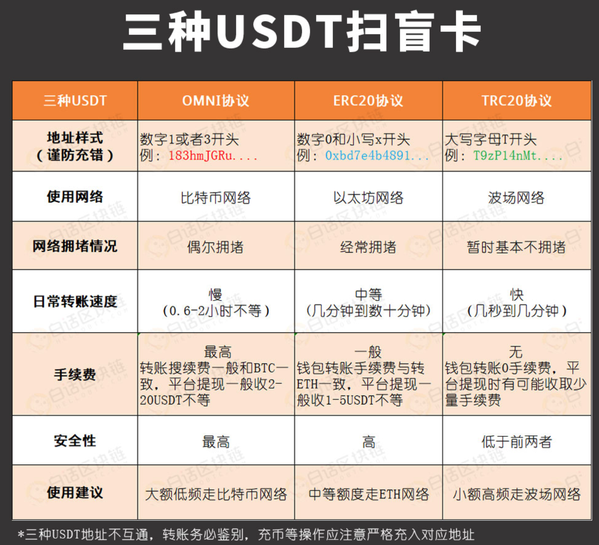

###### 3.5.2.3.1、黑U

*欧美地区法律法规是保护U的把U视为虚拟资产。*

```
黑U被标记了。充值进交易所就会被刑警组织申请锁定或者冻结

说白了，就是用正常的U干了违法的事，事件未公开，未被发觉，这U可能还是干净的。但是一旦被调查或者牵扯案子，U就会被标记，
```

*黑U为何会流入币安、火币等头部交易所呢？*

```
1、头部交易所有一个可以被不法分子利用的优点:交易量大！
2、不法分子所涉及的资金量一般较大，通过头部交易所可以快速出货，将手中的黑U洗白，不至于被查获后，竹篮打水一场空。
```

*如何避免收到黑U？*

```
1、经常有一些项目方发了一个代币，然后割韭菜跑路。像这样的项目的地址出来的U不要碰，虽然没有被标记，但是这个项目不是善茬，风险性较大，比如之前6月份出现的部分动物币，就是瞅准时机出来割韭菜的;
2、如果你看到价格非常便宜的U,不要觉得天上掉馅饼，那很可能是不法分子为了快速洗钱，而用的手段。不要为了贪小便宜而吃大亏;
3、选择商家时尽量找老商家交易，认证都齐全的商家;
4、尽量选择交易所买U而不是钱包，交易所有风控部门，是一道关卡，而直接走钱包风险更大;
5、4大交易所分别为币安、火币、Okex、中币，还没有上这些交易所的币种尽量少碰。一是谨防自己被割韭菜，二是谨防被洗钱者利用;
```

###### 3.5.2.3.2、`ERC-20`和`Trc-20 `

*ERC-20*

```
1、ERC-20是一种以太坊（Ethereum）区块链上的代币标准接口。
		1.1、ERC代表"以太坊请求评论"（Ethereum Request for Comments），而20则是该标准的编号;
		1.2、ERC-20标准为以太坊上的代币发行提供了一种统一的接口，使得不同代币在以太坊网络内可以互相兼容交换和转移;
		1.3、ERC-20标准包含了代币的基本功能，如转账、余额查询、合约管理等;
				1.3.1、目前，大部分以太坊上的代币都遵循ERC-20标准。例如USDT、LINK、UNI等。
```

*Trc-20*

```
1、Trc-20是基于波场（Tron）区块链标准的数字代币协议标准接口;
		1.1、与ERC-20标准类似，允许代币在波场（Tron）网络上创建和发行自己的代币、自由交易、并支持区块链应用程序的生态系统;
2、由于波场区块链支持高吞吐量和低交易费用，因此Trc-20代币在波场上的使用非常普遍;
		2.1、例如：波场的USDT就是以Trc-20协议发行的。
3、基于TRC20的USDT合约地址:TR7NHqjeKQxGTCi8q8ZY4pL8otSzgjLj6t
```

*为什么 **Trc-20** 相比于 **ERC-20**，手续费成本更低，且耗费的处理时间更少?*

```
1、相对于以太坊网络，波场网络的交易手续费通常较低。这意味着使用 Trc-20 代币进行交易时，用户需要支付的手续费较少;
2、共识机制的不同:Trc-20代币的基础设计结构更加简洁，相对于ERC-20更加高效;
		2.1、波场区块链采用了一种称为 TPOS（委托权益证明）的共识机制，使其能够实现更高的交易吞吐量和更快的区块确认时间;
		2.2、相比之下，以太坊网络采用了 POW（工作量证明）共识机制，其处理速度相对较慢。
3、开发成本:Trc-20代币的开发成本较低;
		3.1、在波场（Tron）网络上开发Trc-20代币的工具和技术较为成熟，因此开发者可以更便捷地开发和部署Trc-20代币;
		
但需要注意的是，具体的手续费和处理时间可能会因网络拥堵、交易量和其他因素而有所变化。
```

##### 3.5.2.4、TRX

```
Tron，又称"波场"，最初作为基于Ethereum的代币而创建，2018年5月正式上线主网。 按照该过程的设计，投资者将Ethereum代币交易为Tron的TRX加密货币，又称"波场币"

与以太坊和比特币等基于 PoW 挖矿不同，Tron 采用 DPoS 机制，用户通过投票选出 27 名验证人来维护 Tron 网络的安全，验证链上交易并创建区块，这些验证人被称为超级代表（Super Representatives 简称 SR）。
```

###### 3.5.2.4.1、带宽和能量

```
在比特币、以太坊上转账时需要通过 BTC、ETH 来支付手续费。在波场进行转账时消耗的是带宽和能量。

BTC、ETH 和 TRX 都是主网币，而基于这些主网创建的代币相当于租住在主网币房东的家里，缴纳手续费的方式是由主网这个房东决定的。
比特币和以太坊立下的规矩是，代币转账需要用 BTC 和 ETH 来支付，而波场立下的规矩则是用能量和带宽来支付。

波场上有两类常见租客（两类常见的代币格式）：Trc-10 和 Trc-20。
转账 TRX 和 Trc-10 代币时需要消耗带宽;
转账 Trc-20 代币时需要消耗带宽和能量。
```

```
每个波场账户每天能免费收到 5000 B 的带宽点（Bandwidth Points 简称 BP）。由于 1KB = 1024 B，所以 5000 B = 5000/1024 KB ≈ 4.88 KB，可用于每日 10 多笔 TRX 和 TRX-10 代币的免费转账。

如果你想获得能量或者更多的带宽，有两种方法。
方法一：燃烧 TRX（推荐）
在波场钱包中保留 5-20 个 TRX 代币，转账时会自动燃烧 TRX 以抵扣转账所需的带宽和能量。

方法二：冻结 TRX
点击资产首页的能量 / 带宽，进入 Tron 资源管理界面，选择想获得的资源类型，输入需冻结的 TRX 数量，建议冻结 100 个。冻结后的 TRX 在 3 天后可以解冻取回。
```

###### 3.5.2.4.2、主网币与代币

```
1、市场上成千上万的数字资产可以分为两大类：主网币和代币
2、主网币：ETH、BTC、ATOM、EOS、TRX、CKB、BCH、LTC、KSM、DOT、FIL、XTZ
3、不是每个币都有单独的钱包
4、只有主网币才有以它自己的名字命名的，为它量身定制的钱包，而代币则只能寄宿在主网币的钱包里。
```

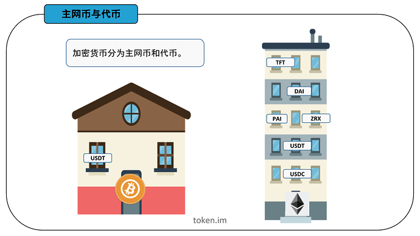

```
比如 USDT 代币，它在比特币钱包、以太坊钱包和波场等钱包里都可以进行存储;
你在交易所提 USDT 时需要进行链名称的选择，有三个选项：ERC-20、Trc-20 和 OMNI。
这三个链名称分别对应着以太坊钱包、波场钱包和比特币钱包。

USDT 是租住在主网币家里的代币，既然是租房子，就得签署租房协议;
不同的房东有不同的要求:
USDT 租住在比特币家里的租房协议叫 Omni，
租住在以太币家里的租房协议叫 ERC-20，
租住在波场币家里的租房协议叫 Trc-20。

若 USDT 提到 BTC 钱包，则选择 OMNI 格式，输入 BTC 钱包地址；
若 USDT 提到 ETH 钱包，则选择 ERC-20 格式，输入 ETH 钱包地址；
若 USDT 提到 TRX 钱包，则选择 Trc20 格式，输入 TRX 钱包地址。
```

**如果你选择的是 ERC-20 格式，但是输入的地址却是比特币钱包或者波场钱包的地址，就会碰到「无效地址」的报错。**

###### 3.5.2.4.3、Tron账户

```
1、Tron采用账户模型，账户的唯一标识为地址（address），对账户操作需要私钥签名;
2、每个账户可以拥有TRX、Trc10 Token、带宽、能量等各种资源;
3、通过发送交易可以增减TRX或者Trc10 Token余额,可以发布并拥有智能合约，也可以调用自己或者他人发布的智能合约;
4、可以申请成为超级代表并被投票，也可以对超级代表进行投票等等;
5、Tron所有的活动都围绕账户进行;
6、Tron账户类型分为两种:
    6.1、普通账户。即外部账户，由拥有该账户私钥的人控制;
    6.2、合约账户。一个部署到Tron网络上的智能合约就是一个合约账户，由代码控制，没有人拥有合约账户的私钥;
7、所有类型的账户都可以:
    7.1、接收，持有和发送TRX/其它tokens
    7.2、与部署的智能合约交互
8、外部账户的创建:
    8.1、Tron的密钥对的生成算法与以太坊完全相同，采用的是椭圆曲线数字签名算法ECDSA-secp256k1;
    8.2、生成的过程是：
        8.2.1、首先，生成一个随机的私钥，私钥由64个十六进制字符组成;
        8.2.2、然后，根据椭圆曲线数字签名算法生成公钥;
        8.2.3、最后，取公钥的 Keccak-256 结果的最后 20 个字节，并在前面添加 41作为Hex格式地址;
9、账户地址格式:
    9.1、Hex格式:同一个私钥生成的Hex格式Tron地址和以太坊地址相比，除了最前面的41，其他完全一样;
    9.2、Base58格式:对Hex格式的地址进行basecheck计算得到Base58格式地址，所有账户地址的第一个字符均为T;
```

**使用Tronweb进行Hex和Base58格式转换示例**

```javascript
TronWeb.address.toHex("TNPeeaaFB7K9cmo4uQpcU32zGK8G1NYqeL")
> "418840E6C55B9ADA326D211D818C34A994AECED808"

TronWeb.address.fromHex("418840E6C55B9ADA326D211D818C34A994AECED808")
> "TNPeeaaFB7K9cmo4uQpcU32zGK8G1NYqeL"
```

**创建账户的几种方式**

```json
1、使用命令行钱包wallet-cli离线创建账户:

wallet> GenerateAddress
{
    "address": "TU6JdEDQGPus64LTMksvnxF2cv4FQrXPCa",
    "privateKey": "b1ba1db577a36421924a87026cda27523851c6e88123d0a0a1def9a974376176"
}
```

```json
2、使用SDK离线创建账户。以Tronweb为例:

TronWeb.createAccount()
> address:
{
    base58: "TDpBe64DqirkKWj6HWuR1pWgmnhw2wDacE"
    hex: "412A2B9F7641D0750C1E822D0E49EF765C8106524B"
    privateKey: "427139B43028A492E2705BCC9C64172392B8DB59F3BA1AEDAE41C88924960091"
    publicKey:"0404B604296010A55D40000B798EE8454ECCC1F8900E70B1ADF47C9887625D8BAE3866351A6FA0B5370623268410D33D345F63344121455849C9C28F9389ED9731"
}
```

```
3、使用钱包应用生成私钥和地址
```

**激活账户**

```
新创建的账户在链上并不存在，需要激活后，才能通过API查询或者通过区块链浏览器搜索到，可以通过以下两种方式激活账户：

由已有老账户往新账户地址发送任意数量的TRX或者Trc-10代币，完成账户的激活。
使用已有的老账户调用Java-Tron的wallet/createaccount接口创建一个交易，然后签名并广播到网络，也能完成对一个新账户的激活。
激活账户需要支付1TRX的账户创建费用，另外上面两种激活新账户的交易，如果交易发送者账户有足够的质押获得的带宽，那么这笔交易消耗的带宽会从发送者账户质押获得的带宽中扣除，否则，会消耗0.1 TRX来支付带宽费用。

在合约中向一个未激活的账户地址转账TRX或Trc-10代币，也能完成这个账户的激活。这种方式除了正常合约调用需要消耗的带宽和能量外，只会额外消耗25,000 能量，不会消耗1TRX的账户创建费用和0.1TRX的带宽费用。
```

**合约账户**

```
将合约部署到Tron区块链时，得到相应的合约账户地址，该地址由部署合约交易的ID以及发送者账户地址计算所得。合约账户和外部账户的地址格式相同，可以是hex格式或者Base58格式，例如：

Base58: TR7NHqjeKQxGTCi8q8ZY4pL8otSzgjLj6t 
Hex:    41A614F803B6FD780986A42C78EC9C7F77E6DED13C
```

###### 3.5.2.4.4、通证

```
1、通证，就是通过加密技术、共识规则、智能合约、应用目标等建立起来的集货币属性、价值属性、荣誉属性、安保属性、确权属性等等多种属性于一体的区块链凭证;
2、通证可以为智能合约所管理，也可以为握有钱包私钥的人所拥有和使用;
3、通证是区块链的硬核之一;
4、目前区块链里面已经出现同质通证、非同质通证、声望通证等多种通证类型。
```

##### 3.5.2.5、数字人民币

```
1、数字人民币是由中国人民银行发行的一种数字货币，也被称为中央银行数字货币（CBDC）;
2、它是一种以人民币为基础的数字化形式，用于替代纸币和硬币，在电子支付和结算中使用;
3、相比于传统电子支付，数字人民币具有更高的安全性、可溯源性和可编程性，还可以帮助减少对第三方支付机构的依赖，降低支付成本;
4、数字人民币可以被存储在数字钱包中，并可通过移动设备进行交易;
5、"半去中心化"货币:
		5.1、数字人民币并不完全去中心化。它的发行、监管和管理仍由中国央行等中央机构掌握;
		5.2、虽然数字人民币的交易过程可能采用类似区块链技术的去中心化方式实现，但仍受到中央机构的监管;
		5.3、与加密货币不同，数字人民币的主要目的是替代纸币，提高支付效率，并使支付更加安全、透明和可追溯。而不是打破中央掌控的货币发行体系;
6、目前，数字人民币在中国内部正在进行试点和推广;
		6.1、推广过程中有抵触情绪和一定阻力;
7、推广阻力分布:
		7.1、基建准备:硬件 + 软件 + 规则制定和实施 + 一定时间 ===> 发行、交易和管理
				7.1.1、包括建立安全可靠的数字支付系统、确保网络安全和防范欺诈等方面;
				7.1.2、这些技术和基础设施的建设可能需要时间和投资;
				7.1.3、新事物。需要很强的技术能力来实现安全性和可靠性;
		7.2、政策和监管风险:中国央行数字货币（DC/EP）试点先于其他国家进行，需要先行制定合适的政策和规定以确保安全性和有效性;
				7.2.1、数字人民币的推广可能需要进行金融体系和政策方面的调整。这可能涉及与现有金融机构和支付系统的协调，确保数字人民币与其他支付工具的互操作性，并满足监管和反洗钱等方面的要求;
		7.3、隐私和安全顾虑:比如能追溯所有的交易，可能引发个人隐私和安全方面的顾虑
		7.4、用户接受度和教育:对于大部分人来说，使用数字人民币可能是一种新的支付方式和概念。因此，推广数字人民币需要用户的接受度和理解，并可能需要进行相关的教育和宣传工作，以便人们能够充分了解并信任这种新的支付形式;
		7.5、利益相关方的反对:数字人民币的推广可能对现有的支付服务提供商和金融机构造成竞争压力。这些利益相关方可能会采取一些措施来阻碍数字人民币的推广，以保护他们自身的地位和利益;
		7.6、商业模式的不确定性:
		与目前的现金、银行卡等支付方式的不同，需要适应不同的商业模式，这种转变的速度可能限制数字人民币在市场上的占有份额;
		7.4、社会反应和信任度:
		数字人民币是一项全新的企业，需要保证在广泛的社会层面上被认可和接受。这是成功推广的必要条件，如果民众对数字人民币不信任，则数字人民币上市可能面临更大的挑战;
		7.5、前景的不确定性;
```

#### 3.5.3、加密货币交易所

*资料来源*

[维基百科/加密货币交易所](https://zh.m.wikipedia.org/zh-hans/%E5%8A%A0%E5%AF%86%E8%B2%A8%E5%B9%A3%E4%BA%A4%E6%98%93%E6%89%80)

[维基百科/Coinbase](https://zh.wikipedia.org/wiki/Coinbase)

[维基百科/Binance](https://en.wikipedia.org/wiki/Binance)

[维基百科/Kraken](https://en.wikipedia.org/wiki/Kraken_(company))

[维基百科/Bitfinex](https://zh.wikipedia.org/zh-hans/Bitfinex)

[维基百科/Huobi](https://en.wikipedia.org/wiki/Huobi)

[维基百科/OKEx](https://en.wikipedia.org/wiki/OKX)

```
加密货币交易所提供了加密货币的交易、存储和管理服务，让用户可以方便地进行数字资产的买卖和交易;
```

##### 3.5.3.1、[Coinbase](https://www.coinbase.com/)（比特币基地）

```
该公司成立于2012年。截至2021年3月，Coinbase 是美国🇺🇸交易量最大的加密货币交易所;
2021年4月13日，Coinbase 股票代码：COIN）在美国纳斯达克交易所上市，成为美国首家上市的加密货币公司;
```

##### 3.5.3.2、[Binance](https://www.binance.com/zh-CN)（币安）

```
2017年，由中国🇨🇳开发者赵长鹏创立，后因为中国大陆政府监管，总部迁出中国大陆;
该公司推出了两种自行开发的加密货币:币安币 (BNB) 和币安美元 (BUSD);
```

##### 3.5.3.3、[Kraken](https://www.kraken.com/)

```
Kraken 于2011年由加州州立大学萨克拉门托分校的校友 Jesse Powell 与 Thanh Luu 共同创立;
Kraken 是一家总部位于美国的加密货币交易所，它是首批在彭博终端上市的比特币交易所之一;
```

##### 3.5.3.4、[Bitfinex](https://www.bitfinex.com/)

```
由 iFinex Inc 拥有及营运;
其总部设于香港，注册地区为英属维尔京群岛🇬🇧;
```

##### 3.5.3.5、[Huobi](https://www.huobi.com/)（火币）

```
由 Leon Li（中文：李林；拼音：Lǐ Lín ）（清华大学校友）于 2013 年创立于中国🇨🇳。目前在香港、韩国、日本和美国设有办事处。
在创立火币之前，李在甲骨文担任计算机工程师。
2018年8月成为香港上市公司;
在中国政府2017年禁止比特币交易之后，火币停止了比特币提款;
火币中国继续作为区块链咨询和研究平台运营;
位于东非塞舌尔🇸🇨
```

##### 3.5.3.6、[OKEx/OKX](https://www.okx.com/cn)（欧易）

```
OKX 前身为 OKEx;
由 Star Xu（徐明星）于 2017 年创立;
OKX 由 OK 集团所有，该集团还拥有加密货币交易所 Okcoin;
全球交易量第二;
位于东非塞舌尔🇸🇨
```

### 3.6、密码货币钱包（又译加密货币钱包）

*资料来源*

[investglass/热与暖与冷：哪个加密货币钱包适合我？](https://www.investglass.com/zh/hot-vs-warm-vs-cold-which-crypto-wallet-is-right-for-me/)

[欧易官网](https://www.okx.com/cn)

[IMToken官网](https://token.im/)

[欧易官网/新手学院](https://www.okx.com/cn/learn)

[权益证明](https://zh.wikipedia.org/wiki/權益證明)

[小科普：助记词和私钥到底是什么?](https://www.odaily.news/post/5140472)

#### 3.6.1、HD钱包

***HD** = **H**ierarchical **D**eterministic = **分层确定性***

#####  3.6.1.1、简介

```
1、在比特币的链上，实际上并没有账户的概念;
2、某个用户持有的比特币，实际上是其控制的一组 UTXO，而这些 UTXO 可能是相同的地址（对应相同的私钥），也可能是不同的地址（对应不同的私钥）;
3、出于保护隐私的目的，同一用户如果控制的 UTXO 其地址都是不同的，那么很难从地址获知某个用户的比特币持币总额;
4、HD 钱包采用分层确定性算法通过根扩展私钥计算所有层级的所有子扩展私钥，继而得到扩展公钥和地址;
		4.1、HD 钱包树状结构提供了极大的灵活性。
		4.2、每一个母扩展密钥有 40 亿个子密钥:20 亿个常规子密钥和 20 亿个强化子密钥。而每个子密钥又会有 40 亿个子密钥并且以此类推;
		4.3、只要你愿意，这个树结构可以无限类推到无穷代;
		4.4、但是，又由于有了这个灵活性，对无限的树状结构进行导航就变得异常困难;
		4.5、尤其是对于在不同的 HD 钱包之间进行转移交易，因为内部组织到内部分支以及亚分支的可能性是无穷的;
5、可以通过 普通衍生 和 硬化衍生 两种方式计算扩展子私钥，后者更安全。但对应的扩展公钥无法计算硬化衍生的子扩展公钥;
6、通过扩展公钥可以在没有扩展私钥的前提下计算所有普通子扩展公钥，此特性可实现观察钱包;
```

##### 3.6.1.2、一个私钥管理成千上万个地址

*但是，管理一组成千上万的地址，意味着管理成千上万的私钥，管理起来非常麻烦。*
*能不能只用一个私钥管理成千上万个地址？*
*实际上是可以的。*

```
虽然椭圆曲线算法决定了一个私钥只能对应一个公钥，但是，可以通过某种确定性算法，先确定一个私钥k1，然后计算出k2、k3、k4……等其他私钥;
就相当于只需要管理一个私钥，剩下的私钥可以按需计算出来。
```

*这种根据某种确定性算法，只需要管理一个根私钥，即可实时计算所有"子私钥"的管理方式，称为**HD**钱包。*

##### 3.6.1.3、相关算法

```
先确定根私钥root，然后根据索引计算每一层的子私钥:

root
│
├─────────────┬─────────────┐
│             │             │
▼             ▼             ▼
k0            k1            k2 ...
│             │             │
├──┬──┐       ├──┬──┐       ├──┬──┐
│  │  │       │  │  │       │  │  │
▼  ▼  ▼       ▼  ▼  ▼       ▼  ▼  ▼
k0 k1 k2 ...  k0 k1 k2 ...  k0 k1 k2 ...
```

*对于任意一个私钥 **k**，总是可以根据索引计算它的下一层私钥 **k<sub>n</sub>***

***k<sub>n</sub>** = hdkey(k,n),即 **HD** 层级实际上是无限的，每一层索引从0～232，约43亿个子key。这种计算被称为衍生（Derivation）*

```
现在问题来了: 如何根据某个私钥计算下一层的子私钥？即函数 hdkey(k, n) 如何实现？

HD 钱包采用的计算子私钥的算法并不是一个简单的 SHA-256，私钥也不是普通的256位 ECDSA 私钥，而是一个扩展的512位私钥，记作 xprv，它通过 SHA-512算法配合 ECC 计算出子扩展私钥，仍然是512位。
通过扩展私钥可计算出用于签名的私钥以及公钥。

简单来说，只要给定一个根扩展私钥（随机512位整数），即可计算其任意索引的子扩展私钥。扩展私钥总是能计算出扩展公钥，记作 xpub:

xprv ────────> xpub
  │              │
  │              │
  │              │
  ▼              ▼
xprv-0 ──────> xpub-0
从 xprv 及其对应的 xpub 可计算出真正用于签名的私钥和公钥。
之所以要设计这种算法，是因为扩展公钥 xpub 也有一个特点，那就是可以直接计算其子层级的扩展公钥:

xpub
│
├───────┬───────┐
│       │       │
▼       ▼       ▼
xpub-0  xpub-1  xpub-2  ...
因为 xpub 只包含公钥，不包含私钥，因此，可以安全地把 xpub 交给第三方（例如，一个观察钱包），它可以根据 xpub 计算子层级的所有地址，然后在比特币的链上监控这些地址的余额，但因为没有私钥，所以只能看，不能花。

因此，HD钱包通过分层确定性算法，实现了以下功能:

只要确定了扩展私钥 xprv，即可根据索引计算下一层的任何扩展私钥;
只要确定了扩展公钥 xpub，即可根据索引计算下一层的任何扩展公钥;
用户只需保存顶层的一个扩展私钥，即可计算出任意一层的任意索引的扩展私钥。
从理论上说，扩展私钥的层数是没有限制的，每一层的数量被限制在0～232，原因是扩展私钥中只有4字节作为索引，因此索引范围是0～232。

通常把根扩展私钥记作 m，子扩展私钥按层级记作m/x/y/z等:

m
│
├──────────────────────┐
│                      │
▼                      ▼
m/0                    m/1 ...
│                      │
├─────┬─────┐          ├─────┬─────┐
│     │     │          │     │     │
▼     ▼     ▼          ▼     ▼     ▼
m/0/0 m/0/1 m/0/2 ...  m/1/0 m/1/1 m/1/2 ...

例如，m/0/2表示从m扩展到m/0（索引为0）再扩展到m/0/2（索引为2）。
```

##### 3.6.1.4、安全性

```
HD 钱包给私钥管理带来了非常大的方便，因为只需要管理一个根扩展私钥，就可以管理所有层级的所有衍生私钥。
但是 HD 钱包的扩展私钥算法有个潜在的安全性问题:就是如果某个层级的 xprv 泄露了，可反向推导出上层的 xprv，继而推导出整个 HD 扩展私钥体系。

为了避免某个子扩展私钥的泄漏导致上层扩展私钥被反向推导，HD 钱包还有一种硬化的衍生计算方式（Hardened Derivation），它通过算法"切断"了母扩展私钥和子扩展私钥的反向推导。
HD 规范把索引0～231作为普通衍生索引，而索引231～232作为硬化衍生索引，硬化衍生索引通常记作0'、1'、2'……，即索引0'=231，1'=231+1，2'=231+2，以此类推。

因此，m/44'/0表示的子扩展私钥，它的第一层衍生索引44'是硬化衍生，实际索引是231+44=2147483692。从m/44'/0无法反向推导出m/44'。

在只有扩展公钥的情况下，只能计算出普通衍生的子公钥，无法计算出硬化衍生的子扩展公钥，即可计算出的子扩展公钥索引被限制在0～231。
因此，观察钱包能使用的索引是0～231。
```

##### 3.6.1.4、地址监控

***HD**钱包通过 **Bloom Filter**可以高效监控链上的所有地址，并根据是否是本地管理的地址决定如何计算钱包余额。*

```
一个 HD 钱包管理的是一组自动计算的地址。
以比特币为例，在确定了根扩展私钥m后，得到一组地址为m/44'/0'/0'/0/x，其中x=0~231。

HD 钱包需要在链上监控每个TX的输入和输出，看看上述管理的一组地址是否存在与输入和输出中;
如果作为输入，则钱包余额减少，如果作为输出，则钱包余额增加。

现在问题来了:如何根据TX的输入和输出地址快速判断这些地址中是否存在HD钱包管理的地址？

首先，可用的地址高达231个，这个数太大了，用户不可能用完，
因此，HD 钱包只会预生成前1000个地址（即索引号为0～999）并保存在本地数据库中，如果不够了，再继续扩展1000个，
这样，HD 钱包管理的地址数量不会太大。

其次，要在上千个地址集合中快速判断某个地址是否存在，查询数据库是一个非常低效的方式。以哈希表存储在内存中虽然效率很高，但管理的集合数量太多，占用的内存会非常大。

要做到高效的查询和低空间占用率，可以使用布隆过滤器（Bloom Filter）;
它是由 Burton Howard Bloom 在1970年提出的，其原理是将每个元素通过若干个哈希函数映射成一个位数组的若干个点，将其置1;
检索的时候，先计算给定元素对应位是否全1，如果是全1，则给定元素很可能存在，否则，元素必定不存在。

因此，Bloom Filter 有个重要特点:
就是判断元素时，如果不存在，那么肯定不存在，
如果存在，实际上是以一定概率存在（例如，99%），还需要再次从数据库查询以确定元素真的存在。

Bloom Filter 的缺点就是它无法100%准确判断存在，此外，添加新的元素到 Bloom Filter 很容易，但删除元素就非常困难。构造 Bloom Filter 时，要先预估元素个数并给定存在概率，才能计算所需的内存空间。

Bloom Filter 广泛用于垃圾邮件地址判断，CDN服务等。
Bloom Filter 也非常适合 HD 钱包监控链上每个交易的地址。
```

#### 3.6.2、`BIP`协议

*资料来源*

[阿里云/开发者社区/Bytom BIP-32协议和BIP-44协议](https://developer.aliyun.com/article/690942)

[bip协议是什么](https://wiki.bsatoshi.com/part-ii/protocol_bip)

[巴比特/比特币Taproot升级终于要来了！一文了解它的过去、现在与未来](https://www.8btc.com/article/6702629)

***BIP** = **B**itcoin **I**mprovement **P**roposal = 比特币改进建议*

##### 3.6.2.1、简介

```
由 Amir Taaki 于 2011 年在 BIP 0001 中提出，并由 Luke Dash Jr. 在 BIP 0002 中对其进行了扩展;
```

##### 3.6.2.2、`BIP`协议的种类

*标准类、信息类和进程类。所有 BIP 都会经历同样的提交、审核和激活过程，因此，这三类 BIP 唯一的不同就在于各自要实现的目标*

```
1、标准类 BIP 的提交目的是改变网络协议或其他足以影响到互通性的运营模式或功能，包括交易验证和区块容量参数;
2、信息类 BIP 主要解决设计问题，建立通用指南。与标准类 BIP 不同，这类 BIP 通常都会提出全新的网络功能。
3、进程类 BIP 大致与标准类相似。主要区别为:进程类 BIP 提出的是比特币协议以外的进程更改。
```

##### 3.6.2.3、提交`BIP`标准

```
1、草案阶段:BIP 作为草案提交给比特币开发邮件列表和 BIP Github 代码仓库。
2、提议阶段:BIP 包括了一个含有部署 BIP 计划的工作执行方案。
3、最终阶段:BIP 符合现实世界的采用标准。且必须客观地验证这一点。
```

##### 3.6.2.4、已经提案通过的`BIP`

```
1、BIP 0011（多重签名输出）
2、BIP-32:就是为了避免管理一堆私钥的麻烦提出的分层推导方案;（HD(分层确定性)钱包）
3、BIP-44:就是给 BIP32 的分层增强了路径定义规范，同时增加了对多币种的支持;（多币种和多帐户钱包）
		3.1、基于 BIP-0032 和 BIP-0043 中描述的目的方案中描述的算法定义确定性钱包的逻辑层级;
		3.2、赋予树状结构中的各层特殊的意义;
		3.3、让同一个"种子"可以支援多币种、多帐户等;
4、BIP-39:是一个系统可以从单一个"种子"产生一树状结构储存多组私钥和公钥。通过定义助记词可以更加友好的方便备份、转移到其他相容装置（因为都只需要 "种子"），以及分层的权限控制等;
5、BIP 0152（致密区块中继）
```

##### 3.6.2.5、协议原英文地址

```javascript
【BIP-32 协议】https://github.com/bitcoin/bips/blob/master/bip-0032.mediawiki#extended-keys
【BIP-44 协议】https://github.com/bitcoin/bips/blob/master/bip-0044.mediawiki
```

##### 3.6.2.6、具体代码实现

*BIP-32/44*

```javascript
https://github.com/Bytom/bytom/blob/master/blockchain/signers/signers.go
```

##### 3.6.2.7、数字货币钱包的私钥

*私钥 3 连问*

**私钥就是你区块链世界的资产的唯一凭证，拥有了私钥的，便拥有了对应地址上的资产。**

```
你的收币地址是怎么诞生的？
是私钥计算的。

你的交易怎样授权发出去的？
是私钥签名的。

你的资产怎样在钱包恢复的？
是私钥帮忙的。
```

*比特币私钥简介*

```
比特币私钥本质上就是一个随机数，就跟你扔骰子扔出一个数字来是一个东西。
不过比特币的私钥会比较长一些，再具象一点，是一个256位，由0和1组成的数字。
0100101…01010100  (共256位)

那么问题来了，这么多0和1看都看晕了，还怎么备份？

中本聪发明了一种特殊编码（Base58）可以将一大串01010转化为较容易备份的样子。

比如下面这段字符，这就是我们常见的私钥的形态:
KwYHFL7WfhJPkfQkp1LsUwHvy1Pd9KynuxjjVDMZvRSV5D9VJq3v
这样的私钥"相对"来说还是比较容易备份和输入的
注意:私钥一般为5、K、L开头
```

###### 3.6.2.7.1、`Base58` 编码方式

*资料来源*

[维基百科/Base58](https://zh.wikipedia.org/wiki/Base58)

*`Base58`简介*

```
1、Base58 是用于比特币（BTC）中使用的一种独特的编码方式，主要用于产生 比特币（BTC）的钱包地址;
2、相比Base64，Base58 不使用数字"0"，字母大写"O"，字母大写"I"，和字母小写"l"，以及"+"和"/"符号;

设计 Base58 主要的目的是:
1、避免混淆。在某些字体下，数字0和字母大写O，以及字母大写I和字母小写l会非常相似;
2、不使用"+"和"/"的原因是非字母或数字的字符串作为帐号较难被接受;
3、没有标点符号，通常不会被从中间分行;
4、大部分的软件支持双击选择整个字符串;
```

##### 3.6.2.8、数字货币钱包的助记词

*助记词的形态*

```
最常见的助记词就是一组12个单词

举例:形如👇🏻
1、health   2、fine       3、profit       4、below 
5、crowd 	 6、wish       7、task         8、gown 
9、mind     10、surge     11、apple       12、max
```

*助记词的作用*

**助记词就是你区块链世界的资产的唯一凭证，拥有了助记词的，便拥有了对应地址上的资产。**

```
你的收币地址是怎么诞生的？
是助记词计算的。

你的交易怎样授权发出去的？
是助记词签名的。

你的资产怎样在钱包恢复的？
是助记词帮忙的。
```

##### 3.6.2.9、"助记词"和"私钥"的关系

```
1、助记词和私钥在功能上是一致的;
2、助记词本质也是一串随机数（128—256位），不过因为随机数形式和私钥形式都不方便使用，所以比特币社区通过了 BIP39 协议，来允许将随机数通过特定编码转化为词库中的单词;
    2.1、比特币改进协议 Bitcoin improvement proposals 简称 BIP。是为比特币社区提供规范，完善比特币及其运行进程和外部环境特性的设计指导文件）
3、助记词不用区分大小写，又是较为常见的单词，比私钥的使用上要方便的多，所以近年来，助记词钱包已经逐渐成为主流钱包;
4、助记词钱包还有一个好处是:一组助记词可以派生出 N 个私钥，每个私钥都可以对应一个币种;
    4.1、例如，你有30个币种（BTC、ETH、LTC、EOS等等等等），你不需要每个币种都单独记录一下私钥，只需记录好一组助记词就可以掌控所有资产;
5、助记词的生成依靠了比特币的BIP32、39、44协议。因此只要是遵循了标准协议的助记词，都是可以互相使用的;
    5.1、但是因为每个钱包的安全水平不同，不建议将助记词互相混着使用
6、当用助记词恢复时提示"无效的助记词"是什么原因？
		6.1、这种原因一般是抄错了某一个单词，不过因为单词都是有固定的词库，所以可以在词库中检索类似的单词尝试下替换输入。
    官方英文词库地址：https://github.com/bitcoin/bips/blob/master/bip-0039/english.txt
    官方中文词库地址：https://github.com/bitcoin/bips/blob/master/bip-0039/chinese_simplified.txt
```

#### 3.6.3、密码货币钱包的类型

##### 3.6.3.1、按照去中心化程度

###### 3.6.3.1.1、全节点钱包

```
此种钱包需要先进行软件安装，安装后会与整个区块链进行同步，存储整个区块链。
所以全新钱包开始同步时，必须从第一笔资料开始下载，会花上数小时～数十日的时间，并且占用为数不小的存储空间与网络流量。
这样的钱包又称为完整节点。
由于此种钱包能提供所对应的加密货币网络完整区块链与服务，所以可以提升该加密货币网络的完整性与可靠性，因此某些加密货币，会对持有这种钱包的用户进行奖励。
```

###### 3.6.3.1.2、`SPV`钱包

***S**implified **P**ayment **V**erification wallet* = **简单支付验证钱包** = **轻钱包**

```
与前者比，此种钱包仅存储私钥与结算，不存储整个区块链，所以占用资源很少，较适用于移动设备。
在线钱包（不保管私钥）:一般设计为网页形式，在网站产生私钥后，由个人保管，日后要访问钱包时必须输入私钥，网站不负责替用户保存。
使用概念上类似于SPV钱包的网页版。
使用此类网站，应挑选有信誉的品牌，以及注意是否为仿冒的钓鱼网站。
```

###### 3.6.3.1.3、中心化钱包

```
在线钱包（保管私钥）:
一般设计为网页形式，同时保管你的私钥;
此类网站风险较高，因为掌握你的私钥，也就等于掌握你该私钥下的加密货币资产;

交易所钱包:
各交易所为了能够出入币，也都会提供对应该币的钱包地址;
此种钱包不会提供私钥给用户，所以一旦存入，就只能依靠交易所的机制来提领;
这同时也算是一种在线钱包;
```

##### 3.6.3.2、按照私钥存储方式

###### 3.6.3.2.1、冷钱包

*也称 **离线钱包** 或者 **断网钱包***

```
意指网络不能访问到用户私钥的钱包。
冷钱包通常依靠"冷"设备（不联网的电脑、手机等）确保比特币私钥的安全，运用二维码通信让私钥不触网，避免了被黑客盗取私钥的风险，但是也可能面临物理安全风险（比如电脑丢失，损坏等）。
将私钥存储至不会与网络连线的设备上，包括打印、手抄（纸钱包），甚至自行背诵（脑钱包），以确保存储期间的绝对安全。不过上述钱包在进行交易时，仍必须将私钥输入到一般软件钱包，而最高标准的冷钱包，还必须能进行离线签署，只将签署过的交易发出来。
将私钥存储在额外的特制硬件设备，使用时交易需在硬件内部进行交易签署才提交，只要硬件没有被破解，就绝对安全。
如果此硬件设备完全离线、只提交签署过的交易消息，那同时也是最高标准的冷钱包。
```

###### 3.6.3.2.2、暖钱包

```
暖钱包是热钱包和冷钱包的混合体。
它们不总是在线，但在需要时可以连接到互联网。
暖钱包通常是硬件钱包，离线存储你的私钥，但当你想转移或交易你的加密货币时可以连接到互联网。

暖钱包提供了比热钱包更高的安全水平，因为它们离线存储私钥。
然而，它们不太方便，因为需要时需要人工干预以连接到互联网。
```

###### 3.6.3.2.3、热钱包

*也称 **在线钱包** 或者 **联网钱包** （Online Wallet）*

```
也就是网络能够访问到用户私钥的钱包。
热钱包因其联网特性，外人可能通过互联网访问用户的私钥，因此安全性比冷钱包低，但比冷钱包更便利。
另外，无论是使用冷钱包还是热钱包，私钥都是关键所在。
```

##### 3.6.3.3、其他钱包

###### 3.6.3.3.1、观察钱包

```
观察钱包本质上是一个观察特定地址链上数据的区块浏览器。

用户只需使用观察钱包导入账户（公钥）或地址即可拥有便捷的使用的体验，通过观察钱包可以查看账户（地址）资产，交易记录等内容。
因此观察钱包是无法直接进行转账等链上操作的,若需要转账可将私钥或助记词导入钱包或搭配冷钱包授权使用。
```

###### 3.6.3.3.2、多签钱包

```
与多签钱包对应的是单签钱包，我们要往区块链上发送一笔转账操作，需要用钱包生成一个签名，我们自己签好名把交易发送出去，这就是典型的单签钱包，也是我们平时常用的钱包。

多签钱包，顾名思义，就是需要多个人去签名执行某个操作的钱包。
使用多签钱包进行转账，往往需要 >= 1 个人去签名发送交易，转账操作才可以完成。
使用多签钱包时，我们可以指定 m/n 的签名模式，就是 n 个人里面有 m 个人签名即可完成操作。比如 2/3 签名模式，就是 3 个人里面有两个人签名就可以。
ETH/ERC20 (包括 BSC/BEP20 等EVM链）的多签采用轻量智能合约（smart contract）方式。

适用场景： 
1、用于需要多人管理资产，避免资产被个人挪用； 
2、通过多签对资产进行多重加密，增强资产安全性；
3、其他安全应用场景。
```

###### 3.6.3.3.3、插件钱包

```
插件钱包是指基于浏览器（主要是google chrome）开发的插件钱包；
其包含了一般钱包都基础操作：比如转账，授权调用合约，导入/导出/创建钱包账号等等操作。

浏览器插件钱包是一类轻钱包，和APP一样，不需要同步全节点数据，同时也不会存钱包资料，所有钱包的私钥和密码都由使用者本身持有
```

#### 3.6.4、`MPC`多方计算 

*资料来源*

[MPC 钱包即服务 - Safeheron](https://www.safeheron.com/zh-CN/mpc-wallet)

[钱包2.0时代：MPC钱包 vs 智能合约钱包](https://www.binance.com/zh-CN/news/top/7248497)

[知乎/一文读懂MPC和智能合约钱包](https://zhuanlan.zhihu.com/p/584460842)

[Foresight News/详解MPC 和智能合约钱包的优缺点与面临的挑战](https://foresightnews.pro/article/detail/19288)

[如何比较MPC 钱包提供商: 5大方面 - Qredo](https://www.qredo.com/zh-cn/blog/comparing-mpc-solutions)

[YouTube/MPC钱包原理和实战](https://www.youtube.com/watch?v=Da9dhEK3vg0)

[Web3入口革命：為何MPC錢包比Metamask 等傳統錢包更安全](https://www.blocktempo.com/why-mpc-wallet-safer-and-more-suitable-for-novices-than-traditional-wallets/)

```
多方计算 MPC 是一种加密技术，它允许多方在其私人输入上联合计算一个函数而不向对方透露其输入。
常见的 MPC 多方计算算法包括安全多方计算(Secure Multi-party Computation，SMC)、同态加密(Homomorphic Encryption，HE)等
它是一种对数据进行安全计算的方式，而不向任何人透露数据，包括参与计算的其他各方。

MPC 是一种先进的安全措施，可以大大增强数字资产的安全性。被广泛应用于数据保密性要求较高的场景;
包括:安全数据共享、安全投票、安全金融交易、医疗、智能制造等领域;
在加密货币的背景下，MPC可用于保护钱包和保护私钥，确保数字资产保持安全，即使一方的私钥被破坏;
MPC 可以减少盗窃、欺诈和其他安全漏洞的风险;
MPC可以成为保护你的数字资产的一种有效方式，特别是当你与多方合作或担心你的私钥安全时。

MPC 是一种先进的加密技术，可能需要专门的知识和专长来正确实施。
如果你正在考虑使用 MPC 来保护你的数字资产，你应该向安全专家咨询，或者寻找一个在实施 MPC 解决方案方面有经验的知名服务提供商。
```

#### 3.6.5、数字钱包的一些注意事项

*丢失私钥与误发送*

```
如果一旦丢失了私钥、或是误将钱币发送到错误的地址，以现今的技术，几乎不可能再把货币取回来，而这一批货币也相当于被消灭了。

不过有一种状况是例外，就是在使用共同加密机制的前提下，误将 A 种货币，发送到了使用中的 B 种币的地址。
由于 A 种币与 B 种币使用同样的加密签名方式，所以只要持有B种币地址的私钥，就能取回同位置的 A 种币。
例如将以太币发送到一个以太坊经典的位置，那就持后者的私钥去以太坊钱包取回即可。

由此可知，如果你在一种货币发生硬分岔、形成两种货币后，曝露自己任一种货币的私钥，都可能会导致同地址上另一种货币的不安全。
```

### 3.7、发行数字货币

*资料来源*

[Youtube/10分钟发行自己的加密货币，零基础教学 | 2021 （ETH， BTC）](https://www.youtube.com/watch?v=x2ZRyloHyG8)

[发行Trc-20代币教程](https://cn.developers.Tron.network/docs/issuing-Trc20-tokens-tutorial)

[在波场转账时的能量和带宽是什么？](https://imtoken.fans/t/topic/38625)

 [手把手教你把资产提到钱包](https://imtoken.fans/t/topic/24171)

#### 3.7.1、遵循的步骤

```
1、定义目标:确定你的数字货币的目标、用途和特点。需要明确自己的目标受众、数字货币的发行总量、货币供应机制、数字货币类型;
		1.1、比如基于比特币的货币或基于以太坊的ERC20代币等;
2、建立团队:成立一个专业团队包括经验丰富的开发人员、网络安全专家和市场营销人员等，确定好各个团队成员职责。
3. 技术选择:选择合适的区块链平台或技术来构建你的数字货币。
		3.1、常用的区块链平台包括以太坊、EOS、Stellar等;
		3.2、可以选择使用现有的区块链技术，或者自己搭建一个区块链网络;
4、创建代币：在选择的区块链平台上创建你的代币。
		4.1、确定货币的参数:如币名、供应量、挖矿算法、挖矿奖励, 白皮书等;
		4.2、这通常需要编写智能合约源代码，规定代币的发行规则和功能;
		4.3、ICO或发行策略:确定你的数字货币的发行方式。确保你的发行策略合法合规，并考虑如何吸引投资者;
				4.3.1、可以选择进行ICO（Initial Coin Offering）或其他发行策略，如空投或私募。
		4.4、测试源代码（安全性考虑），确保数字货币的功能和系统的可靠性。
				4.4.1、修复代码漏洞、改进代码结构，确保代码安全，同时提高对应的数字货币的使用体验;
		4.5、上架交易所，以此获取用户，并成功的进入交易流通。
5、宣传和推广:数字货币发布之后，需要进行广泛的宣传和推广活动，包括但不限于:
		建立社区、开展宣传活动、与交易所合作、社交媒体推广、新闻发布、演讲、合作等渠道，等;
```

#### 3.7.2、在波场（Tron）发布属于自己的数字货币（Trc-20代币）

##### 3.7.2.1、安装TronLink Chrome插件

```javascript
https://chrome.google.com/webstore/detail/Tronlink/ibnejdfjmmkpcnlpebklmnkoeoihofec
```

##### 3.7.2.2、准备一个账户用户发行

```
1、创建一个波场（Tron）钱包（如TronLink、TronWallet、MathWallet、BitKeep等。或其他支持Tron的钱包）并存入TRX作为Gas;
2、可通过 创建账户、导入账户、链接硬件钱包 三种方式。需要确保账户中有1000个以上的TRX。
```

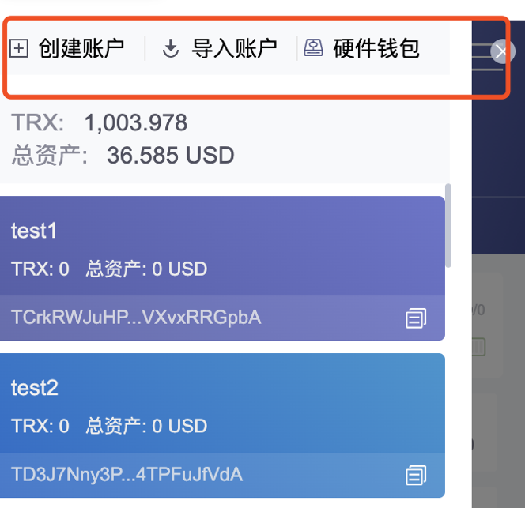

##### 3.7.2.3、准备Trc20合约代码

*[Trc20合约模版](https://github.com/Tron-Developer-Hub/Trc20-Contract-Template/blob/main/Token.sol)*

```javascript
https://github.com/Tron-Developer-Hub/Trc20-Contract-Template/blob/main/Token.sol
```

修改Token.sol文件，定义 **token名称**、**token符号**、**精度**、**发行量**

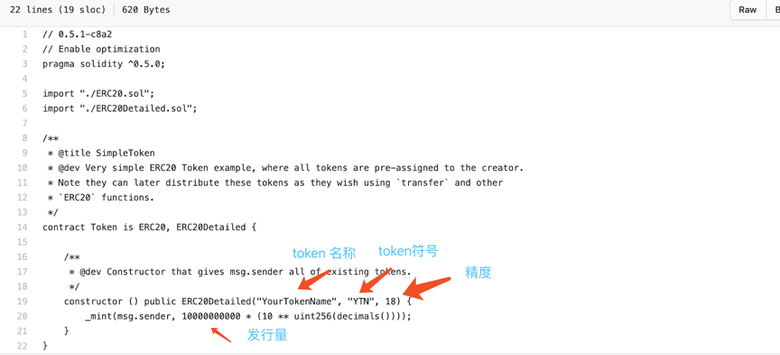

##### 3.7.2.4、部署Trc20合约

*[使用Tronscan进行部署](https://Tronscan.io/#/contracts/contract-compiler)*

###### 3.7.2.4.1、链接钱包

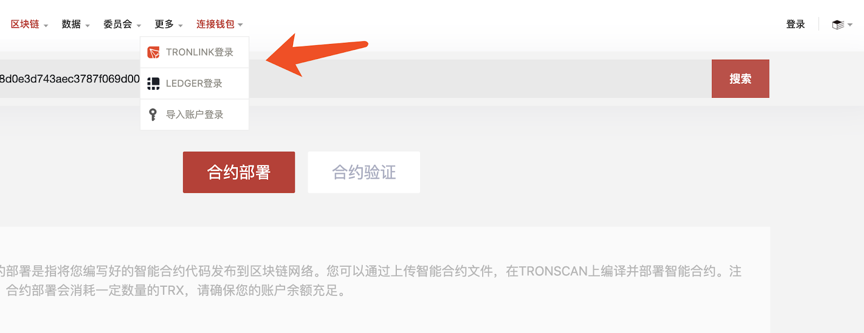

###### 3.7.2.4.2、上传合约代码

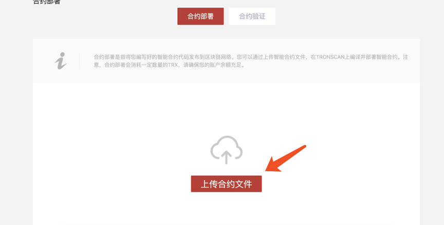

###### 3.7.2.4.3、编译合约（请选择0.5.10版本编译器）

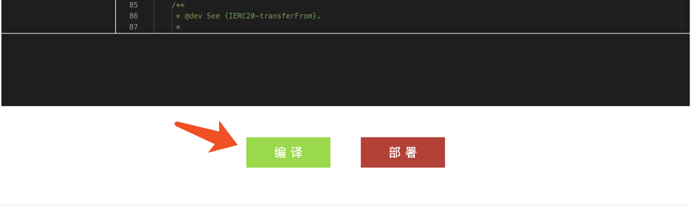

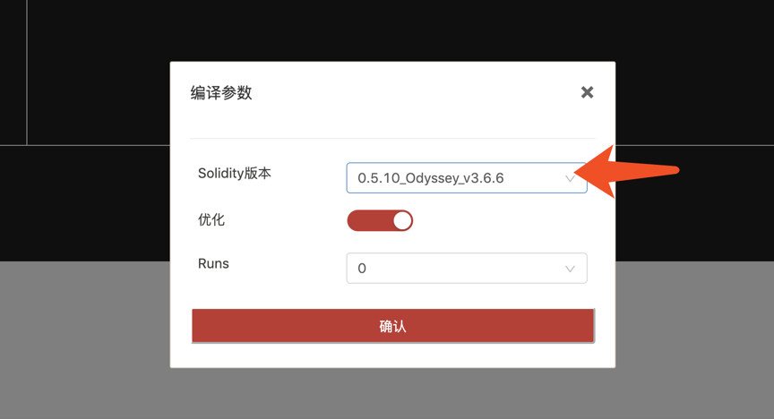

**出现如下提示，表示编译成功**

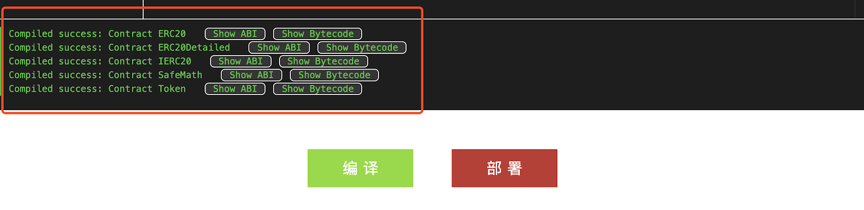


###### 3.7.2.4.4、部署合约

**请注意一定要选择Token合约，因为Token是主合约**


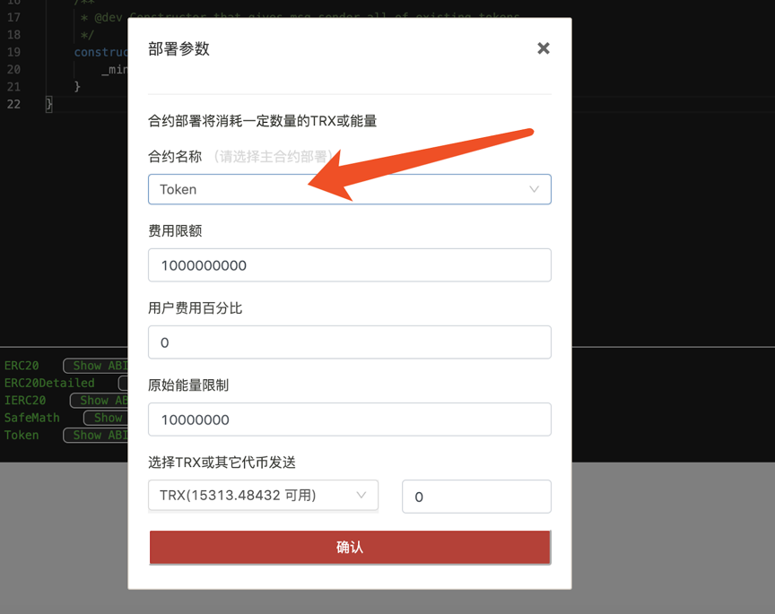

**点击确认进行部署，会弹出Tronlink签名对话框，点接受进行签名**

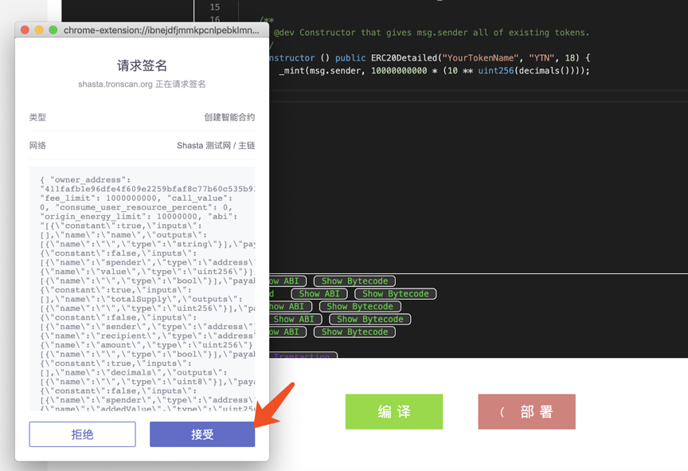

**部署成功，得到合约地址， 请记录下合约地址**

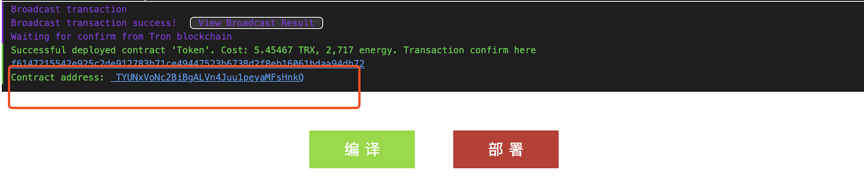

##### 3.7.2.5、录入Trc20通证

[使用Tronscan进行录入](https://Tronscan.org/#/tokens/create/Type)

###### 3.7.2.5.1、选择通证类型录入

**选择Trc20通证，点击确定**

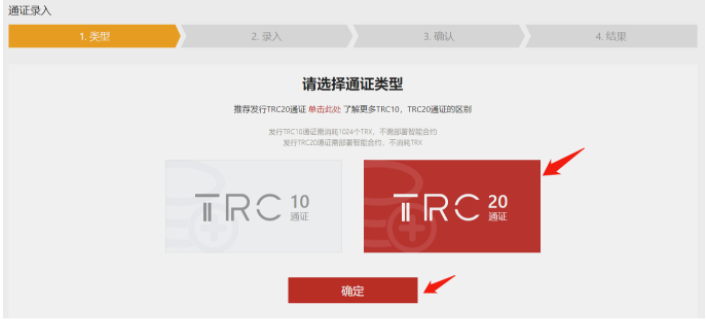

**录入Trc20通证的信息**

```
填写通证的基本信息，合约信息和社交信息。标“*”的内容是必填信息。录入的信息需要和 Trc20合约的信息保持一致。
请注意录入必须用部署者地址登陆。
```

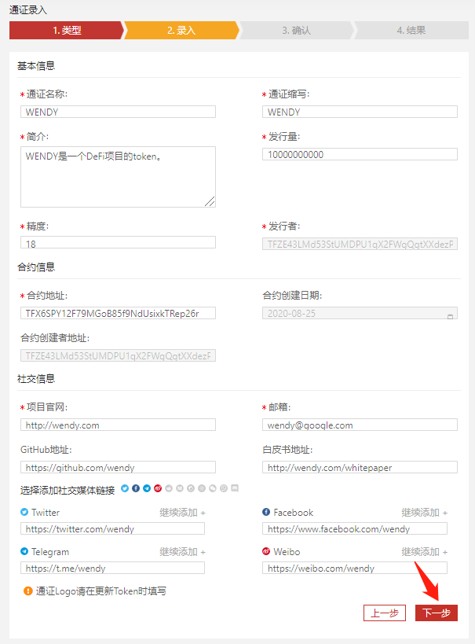

**录入完Trc20通证的信息，点击下一步 : 确认通证信息**

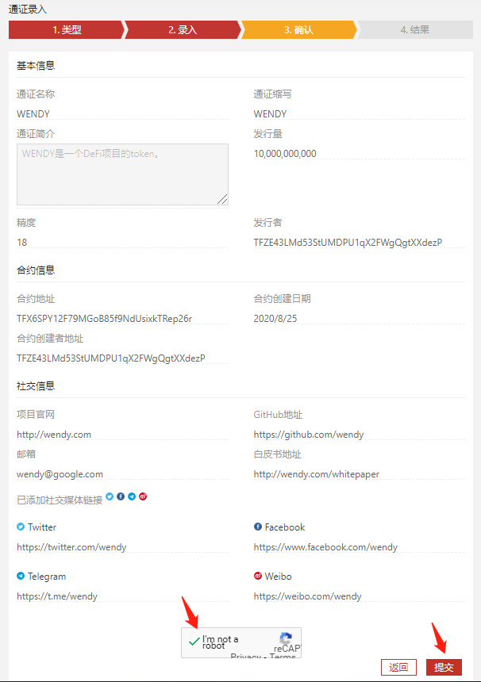

**确认通证信息，勾选I’m not a robot，然后点击提交（注意：此步需要谷歌验证，中国大陆用户可能需要使用VPN才能进入下一步）**

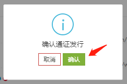


**然后出现确认通证发行提示框，选择确认，会弹出Tronlink签名对话框，点击接受进行签名**

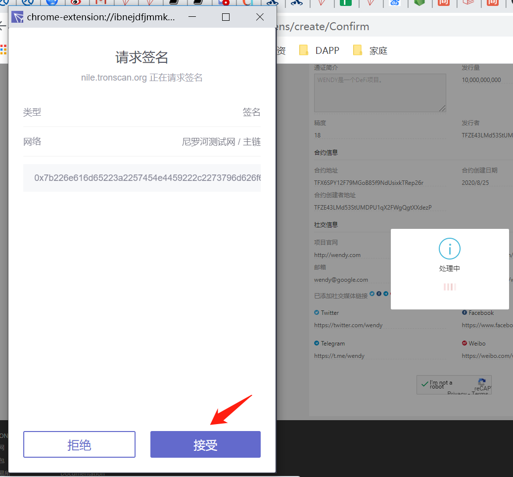

**通证录入成功**

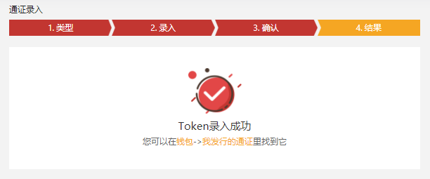


##### 3.7.2.6、添加代币到Tronlink中

**在资产管理页面中，将前面部署成功后得到的合约地址填写到添加通证 输入框中，会弹出刚才部署的合约，点解开关按钮，添加token到Tronlink中。添加成功后就可以进行转账了。**

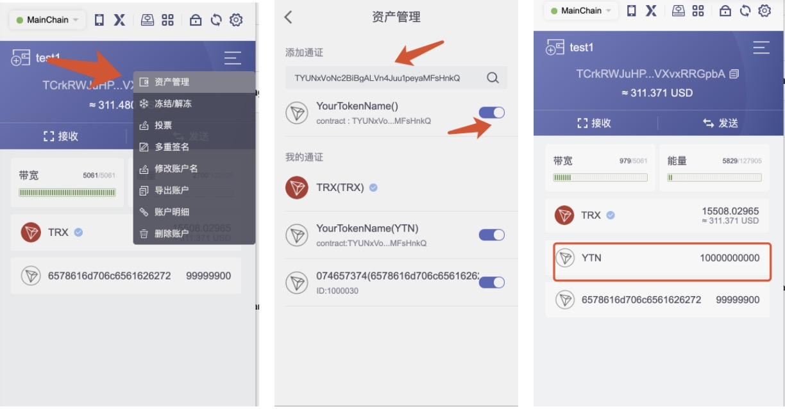

**也可以在Tronscan上搜索到合约主页**

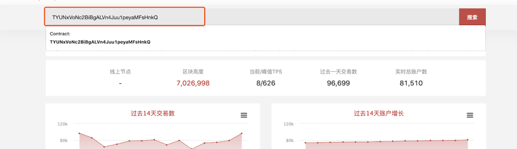

**注：Tronlink插件目前支持主网及Nile测试网添加Token，同时Token需在Tronscan录入成功并且需要2个小时的数据同步。**

##### 3.7.2.7、验证Trc20合约

*[使用Tronscan进行验证](https://Tronscan.org/#/contracts/verify)*

```
填写合约信息包括合约地址，合约名称、编译器版本，License，是否优化和Runs
合约地址是部署合约时记录下来的合约地址

合约名称是部署的主合约名称，例子中是Token
编译器版本是0.5.10版本
License可以选None
是否优化和Runs保持默认的yes和0
```

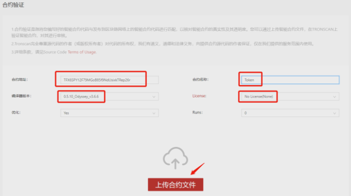

**点击上传合约文件进行验证**

```
点击确认I am not a robot（注意：此步需要谷歌验证，中国大陆用户可能需要使用VPN才能进入下一步）
点击验证并发布, 验证成功会跳转到合约详情页面。
```

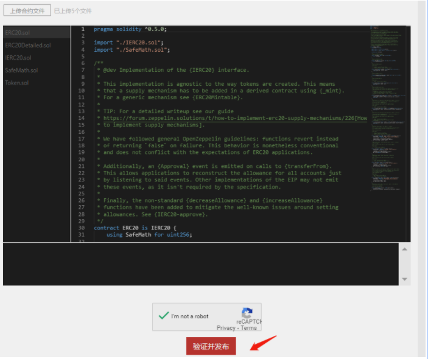

**合约详情页面会显示合约验证成功**

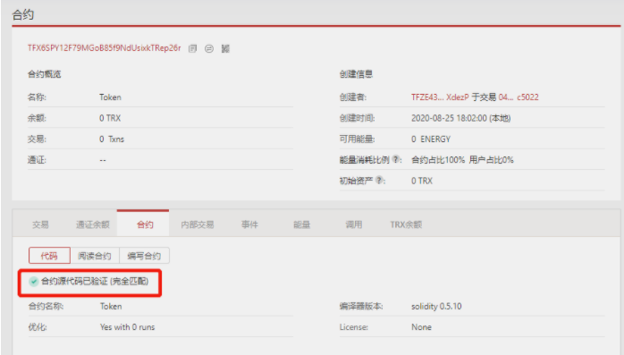

```
需要注意的是，这只是发布数字货币的简单过程，并不包括其他复杂过程，如智能合约编写、白皮书编写、市场推广等。发行数字货币需要花费时间和金钱，并且需要高度的技术知识和市场分析。
```

### 3.8、数字货币的减半

```
1、比特币的总量只有2100万个;（永不超发）
		1.1、从第一个创世区块开始，每10分钟产生一个新区块（随之带来50比特币BTC）;
		1.2、每产生210000个区块 = 每过大约4年时间之后 ===> 区块奖励减半。即：从210001个区块开始（带来 50/2 = 25个比特币BTC）;
```

**lim<sup>n = 0</sup><sub>t → +∞ </sub> BTC<sub>sum</sub>  = 2100万**

```
假设在比特币减半前，每10分钟生成的比特币数量为X，比特币的总数为S。
在比特币减半后，每10分钟生成的比特币数量变成了X/2，比特币的总数仍为S。
那么有如下公式：

S = X + X2 + X2^2 + X2^3 + … + X2^n

其中，n表示比特币减半的次数。根据等比数列求和公式，有：

S = X * (1 - 2^(n+1)) / (1 - 2)
化简后得到：
S = 2 * X * (1 - 2^n)

这个公式告诉我们，比特币的总数S是与初始生成速度X和减半次数n有关的。
当n趋近于无穷大时，S会趋近于2100万个。
```


