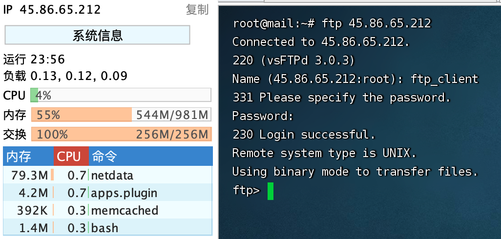

# `FTP`的配置

***FTP** = **F**ile **T**ransfer **P**rotocol = **文件传输协议***

```
1、是在计算机网络的用户端和服务器间传输文件的应用层协议;
2、传送文件（file transfer）和访问文件（file access）之间的区别在于:前者由FTP提供，后者由NFS等应用系统提供;
3、FTP是8位的客户端－服务器协议，能操作任何类型的文件而不需要后续处理，就像MIME或Unicode一样;
4、FTP服务一般运行在20和21两个端口;
		4.1、端口20用于在客户端和服务器之间传输数据流;
		4.2、而端口21用于传输控制流，并且是命令通向FTP服务器的进口;
5、但FTP有极高的延时，意味从开始请求到第一次接收数据间的时间非常长，并且必须不时执行一些冗长的登录进程;		
		5.1、当数据通过数据流传输时，控制流处于空闲状态;而当控制流空闲很长时间后，客户端的防火墙会将其会话置为超时;
		5.2、这样当大量数据通过防火墙时，会产生一些问题。此时，虽然文件可以成功的传输，但因为控制会话，会被防火墙断开;传输会产生一些错误。	
6、FTP有两种使用模式：主动和被动。
		6.1、主动模式要求客户端和服务器端同时打开并且监听一个端口以创建连接。在这种情况下，客户端由于安装了防火墙会产生一些问题。
		6.2、所以，创立了被动模式。被动模式只要求服务器端产生一个监听相应端口的进程，这样就可以绕过客户端安装了防火墙的问题。
7、一个主动模式的FTP连接创建要遵循以下步骤:
		7.1、客户端打开一个随机的端口（端口号大于1024，在这里，我们称它为x），同时一个FTP进程连接至服务器的21号命令端口。此时，该tcp连接的来源地端口为客户端指定的随机端口x，目的地端口（远程端口）为服务器上的21号端口。
		7.2、客户端开始监听端口（x+1），同时向服务器发送一个端口命令（通过服务器的21号命令端口），此命令告诉服务器客户端正在监听的端口号并且已准备好从此端口接收数据。这个端口就是我们所知的数据端口。
		7.3、服务器打开20号源端口并且创建和客户端数据端口的连接。此时，来源地的端口为20，远程数据(目的地)端口为（x+1）。
		7.4、客户端通过本地的数据端口创建一个和服务器20号端口的连接，然后向服务器发送一个应答，告诉服务器它已经创建好了一个连接。
8、语法格式:ftp://[user[:password]@]host[:port]/url-path
```

***FTP**主要有两种：**FTP**协议和**SFTP**协议。*

```
FTP协议（File Transfer Protocol，文件传输协议）是一种标准的互联网协议，用于在网络上传输文件。
FTP协议使用TCP协议进行数据传输和控制连接。使用FTP协议需要通过用户名和密码进行身份验证。

SFTP协议（Secure Shell FTP，安全壳FTP）是FTP协议的安全版本。
SFTP协议通过加密数据传输，提供更高的安全性。SFTP协议使用SSH协议进行数据传输和控制连接。SFTP协议也需要通过用户名和密码进行身份验证。
```

## 1、前置条件

*资料来源*

[Akamai/Install VSFTPD on Ubuntu 20.04](https://www.linode.com/docs/guides/vsftpd-on-ubuntu-2004-installation-and-configuration/)

```
VSFTPD (Very Secure FTP Daemon)是一个安全的轻量级FTP服务器软件，适用于Linux和类unix操作系统。
它支持FTP和FTPS两种传输方式，实现了SSL/TLS加密、PAM认证、基于ip的访问控制等多种安全特性。

VSFTPD的一些关键特性包括:性能和可扩展性:VSFTPD设计高效、快速，可以处理大量并发连接。
安全性:VSFTPD实现了强大的安全措施，以防止未经授权的访问和数据泄露，如SSL/TLS加密、PAM身份验证和chroot监狱。
可定制性:VSFTPD是高度可配置的，可以定制以满足广泛的特定要求。
兼容性:VSFTPD兼容大多数类unix操作系统，包括Linux、FreeBSD和Solaris。
易于使用:VSFTPD易于安装和配置，具有用户友好的配置文件，允许管理员快速设置和自定义服务器。

总的来说，对于需要通过FTP安全地传输文件的组织来说，VSFTPD是一个可靠和安全的选择。
```

```
服务器IP:45.86.65.212
账号:root
密码:Jobs_29506045^
```

```shell
sudo apt update
apt install selinux-utils
```

## 2、`VSFTPD`的安装步骤

```shell
sudo apt install vsftpd ftp ufw -y # UFW 防火墙
sudo systemctl enable vsftpd
sudo systemctl start vsftpd
sudo systemctl status vsftpd
```

```shell
root@mail:~# sudo systemctl status vsftpd
● vsftpd.service - vsftpd FTP server
     Loaded: loaded (/lib/systemd/system/vsftpd.service; enabled; vendor preset: enabled)
     Active: active (running) since Sun 2023-05-28 20:18:24 CEST; 20min ago
   Main PID: 86197 (vsftpd)
      Tasks: 1 (limit: 1074)
     Memory: 584.0K
     CGroup: /system.slice/vsftpd.service
             └─86197 /usr/sbin/vsftpd /etc/vsftpd.conf

May 28 20:18:24 mail systemd[1]: Starting vsftpd FTP server...
May 28 20:18:24 mail systemd[1]: Started vsftpd FTP server.
```

## 3、创建一个`FTP`用户

```
服务器IP:45.86.65.212
账户：ftp_client
密码：Jobs_29506045^
```

```shell
sudo useradd -m ftp_client
sudo passwd ftp_client

useradd -d /home/ftpUser/ -g ftp -s /sbin/nologin ftpUser
```

*创建示例文本 **testfile.txt***

```shell
sudo -u ftp_client sh -c 'echo "This is the content in the file." > /home/ftp_client/testfile.txt'
```


*打开与本地主机上运行的**VSFTPD**服务器的**FTP**连接*

```shell
root@mail:~# ftp localhost
Connected to localhost.
220 (vsFTPd 3.0.3)
Name (localhost:root): ftp_client
331 Please specify the password.
Password:
230 Login successful.
Remote system type is UNIX.
Using binary mode to transfer files.
ftp> 
```

*验证**ftp_client**用户的主目录中的样例文件**testfile.txt**在**FTP**连接中是可见的:*

```shell
ftp> ls /home/ftp_client
200 EPRT command successful. Consider using EPSV.
150 Here comes the directory listing.
-rw-rw-r--    1 2005     2005           33 May 28 20:44 testfile.txt
226 Directory send OK.
ftp> 
```

*关闭**FTP**连接*

```
exit
或者
quit
```

## 4、重启`VSFTPD`

```shell
sudo systemctl restart vsftpd
```

## 5、`vsftpd`的配置文件（vsftpd.conf）

### 5.1、备份

```shell
sudo cp /etc/vsftpd.conf /etc/vsftpd.conf.bak
```

### 5.2、编辑

```
vi /etc/vsftpd.conf
```

```bash
anonymous_enable=NO                    #不允许匿名用户登陆 
local_enable=YES                      #vsftpd所在系统的用户可以登录vsftpd 
write_enable=YES                      #允许使用任何可以修改文件系统的FTP的指令 
local_umask=002                        #匿名用户新增文件的umask数值 
anon_upload_enable=NO                  #匿名用户不可以上传文件 
anon_mkdir_write_enable=NO            #匿名用户不可以修改文件 
xferlog_enable=YES                    #启用一个日志文件，用于详细记录上传和下载。                
use_localtime=YES                      #使用本地时间而不是GMT 
vsftpd_log_file=/var/log/vsftpd.log    #vsftpd日志存放位置 
dual_log_enable=YES                    #用户登陆日志 
connect_from_port_20=YES              #开启20端口      
xferlog_file=/var/log/xferlog          #记录上传下载文件的日志 
xferlog_std_format=YES                #记录日志使用标准格式 
idle_session_timeout=600              #登陆之后超时时间60秒，登陆之后，一分钟不操作，就会断开连接。 
chroot_local_user=YES                  #用于指定用户列表文件中的用户,是否允许切换到上级目录      
listen=YES                            #开启监听 
pam_service_name=vsftpd.vu            #验证文件的名字 
userlist_enable=YES                    #允许由userlist_file指定文件中的用户登录FTP服务器                    
tcp_wrappers=YES                      #支持tcp_wrappers,限制访问(/etc/hosts.allow,/etc/hosts.deny) 
guest_enable=YES                      #起用虚拟用户 
guest_username=taokey                  #虚拟用户名 

#user_config_dir=/etc/vsftpd/vsftpuser  #虚拟用户配置文件路径 
local_root=/home/ftpUser/ #自定义ftp上传路径（注意文件夹权限）
pasv_min_port=35000  
pasv_max_port=45000 
pasv_enable=YES 
pasv_promiscuous=YES 
anon_other_write_enable=YES
```

### 5.3、关闭并保存配置文件。并重启`vsftpd`

```shell
sudo systemctl restart vsftpd
```

### 5.4、查看端口

```shell
root@mail:/etc# netstat -ntlp lgrep vsftpd
Active Internet connections (only servers)
Proto Recv-Q Send-Q Local Address           Foreign Address         State       PID/Program name    
tcp        0      0 0.0.0.0:19999           0.0.0.0:*               LISTEN      42767/netdata       
tcp        0      0 127.0.0.1:20000         0.0.0.0:*               LISTEN      42141/sogod         
tcp        0      0 0.0.0.0:993             0.0.0.0:*               LISTEN      38824/dovecot       
tcp        0      0 0.0.0.0:995             0.0.0.0:*               LISTEN      38824/dovecot       
tcp        0      0 127.0.0.1:10024         0.0.0.0:*               LISTEN      57339/amavisd-new ( 
tcp        0      0 127.0.0.1:10026         0.0.0.0:*               LISTEN      57339/amavisd-new ( 
tcp        0      0 127.0.0.1:3306          0.0.0.0:*               LISTEN      40428/mysqld        
tcp        0      0 127.0.0.1:10027         0.0.0.0:*               LISTEN      57339/amavisd-new ( 
tcp        0      0 127.0.0.1:11211         0.0.0.0:*               LISTEN      27577/memcached     
tcp        0      0 127.0.0.1:9998          0.0.0.0:*               LISTEN      57339/amavisd-new ( 
tcp        0      0 0.0.0.0:110             0.0.0.0:*               LISTEN      38824/dovecot       
tcp        0      0 0.0.0.0:143             0.0.0.0:*               LISTEN      38824/dovecot       
tcp        0      0 0.0.0.0:80              0.0.0.0:*               LISTEN      28354/nginx: master 
tcp        0      0 0.0.0.0:22              0.0.0.0:*               LISTEN      770/sshd: /usr/sbin 
tcp        0      0 0.0.0.0:25              0.0.0.0:*               LISTEN      17592/master        
tcp        0      0 127.0.0.1:8125          0.0.0.0:*               LISTEN      42767/netdata       
tcp        0      0 0.0.0.0:4190            0.0.0.0:*               LISTEN      38824/dovecot       
tcp6       0      0 :::19999                :::*                    LISTEN      42767/netdata       
tcp6       0      0 :::993                  :::*                    LISTEN      38824/dovecot       
tcp6       0      0 :::995                  :::*                    LISTEN      38824/dovecot       
tcp6       0      0 :::110                  :::*                    LISTEN      38824/dovecot       
tcp6       0      0 :::143                  :::*                    LISTEN      38824/dovecot       
tcp6       0      0 :::80                   :::*                    LISTEN      28354/nginx: master 
tcp6       0      0 :::21                   :::*                    LISTEN      112244/vsftpd       
tcp6       0      0 :::22                   :::*                    LISTEN      770/sshd: /usr/sbin 
tcp6       0      0 :::25                   :::*                    LISTEN      17592/master        
tcp6       0      0 ::1:8125                :::*                    LISTEN      42767/netdata       
tcp6       0      0 :::4190                 :::*                    LISTEN      38824/dovecot       
root@mail:/etc# 
```

### 5.5、防火墙

```
```

### 5.7、黑白名单

```

```

## 6、访问

```
1、打开 FTP 客户端程序（例如 FileZilla，CuteFTP，WinSCP 等），并输入要连接的 FTP 服务器的主机名或 IP 地址和端口号;
2、输入 FTP 服务器的用户名和密码。如果您不知道这些凭据，请联系您的 FTP 主机提供商或系统管理员;
3、单击"连接"按钮，等待连接成功;
4、一旦连接成功，您应该能够看到服务器上的文件和文件夹。 您可以使用客户端程序的界面来上传和下载文件，创建和删除文件夹等操作;
```

```
brew install inetutils
```

https://www.jianshu.com/p/d395a16648e1

```bash
ftp 45.86.65.212
```




## 7、服务器的访问

https://wangchujiang.com/linux-command/c/ssh.html

```shell
Last login: Mon May 29 09:24:45 on ttys000
➜  ~ ssh root@45.86.65.212           
The authenticity of host '45.86.65.212 (45.86.65.212)' can't be established.
RSA key fingerprint is SHA256:e/J65VcFwOmN836Mw/bEyFKbDCyNZXCEqm+pIZhDPV8.
This key is not known by any other names
Are you sure you want to continue connecting (yes/no/[fingerprint])? yes
Warning: Permanently added '45.86.65.212' (RSA) to the list of known hosts.
root@45.86.65.212's password: 
Welcome to Ubuntu 20.04 LTS (GNU/Linux 5.4.0-29-generic x86_64)

 * Documentation:  https://help.ubuntu.com
 * Management:     https://landscape.canonical.com
 * Support:        https://ubuntu.com/advantage

  System information as of Mon 29 May 2023 04:27:17 AM CEST

  System load:  0.01               Processes:             140
  Usage of /:   26.2% of 14.46GB   Users logged in:       1
  Memory usage: 45%                IPv4 address for eth0: 45.86.65.212
  Swap usage:   100%               IPv6 address for eth0: 2402:d0c0:2:449b::1

 * Strictly confined Kubernetes makes edge and IoT secure. Learn how MicroK8s
   just raised the bar for easy, resilient and secure K8s cluster deployment.

   https://ubuntu.com/engage/secure-kubernetes-at-the-edge

281 updates can be installed immediately.
186 of these updates are security updates.
To see these additional updates run: apt list --upgradable


*** System restart required ***
Last login: Mon May 29 04:12:53 2023 from 119.15.88.194
root@mail:~# 
```

*telnet 45.86.65.212 和 ssh root@45.86.65.212  的区别*

```
telnet和ssh都是远程登录协议。但是区别如下：

1、telnet是纯文本协议，ssh是加密协议，ssh可以保护数据传输的安全性。
2、telnet不支持文件传输等高级功能，ssh可以支持文件传输和端口转发等高级功能。
3、telnet登录时不需要用户名密码，ssh登录时需要用户名密码或者公钥认证。
4、telnet已经被逐渐淘汰，ssh被广泛应用于Linux和Unix系统的远程登录和管理中。
```

*一个问题的解决*

```
root@mail:~# sudo systemctl status telnet
Unit telnet.service could not be found.
```

```
telnet 服务不是默认安装在许多现代操作系统中的，因为它被认为不够安全

# 什么也没有输出，则表示没有开启该服务
netstat -a | grep telnet

# 安装 openbsd-inetd。如果已经安装过了，会提示已经安装过了，直接执行下面的步骤就可以了。
apt-get install openbsd-inetd

# 安装 telnetd
apt-get install telnetd

# 验证安装：成功安装完之后，/etc/inetd.conf 的内容会多了一行
cat /etc/inetd.conf | grep telnet 输出：
telnet stream tcp nowait telnetd /usr/sbin/tcpd /usr/sbin/in.telnetd

# 重启 openbsd-inetd
/etc/init.d/openbsd-inetd restart

# 这个时候重复第一步操作，则有输出:
netstat -a | grep telnet 输出：
root@mail:~# netstat -a | grep telnet
tcp        0      0 0.0.0.0:telnet          0.0.0.0:*               LISTEN     
tcp        0      0 localhost:telnet        localhost:38616         ESTABLISHED
tcp        0      2 localhost:38616         localhost:telnet        ESTABLISHED

# telnet 登陆测试
root@mail:~# telnet 127.0.0.1
Trying 127.0.0.1...
Connected to 127.0.0.1.
Escape character is '^]'.
Ubuntu 20.04 LTS
mail login: root
Password: 
Welcome to Ubuntu 20.04 LTS (GNU/Linux 5.4.0-29-generic x86_64)

 * Documentation:  https://help.ubuntu.com
 * Management:     https://landscape.canonical.com
 * Support:        https://ubuntu.com/advantage

 System information disabled due to load higher than 1.0

 * Strictly confined Kubernetes makes edge and IoT secure. Learn how MicroK8s
   just raised the bar for easy, resilient and secure K8s cluster deployment.

   https://ubuntu.com/engage/secure-kubernetes-at-the-edge

281 updates can be installed immediately.
186 of these updates are security updates.
To see these additional updates run: apt list --upgradable

New release '22.04.2 LTS' available.
Run 'do-release-upgrade' to upgrade to it.


*** System restart required ***
Last login: Mon May 29 04:46:48 CEST 2023 from localhost on pts/2
root@mail:~# 

```

[简书/ubuntu下安装telnet服务](https://www.jianshu.com/p/1c6d99e078b6)

https://blog.csdn.net/whbttst/article/details/96428805

[CSDN/telnet Connection closed by foreign host.](https://blog.csdn.net/whbttst/article/details/96428805)


