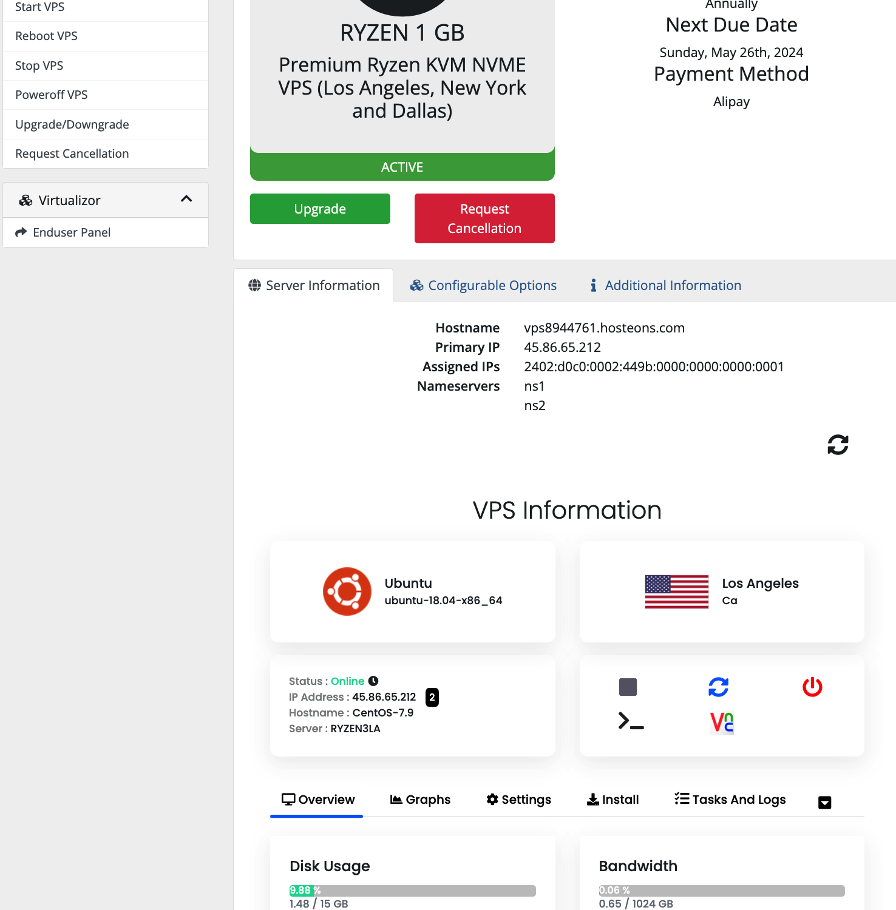
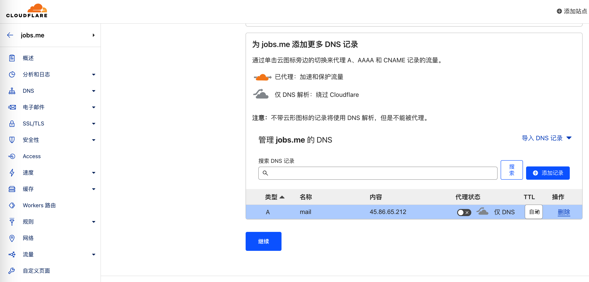

# 搭建邮件服务器（Mail server）

[toc]
- [搭建邮件服务器（Mail server）](#搭建邮件服务器mail-server)
	- [1、基础概念介绍](#1基础概念介绍)
		- [1.1、SMTP](#11smtp)
		- [1.2、用户代理](#12用户代理)
		- [1.3、PTR 反向解析](#13ptr-反向解析)
		- [1.4、 电子邮件系统中的邮件交换记录(PTR Record)](#14-电子邮件系统中的邮件交换记录ptr-record)
	- [2、搭建流程](#2搭建流程)
		- [2.1、连接`VPS`](#21连接vps)
			- [2.1.1、相关准备工作](#211相关准备工作)
			- [2.1.2、运行下列代码](#212运行下列代码)
		- [2.2、更改主机名为`mail`，更改当前计算机的完整域名为`mail.Jobs.me`](#22更改主机名为mail更改当前计算机的完整域名为mailjobsme)
		- [2.4、下载安装`iRedMail`](#24下载安装iredmail)
		- [2.5、配置 `iRedMail` 邮件服务器](#25配置-iredmail-邮件服务器)
			- [2.5.1、解析域名 `mail.jobs.me`](#251解析域名-mailjobsme)
			- [2.5.2、申请`SSL`证书](#252申请ssl证书)
				- [2.5.2.1、80 端口空闲的验证申请](#252180-端口空闲的验证申请)
				- [2.5.2.2、Nginx 的方式验证申请](#2522nginx-的方式验证申请)
				- [2.5.2.3、Http 的方式验证申请](#2523http-的方式验证申请)
				- [2.5.2.4、DNS 验证的方式申请证书](#2524dns-验证的方式申请证书)
			- [2.5.3、安装证书到指定文件夹](#253安装证书到指定文件夹)
*资料来源*

[百度百科/邮件服务器](https://baike.baidu.com/item/%E9%82%AE%E4%BB%B6%E6%9C%8D%E5%8A%A1%E5%99%A8/985736)

[百度百科/SMTP](https://baike.baidu.com/item/SMTP/175887?fromModule=lemma_inlink&fromtitle=%E7%AE%80%E5%8D%95%E9%82%AE%E4%BB%B6%E4%BC%A0%E9%80%81%E5%8D%8F%E8%AE%AE&fromid=5927681)

[维基百科/反向DNS](https://zh.wikipedia.org/wiki/%E5%8F%8D%E5%90%91DNS)

[百度百科/PTR记录](https://baike.baidu.com/item/PTR%E8%AE%B0%E5%BD%95/8243039)

## 1、基础概念介绍

```
1、邮件服务器是一种用来负责电子邮件收发管理的设备，构成了电子邮件系统的核心;
2、它比网络上的免费邮箱更安全和高效，因此一直是企业公司的必备设备
```

### 1.1、SMTP

***SMTP** = **S**imple **M**ail **T**ransfer **P**rotocol = 简单邮件传送协议 = 是因特网电子邮件系统首要的应用层协议*

```
1、协议和服务的介绍
		1.1、在 RFC 821中定义的，相对简单的基于文本的协议;
		1.2、由于这个协议开始是基于纯 ASCII 文本的，它在二进制文件上处理得并不好;
		1.3、SMTP 的历史比 HTTP 早得多，其 RFC 是在1982年编写的，而 SMTP 的现实使用又在此前多年就有了;
		1.4、SMTP 协议属于 TCP/IP 协议族，它帮助每台计算机在发送或中转信件时找到下一个目的地;
		1.5、是建立在FTP文件传输服务上的一种邮件服务;
		1.6、SMTP 重要的特性之一是它能跨越网络传输邮件，也即"SMTP 邮件中继"。
				1.6.1、使用 SMTP，可实现相同网络上处理机之间的邮件传输，也可以通过中继器或网关实现某处理机与其它网络之间的邮件传输。
				1.6.2、具有域名服务系统(DNS)功能的邮件交换服务器还可以用来识别出传输邮件的下一跳 IP 地址;
		1.7、SMTP 的局限性表现在只能发送ASCII码格式的报文，不支持中文、法文、德文等，它也不支持语音、视频的数据;
		1.8、通过 MIME 协议，对 SMTP 补充。MIME使用网络虚拟终端(NVT)标准，允许非 ASCII 码数据通过 SMTP 传输;
		1.9、最初的 SMTP 的局限之一在于它没有对发送方进行身份验证的机制。因此，后来定义了SMTP-AUTH扩展;
		1.10、反垃圾邮件:Internet Mail 2000就是一个替代SMTP的建议方案;
2、使用由 TCP 提供的可靠的数据传输服务：发信人（邮件服务器） => 收信人（邮件服务器）
3、跟大多数应用层协议一样，SMTP 也存在两个端:
		3.1、在发信人的邮件服务器上执行的客户端;
		3.2、在收信人的邮件服务器上执行的服务器端;
4、SMTP 的基本操作:演示甲 ===> 乙
		对甲方:
		4.1、甲的用户代理 ===（消息 + 邮件地址）===> 甲的邮件服务器.排入某个消息队列中 ===> 准备发送本邮件消息;
		4.2、甲（邮件服务器.SMTP 客户端）===（通过 TCP 连接，通过最初的一些 SMTP 握手，打开并发送）===> 乙（邮件服务器.SMTP 服务端）;
		对乙方:
		4.3、乙（邮件服务器.SMTP 服务端）===> 乙的邮箱 ===> 乙的用户代理 ===> 阅读
5、需注意的是，SMTP 通常不使用中间的邮件服务器主机中转邮件。即便源端和目的端邮件服务器主机位于地球上相反的位置也一样。
		即，乙方服务器异常，导致消息发送失败，则消息处于甲方服务器，而非中转站
6、SMTP 把邮件消息从发送端邮件服务器传送到接收端邮件服务器的具体过程:
		6.1、建立连接:
				6.1.1、尝试建立 TCP 连接:端口号25
				6.1.2、如果接收邮件服务器当前不在工作，SMTP客户就等待一段时间后再尝试建立该连接。
				6.1.3、连接建立以后，进入 SMTP 握手阶段:SMTP客户向服务器分别指出发信人和收信人的电子邮件地址
		6.2、实质性的信息发送阶段:
				6.2.1、如果客户还有其他邮件消息需发送到同一个服务器，它就在同一个TCP连接上重复上述过程
				6.2.2、否则，它就指示 TCP 关闭该连接
		6.3、连接释放:
				6.3.1、SMTP 客户发出退出命令，服务器在处理命令后进行响应，随后关闭 TCP 连接。
7、SMTP VS HTTP
	7.1、都是用于从一台主机向另一台主机传送文件（使用持久连接）：
			HTTP:Web 服务器 ===文件(或对象)===>  Web 用户代理(即浏览器)
			SMTP:邮件服务器A ===电子邮件消息===> 邮件服务器B
	7.2、信息流拉起的方向:
			7.2.1、HTTP:内拉式协议(pull protocol) 连接是由想要接收文件的主机发起的;
			7.2.2、SMTP:外推式协议(push Protocol)连接是由想要发送文件的主机发起的;
	7.3、SMTP要求包括信体部分在内的每个邮件消息都是7位 ASCII 文本格式
```

### 1.2、用户代理

```
允许用户阅读、回复、转寄、保存和编写邮件消息（有时称为邮件阅读器）
```

### 1.3、PTR 反向解析

```
域名解析（正向解析）。即，A记录: 从域名 ===映射===> IP 地址
PTR 反向解析（逆向解析）。即，PTR记录: IP 地址 ===映射===> 到域名

在计算机网络中，反向DNS查找或反向DNS解析（rDNS）是查询域名系统（DNS）来确定IP地址关联的域名的技术——通常的"转发"的反向DNS查找域名的IP地址。
反向DNS查询的过程使用PTR记录。
互联网的反向DNS数据库植根于 .arpa 顶级域名。

因为一个 IP 可能被多个域名使用，所以在进行反向解析时要先验证一个 IP 地址是否对应一个或者多个域名。
若从 IP 出发遍历整个 DNS 系统来验证，将会因工程浩大而无法实现。
因此，RFC1035 定义了 PTR（Pointer Record）记录。PTR 记录将 IP 地址指向域名。
```

### 1.4、 电子邮件系统中的邮件交换记录(PTR Record)

```
1、PTR记录 = Pointer Record = 指针记录 = 电子邮件系统中的邮件交换记录的一种数据类型;
2、另一种邮件交换记录是A记录（在IPv4协议中）或AAAA记录（在IPv6协议中）;
3、PTR记录常被用于反向地址解析;
4、被互联网标准文件RFC1035所定义:与其相对应的是A记录、地址记录。二者组成邮件交换记录;
5、当正向域名解析完成后，还应当向您的线路接入商（ISP）申请做反向地址解析，以减少被国外机构退信的可能性;
6、邮件服务器收到邮件的时候，会查询邮件是从那个IP发出的，根据这个地址做反向解析。
	6.1、如果反向解析得到的域名 ≠ 发送邮件的域名 ===> 邮件不是从真正的服务器发出的 ===> 导致邮件被拒收，造成退信
```

## 2、搭建流程

*资料来源*

[自建企业级邮件服务器、域名邮箱！iRedMail 企业级邮件系统搭建、配置、优化教程！](https://v2rayssr.com/iredmail.html)

[VPS自建邮件服务器，免费开源的iRedMail企业级邮件系统、域名邮箱！测试邮件的满分！搬瓦工VPS搭建企业邮局！](https://www.youtube.com/watch?v=pwgU4FRck98)

[segmentfault/从0到1搭建域名邮件服务器](https://segmentfault.com/a/1190000040727863)

*搭建的意义*

```
1、ZOH O免费邮箱，可以建立属于自己的域名邮箱。类似于:admin@jobs.me;
2、ZOHO 广告多，Yandex 或者 ZOHO，都存在不同程度的局限性;
3、由宝塔邮局等一些邮件系统，发送的邮件，大概率会进入对方的垃圾箱，且有丢失邮件的情况;
特别是有自己网站和公司的，需要有自己的邮件系统

我们需要一个稳定、安全可靠、不丢失文件、不被判定为广告垃圾...
免费、开源的 iRedMail 就很不错
```

*服务器配置*

**https://hosteons.com/**

```
1、内存 > 1GB
2、操作系统推荐:CentOS、Ubuntu
3、域名托管:Cloudflare（解析生效快）
4、VPS 最好要能够支持 PTR 反向解析
```

### 2.1、连接`VPS`

#### 2.1.1、相关准备工作



*打开 FinalShell*

```
IP:45.86.65.212
账号:root
密码:Jobs_29506045^
```

```
连接主机...
连接主机成功
Welcome to Ubuntu 18.04 LTS (GNU/Linux 4.15.0-22-generic x86_64)

 * Documentation:  https://help.ubuntu.com
 * Management:     https://landscape.canonical.com
 * Support:        https://ubuntu.com/advantage

New release '20.04.6 LTS' available.
Run 'do-release-upgrade' to upgrade to it.

Last login: Thu May 25 14:45:58 2023 from 36.37.187.89
root@CentOS-7:~# 
```

#### 2.1.2、运行下列代码

*更新系统、安装组件*

```ruby
yum update -y  #CentOS 命令
yum install wget curl sudo tar socat bind-utils -y  #CentOS 命令
或者
apt-get update -y #Debian/Ubuntu 命令
dpkg --configure -a #Debian/Ubuntu 命令
apt-get install wget curl sudo tar socat bind-utils -y #Debian/Ubuntu 命令

sudo apt-get install hostname #Debian/Ubuntu 命令
```

*安装 vim*

```ruby
yum install vim  #CentOS 命令
或者
apt-get install vim #Debian/Ubuntu 命令
```

*卸载 vim*

```ruby
yum -y remove vim  #CentOS 命令

sudo apt-get remove vim #Debian/Ubuntu 命令
要同时移除所有相关的配置文件，可以使用以下命令：
sudo apt-get purge vim #Debian/Ubuntu 命令
```

### 2.2、更改主机名为`mail`，更改当前计算机的完整域名为`mail.Jobs.me`

*编辑`/etc/hosts`文件*

```
127.0.0.1	localhost
127.0.0.1 Ubuntu
127.0.0.1 mail.jobs.me mail
# The following lines are desirable for IPv6 capable hosts
::1     localhost ip6-localhost ip6-loopback
ff02::1 ip6-allnodes
ff02::2 ip6-allrouters
```

*编辑`/etc/hostname`文件*

```
mail
```

*重启*

```
reboot
```

*在Ubuntu系统下，hostname -f命令用于查询当前计算机的完整域名。其中“-f”表示“完整域名”*

*这个命令会返回计算机的主机名和域名的组合*

*例如：ubuntu.example.com。*

```shell
连接主机...
连接主机成功
[root@mail ~]# hostname
mail
[root@mail ~]# hostname -f
mail.Jobs.me
[root@mail ~]# 
```

**更改主机名成功**🍺

### 2.4、下载安装`iRedMail`

[iredmail 官网下载地址](https://www.iredmail.org/download.html)

*先去官网下载文件，获得下载链接地址，分析最新版本号，进行对比填充*

```shell
wget https://github.com/iredmail/iRedMail/archive/1.6.3.tar.gz -O /root/iRedMail.tar.gz
tar -xf iRedMail.tar.gz
cd iRedMail-1.6.3
bash iRedMail.sh
```

[安装过程图](https://v2rayssr.com/iredmail.html)

**数据库密码：Jobs295060456**

**重启服务器，让邮件服务器生效！**

*至此，邮件服务器搭建完毕，以下开始设置邮件服务器。*

### 2.5、配置 `iRedMail` 邮件服务器

#### 2.5.1、解析域名 `mail.jobs.me`

*添加站点：Jobs.me*



*等待域名生效*

```
名称服务器更新的速度通常取决于多个因素，包括但不限于：

1、进行更新的域名服务器本身的特征，例如其网络速度，负载，缓存情况等；
2、DNS记录的TTL（生存时间），即记录在缓存中的时间；
3、不同DNS服务器之间的同步延迟；
4、在更新后重新传播记录的时间，以及可能包含更新的任何中间DNS服务器传播的时间。

一般来说，名称服务器更新通常需要几个小时至一天的时间才能生效。但是，这是一个估计值，具体时间可能会有所不同。
```

*如果域名尚未成功解析，这个时候去申请SSL证书，可以成功吗？*

```
不可以。
SSL证书需要在域名解析成功后才能申请，因为SSL证书需要验证域名的所有权。
如果域名没有成功解析，证书颁发机构无法验证域名所有权，因此无法颁发SSL证书。
```

#### 2.5.2、申请`SSL`证书

*利用 Acme 脚本申请证书，是我们用到的最常见的一种证书的申请方式*

```shell
从 acme.sh v 3.0.0 开始，acme.sh 使用 Zerossl 作为默认 ca，
必须先注册帐户（一次），然后才能颁发新证书。
具体操作步骤如下：
1、安装 Acme 脚本之后，请先执行下面的命令（下面的邮箱为你的邮箱）
~/.acme.sh/acme.sh --register-account -m xxxx@xxxx.com
2、其他的命令暂时没有变动
```

```shell
curl https://get.acme.sh | sh #安装 Acme 脚本
~/.acme.sh/acme.sh --register-account -m lg295060456@gmail.com

apt update -y          #Debian/Ubuntu 命令
apt install -y curl    #Debian/Ubuntu 命令
apt install -y socat    #Debian/Ubuntu 命令
或者
yum update -y          #CentOS 命令
yum install -y curl    #CentOS 命令
yum install -y socat    #CentOS 命令

~/.acme.sh/acme.sh  --issue  -d mail.jobs.me  --webroot  /var/www/html
```

##### 2.5.2.1、80 端口空闲的验证申请

*如果你还没有运行任何 web 服务, 80 端口是空闲的, 那么 Acme.sh 还能假装自己是一个 WebServer, 临时监听在 80 端口, 完成验证*

```shell
~/.acme.sh/acme.sh  --issue -d mail.jobs.me   --standalone
```

##### 2.5.2.2、Nginx 的方式验证申请

*这种方式需要你的服务器上面已经部署了 Nginx 环境，并且保证你申请的域名已经在 Nginx 进行了 conf 部署。（被申请的域名可以正常被打开）*

```shell
~/.acme.sh/acme.sh --issue  -d mail.jobs.me  --nginx
```

##### 2.5.2.3、Http 的方式验证申请

这种方式需要你的服务器上面已经部署了网站环境。（被申请的域名可以正常被打开）

原理：Acme 自动在你的网站根目录下放置一个文件, （这个文件可以被互联网访问）来验证你的域名所有权,完成验证. 然后就可以生成证书了.

实例代码：（后面的路径请更改为你的 `网站根目录` `绝对路径` ）

```shell
~/.acme.sh/acme.sh  --issue  -d mail.jobs.me -d www.mail.jobs.me  --webroot  /home/wwwroot/mydomain.com/
```

##### 2.5.2.4、DNS 验证的方式申请证书

```
这种方式的好处是:你不需要任何服务器，不需要任何公网 ip，只需要 dns 的解析记录即可完成验证。
坏处是:如果不同时配置 Automatic DNS API，使用这种方式 acme.sh 将无法自动更新证书，每次都需要手动再次重新解析验证域名所有权。

Acme.sh 目前支持 cloudflare, dnspod, cloudxns, godaddy 以及 ovh 等数十种解析商
该方式可以申请多域名、泛域名证书，达到很多域名可以共用一张证书的目的。
```

#### 2.5.3、安装证书到指定文件夹

**注意:默认生成的证书都放在安装目录下: `~/.acme.sh/ `请不要直接使用此目录下的证书文件。**


*SSL证书的正确使用方式*

```shell
~/.acme.sh/acme.sh --installcert -d mail.jobs.me --key-file /etc/pki/tls/private/iRedMail.key --fullchain-file /etc/pki/tls/certs/iRedMail.crt
```


