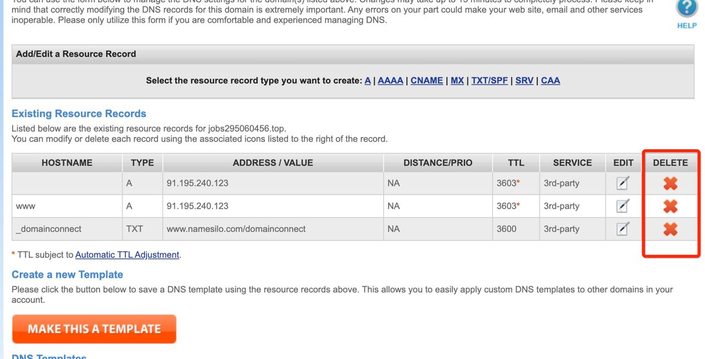
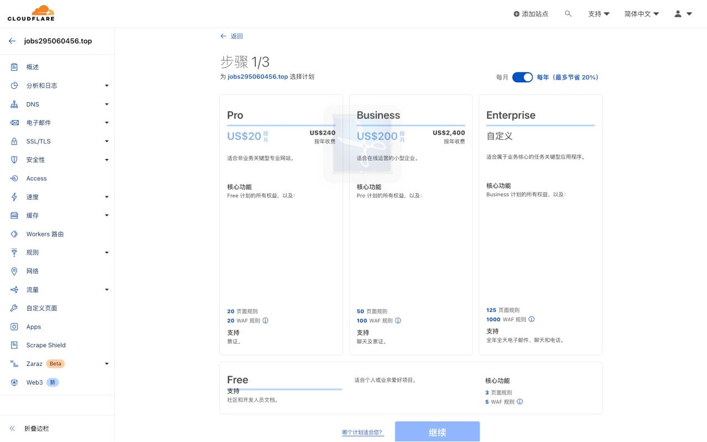
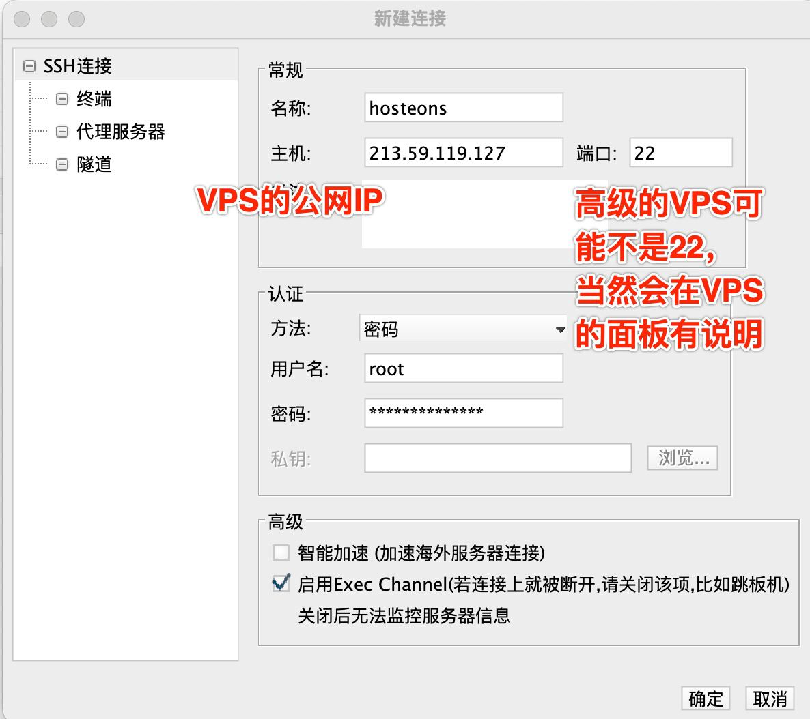
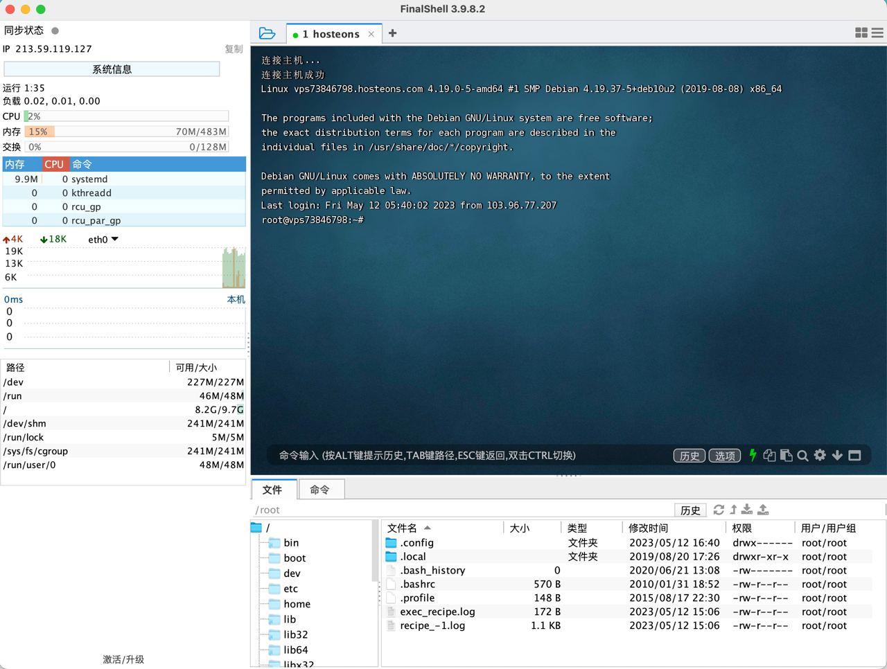
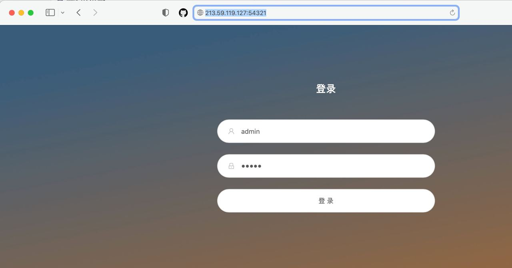
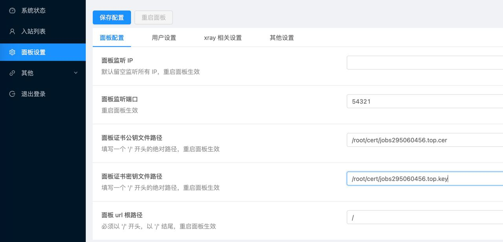
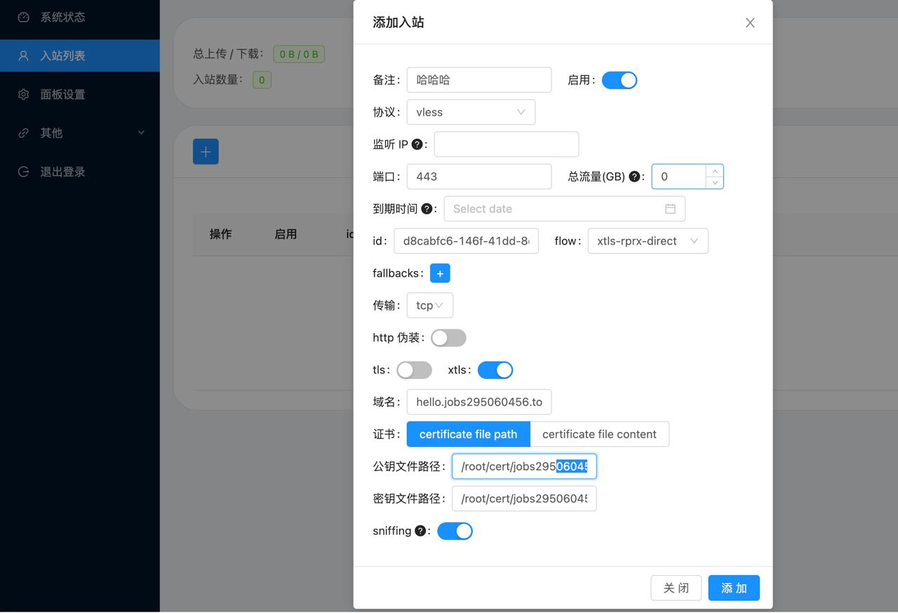
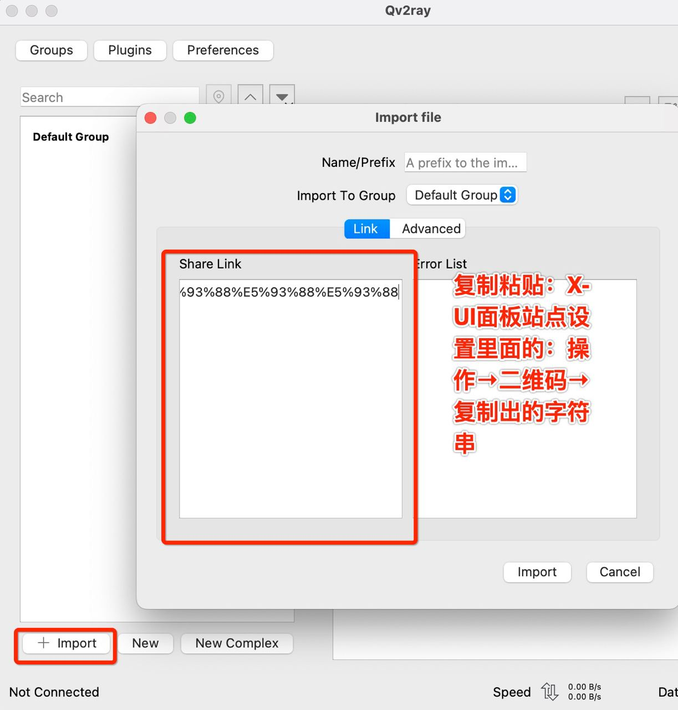
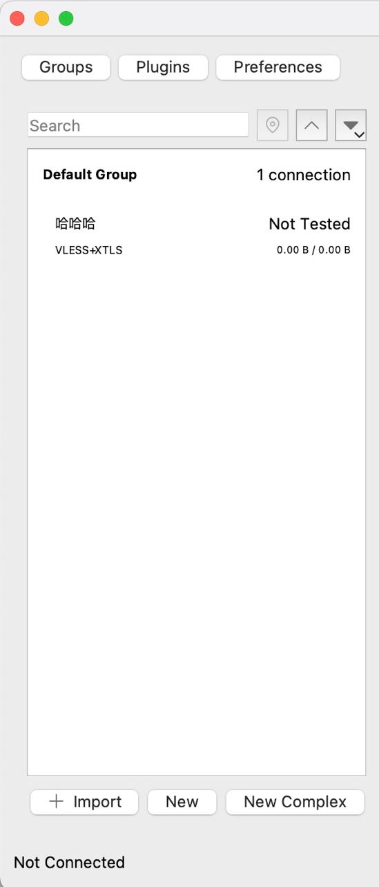

#  科学上网【自建 OVZ 机型的 VPS 】

[toc]

- [科学上网【自建 OVZ 机型的 VPS 】](#科学上网自建-ovz-机型的-vps-)
  - [1、前言](#1前言)
  - [2、使用到的工具](#2使用到的工具)
  - [3、流程](#3流程)
    - [3.1、Namesilo](#31namesilo)
      - [3.1.1、身份认证](#311身份认证)
      - [3.1.2、 DNS管理](#312-dns管理)
    - [3.2、Cloudflare](#32cloudflare)
      - [3.2.1、注册](#321注册)
      - [3.2.2、添加站点](#322添加站点)
      - [3.2.3、选择（Free）计划](#323选择free计划)
      - [3.2.4、查看记录](#324查看记录)
      - [3.2.5、更改您的名称服务器（完毕以后，需要刷新 Cloudflare ，检查是否生效）](#325更改您的名称服务器完毕以后需要刷新-cloudflare-检查是否生效)
      - [3.2.6、成功生效](#326成功生效)
    - [3.3、hosteons](#33hosteons)
      - [3.3.1、注册](#331注册)
      - [3.3.2、服务器的购买和设置](#332服务器的购买和设置)
      - [3.3.3、hosteons  ↔ Cloudflare](#333hosteons---cloudflare)
        - [3.3.3.1、进入 hosteons → DNS  → 添加记录](#3331进入-hosteons--dns---添加记录)
        - [3.3.3.2、检测二级域名是否成功](#3332检测二级域名是否成功)
    - [3.4、SSH工具连接 VPS](#34ssh工具连接-vps)
    - [3.5、部署`X-UI`](#35部署x-ui)
    - [3.6、访问`X-UI`面板](#36访问x-ui面板)
    - [3.7、申请SSL证书](#37申请ssl证书)
      - [3.7.1、在`FinalShell`下输入`x-ui`,调出`X-UI`的管理脚本，输入`16`](#371在finalshell下输入x-ui调出x-ui的管理脚本输入16)
      - [3.7.2、完成一些设置](#372完成一些设置)
        - [3.7.2.1、域名设置](#3721域名设置)
        - [3.7.2.2、密钥设置](#3722密钥设置)
        - [3.7.2.3、注册邮箱设置，即输入`Cloudflare`的用户名](#3723注册邮箱设置即输入cloudflare的用户名)
        - [3.7.2.4、相关日志打印](#3724相关日志打印)
      - [3.7.3、`/root/cert` 证书文件夹](#373rootcert-证书文件夹)
      - [3.7.4、`X-UI`面板证书设置](#374x-ui面板证书设置)
    - [3.8、在`X-UI`面板里面部署入站节点](#38在x-ui面板里面部署入站节点)
    - [3.9、使用`Qv2ray`](#39使用qv2ray)
      - [3.9.1、安装](#391安装)
      - [3.9.2、数据导入](#392数据导入)
    - [3.10、IP优选：套用CDN拯救线路](#310ip优选套用cdn拯救线路)
      - [3.10.1、准备工作](#3101准备工作)
        - [3.10.1.1、断开Qv2ray链接并删除(图略)](#31011断开qv2ray链接并删除图略)
        - [3.10.1.2、在X-UI面板-入站列表里面，删除刚才配置的节点(图略)](#31012在x-ui面板-入站列表里面删除刚才配置的节点图略)
      - [3.10.2、操作流程](#3102操作流程)
        - [3.10.2.1、打开DNS：Cloudflare，找到解析域名的地方，开启代理](#31021打开dnscloudflare找到解析域名的地方开启代理)
        - [3.10.2.2、Cloudflare里面SSL/TLS 加密模式设置为完全（严格）](#31022cloudflare里面ssltls-加密模式设置为完全严格)
        - [3.10.2.3、在`X-UI`面板里面建立`VLESS+WS+TLS`的代理节点](#31023在x-ui面板里面建立vlesswstls的代理节点)
        - [3.10.2.4、Cloudflare设置请求头](#31024cloudflare设置请求头)
        - [3.10.2.5、Cloudflare设置服务器地址](#31025cloudflare设置服务器地址)

## 1、前言

*资料来源*

[youtube/自建VPS科学上网节点！一个视频就够了！6.88RMB/月无限流量看8K！域名注册、解析、托管Cloudflare、证书申请、套用CDN！保姆级VPN搭建教程！（关联翻墙/VPS推荐/节点搭建）](https://www.youtube.com/watch?v=Stdj6U568S0)

[v2rayssr综合网/保姆级节点搭建！VPS、域名、CF、VLESS小白教程！1刀/月的VPS居然可以看8K？新手这一个教程就够了](https://v2rayssr.com/teach-vless.html)

*VPS 是什么？*

```
把一部服务器分割为多个服务器，每个服务器拥有自己独立的公网IP地址以及独立的操作系统
VPS 分国内的和国外的。国外的 VPS 就是我们科学上网所需要的 VPS
我们可以通过访问国外的 VPS 来访问 YouTube
通过这么一个中转站，我们可以访问被墙的资源
```

*特点*

```
1、无限流量
2、小白入门
3、价格便宜
```

## 2、使用到的工具

| 域名购买       | Namesilo          | https://www.namesilo.com                                     | 可以使用支付宝 |
| -------------- | ----------------- | ------------------------------------------------------------ | -------------- |
| CDN            | Cloudflare        | https://www.cloudflare.com/zh-cn/                            | 可以使用支付宝 |
| 服务器购买     | hosteons          | https://hosteons.com/                                        | 可以使用支付宝 |
| SSH工具        | FinalShell        | http://www.hostbuf.com/                                      | 免费           |
| 服务器监控工具 | X-UI              | apt update -y<br/>apt install -y curl socat<br/>bash <(curl -Ls https://raw.githubusercontent.com/vaxilu/x-ui/master/install.sh) | 免费           |
| SSL证书申请    | x-ui 和Cloudflare | 16                                                           | 免费           |

## 3、流程

### 3.1、Namesilo

#### 3.1.1、身份认证

**https://www.namesilo.com/account_profile.php**

```javascript
未完成身份认证的时候，购买域名完成以后，需要有身份认证

如果身份认证已通过，则:
https://www.namesilo.com/account_profile.php 重定向为 https://www.namesilo.com/account_home.php

注：身份认证不核验电话号码，但是必须全英文，不接受中文，地址随机英文字也可
```


#### 3.1.2、 DNS管理

**https://www.namesilo.com/account_domain_manage_dns.php**

*删除默认配置*



**自此，域名`jobs295060456.top`购买成功**

### 3.2、Cloudflare

**https://www.cloudflare.com/zh-cn/**

```
Cloudflare 是一个广受欢迎的云安全和性能服务提供商，它为网站、应用程序、API 等提供加速、安全和可靠的服务。
主要功能包括：
1、CDN (内容分发网络) 加速 - 让您的网站、应用程序等运行更快的全球 CDN。
2、DDoS (分散式拒绝服务攻击) 防护 - 保护您的网站、应用程序等免于恶意攻击。
3、网络优化技术 - 使您的网站、应用程序等更快、更安全、更可靠。
4、SSL/TLS (安全套接字层/传输层安全协议) 安全证书 - 保护您的访问者和您的数据免受数据泄露、网络窃听等风险。
5、WAF(Web 应用程序防火墙) - 防止您的应用程序受到各种网络攻击，例如 SQL 注入，跨站点脚本等等。
6、Bot 管理 - 防止恶意和垃圾邮件的机器人访问您的网站、应用程序等。
```

```
Cloudflare 是一个内容分发网络，即:CDN。
对于我们搭建节点来说，就是一个转发的服务器。
常规站就是我们本地数据和远程服务器数据进行交换即可，如果是套用 Cloudflare，我们的数据就可以通过 Cloudflare 进行转发。
转发的网络速度受制于我们本地计算机👉🏻Cloudflare 的速度。
本质来讲，一个优秀的 VPS 线路，通常来说是不需要数据的转发
但是对于低配 VPS 来说，使用 Cloudflare 以后，就会有意想不到的一些结果。

我们需要注册一个 Cloudflare，并把我们的域名托管到 Cloudflare;
也就是 Cloudflare 来接管我们的域名管理业务;
就算我们不使用 Cloudflare 的 CDN 业务，域名托管到 Cloudflare 以后，也会加速 DNS 解析生效;
```

#### 3.2.1、注册

略

#### 3.2.2、添加站点


#### 3.2.3、选择（Free）计划



#### 3.2.4、查看记录


**点击`继续`**

#### 3.2.5、更改您的名称服务器（完毕以后，需要刷新 Cloudflare ，检查是否生效）

*等待域名生效*

```
名称服务器更新的速度通常取决于多个因素，包括但不限于:

1、进行更新的域名服务器本身的特征，例如其网络速度，负载，缓存情况等;
2、DNS 记录的 TTL（生存时间），即记录在缓存中的时间;
3、不同 DNS 服务器之间的同步延迟;
4、在更新后重新传播记录的时间，以及可能包含更新的任何中间 DNS 服务器传播的时间;

一般来说，名称服务器更新通常需要几个小时至一天的时间才能生效。但是，这是一个估计值，具体时间可能会有所不同。
```


**自此，namesilo 完毕  ！！！相关功能被 Cloudflare 进行托管  ... 等待域名生效**

#### 3.2.6、成功生效


**同时，Cloudflare 的注册邮箱会受到一封生效的邮件**

### 3.3、hosteons

**https://hosteons.com/**

#### 3.3.1、注册

略

#### 3.3.2、服务器的购买和设置

*自行选择一款配置，支持支付宝购买*

```
root 密码即为以后用 SSH 工具链接时用的密码，即：Jobs_29506045^
机房按需选择，这里选择LA（美国.加尼福尼亚.洛杉矶）
系统按需选择，这里选用debian 10
```


*点击"服务"订购新的服务器计划*

```
Primary IP
213.59.119.127
```

#### 3.3.3、hosteons  ↔ Cloudflare

##### 3.3.3.1、进入 hosteons → DNS  → 添加记录

**搭建 VPS 推荐使用二级域名**


**暂时关闭是为了演示一个不良效果**

##### 3.3.3.2、检测二级域名是否成功

```bash
➜  ~ ping hello.jobs295060456.top                      
PING hello.jobs295060456.top (213.59.119.127): 56 data bytes
64 bytes from 213.59.119.127: icmp_seq=0 ttl=44 time=219.361 ms
64 bytes from 213.59.119.127: icmp_seq=1 ttl=44 time=211.785 ms
64 bytes from 213.59.119.127: icmp_seq=2 ttl=44 time=215.781 ms
64 bytes from 213.59.119.127: icmp_seq=3 ttl=44 time=293.858 ms
64 bytes from 213.59.119.127: icmp_seq=4 ttl=44 time=311.871 ms
64 bytes from 213.59.119.127: icmp_seq=5 ttl=44 time=220.170 ms
64 bytes from 213.59.119.127: icmp_seq=6 ttl=44 time=250.909 ms
64 bytes from 213.59.119.127: icmp_seq=7 ttl=44 time=269.210 ms
^Z
[1]  + 21627 suspended  ping hello.jobs295060456.top
```

**🎉🍺 成功 🎉🍺**

### 3.4、🌹SSH工具 FinalShell 连接 VPS（含账密）🌹

*FinalShell*

```javascript
http://www.hostbuf.com/
http://www.hostbuf.com/t/988.html
```

```
IP:213.59.119.127
账号:root
密码:Jobs_29506045^
```






### 3.5、部署`X-UI`

*`X-UI`可视化节点部署的一个脚本*

*资料来源*

[科学上网：使用X-UI面板快速搭建多协议、多用户代理服务，支持CDN](https://coderfan.net/how-to-use-x-ui-pannel-to-set-up-proxies-for-bypassing-gfw.html)

```bash
apt update -y
apt install -y curl socat
bash <(curl -Ls https://raw.githubusercontent.com/vaxilu/x-ui/master/install.sh)
```


### 3.6、访问`X-UI`面板

*因为没有配置https证书，所以网页报红*

**VPS 公网IP + 刚设置的端口号54321，账密都是admin**

```javascript
open http://213.59.119.127:54321
```




### 3.7、申请`SSL`证书

```
一个域名对应一个SSL证书
泛域名配置证书，也就是一个证书涵盖所有的泛域名
```

#### 3.7.1、在`FinalShell`下输入`x-ui`,调出`X-UI`的管理脚本，输入`16`


#### 3.7.2、完成一些设置

##### 3.7.2.1、域名设置

`jobs295060456.top`

##### 3.7.2.2、密钥设置

```
密钥位置: Cloudflare 👉🏻概述 👉🏻获取您的API令牌
```


Api密钥：`4890192c37124e425dac15c55768117c954ad`

**注：查看Api密钥需要输入Cloudflare的登录密码，如果报错，请尝试重置登录密码**


##### 3.7.2.3、注册邮箱设置，即输入`Cloudflare`的用户名

`lg295060456@gmail.com`

#####  3.7.2.4、相关日志打印

```bash
root@vps73846798:~# x-ui

  x-ui 面板管理脚本
  0. 退出脚本
————————————————
  1. 安装 x-ui
  2. 更新 x-ui
  3. 卸载 x-ui
————————————————
  4. 重置用户名密码
  5. 重置面板设置
  6. 设置面板端口
  7. 查看当前面板设置
————————————————
  8. 启动 x-ui
  9. 停止 x-ui
  10. 重启 x-ui
  11. 查看 x-ui 状态
  12. 查看 x-ui 日志
————————————————
  13. 设置 x-ui 开机自启
  14. 取消 x-ui 开机自启
————————————————
  15. 一键安装 bbr (最新内核)
  16. 一键申请SSL证书(acme申请)
 
面板状态: 已运行
是否开机自启: 是
xray 状态: 运行

请输入选择 [0-16]: 16

[DEG] ******使用说明****** 
[INF] 该脚本将使用Acme脚本申请证书,使用时需保证: 
[INF] 1.知晓Cloudflare 注册邮箱 
[INF] 2.知晓Cloudflare Global API Key 
[INF] 3.域名已通过Cloudflare进行解析到当前服务器 
[INF] 4.该脚本申请证书默认安装路径为/root/cert目录 

我已确认以上内容[y/n] [默认y]: y
[INF] 安装Acme脚本 
  % Total    % Received % Xferd  Average Speed   Time    Time     Time  Current
                                 Dload  Upload   Total   Spent    Left  Speed
100  1032    0  1032    0     0  33290      0 --:--:-- --:--:-- --:--:-- 33290
  % Total    % Received % Xferd  Average Speed   Time    Time     Time  Current
                                 Dload  Upload   Total   Spent    Left  Speed
100  216k  100  216k    0     0  11.7M      0 --:--:-- --:--:-- --:--:-- 11.7M
[Sun 14 May 2023 05:28:30 AM EDT] Installing from online archive.
[Sun 14 May 2023 05:28:30 AM EDT] Downloading https://github.com/acmesh-official/acme.sh/archive/master.tar.gz
[Sun 14 May 2023 05:28:30 AM EDT] Extracting master.tar.gz
[Sun 14 May 2023 05:28:30 AM EDT] Installing to /root/.acme.sh
[Sun 14 May 2023 05:28:30 AM EDT] Installed to /root/.acme.sh/acme.sh
[Sun 14 May 2023 05:28:30 AM EDT] Installing alias to '/root/.bashrc'
[Sun 14 May 2023 05:28:30 AM EDT] OK, Close and reopen your terminal to start using acme.sh
[Sun 14 May 2023 05:28:30 AM EDT] Installing cron job
6 0 * * * "/root/.acme.sh"/acme.sh --cron --home "/root/.acme.sh" > /dev/null
[Sun 14 May 2023 05:28:30 AM EDT] Good, bash is found, so change the shebang to use bash as preferred.
[Sun 14 May 2023 05:28:31 AM EDT] OK
[Sun 14 May 2023 05:28:31 AM EDT] Install success!
[DEG] 请设置域名: 
Input your domain here:jobs295060456.top
[DEG] 你的域名设置为:jobs295060456.top 
[DEG] 请设置API密钥: 
Input your key here:4890192c37124e425dac15c55768117c954ad
[DEG] 你的API密钥为:4890192c37124e425dac15c55768117c954ad 
[DEG] 请设置注册邮箱: 
Input your email here:lg295060456@gmail.com
[DEG] 你的注册邮箱为:lg295060456@gmail.com 
[Sun 14 May 2023 05:30:52 AM EDT] Changed default CA to: https://acme-v02.api.letsencrypt.org/directory
[Sun 14 May 2023 05:30:53 AM EDT] Using CA: https://acme-v02.api.letsencrypt.org/directory
[Sun 14 May 2023 05:30:53 AM EDT] Create account key ok.
[Sun 14 May 2023 05:30:53 AM EDT] Registering account: https://acme-v02.api.letsencrypt.org/directory
[Sun 14 May 2023 05:30:54 AM EDT] Registered
[Sun 14 May 2023 05:30:54 AM EDT] ACCOUNT_THUMBPRINT='gpIfCKnb0NOoau8u24tSbdTBfRkyYB8KCTiMyUnR44I'
[Sun 14 May 2023 05:30:54 AM EDT] Creating domain key
[Sun 14 May 2023 05:30:54 AM EDT] The domain key is here: /root/.acme.sh/jobs295060456.top_ecc/jobs295060456.top.key
[Sun 14 May 2023 05:30:54 AM EDT] Multi domain='DNS:jobs295060456.top,DNS:*.jobs295060456.top'
[Sun 14 May 2023 05:30:54 AM EDT] Getting domain auth token for each domain
[Sun 14 May 2023 05:30:54 AM EDT] Getting webroot for domain='jobs295060456.top'
[Sun 14 May 2023 05:30:54 AM EDT] Getting webroot for domain='*.jobs295060456.top'
[Sun 14 May 2023 05:30:54 AM EDT] Adding txt value: 0MdK3Ei8URRUkjoMSu65jtUlDfOQbOxTJVDHb7f2TYQ for domain:  _acme-challenge.jobs295060456.top
[Sun 14 May 2023 05:30:55 AM EDT] Adding record
[Sun 14 May 2023 05:30:55 AM EDT] Added, OK
[Sun 14 May 2023 05:30:55 AM EDT] The txt record is added: Success.
[Sun 14 May 2023 05:30:55 AM EDT] Adding txt value: 17wqB9BfXBUlVVVK5RQBS8OByjKhkYhyzU3WSGDgsO8 for domain:  _acme-challenge.jobs295060456.top
[Sun 14 May 2023 05:30:56 AM EDT] Adding record
[Sun 14 May 2023 05:30:56 AM EDT] Added, OK
[Sun 14 May 2023 05:30:56 AM EDT] The txt record is added: Success.
[Sun 14 May 2023 05:30:56 AM EDT] Let's check each DNS record now. Sleep 20 seconds first.
[Sun 14 May 2023 05:31:17 AM EDT] You can use '--dnssleep' to disable public dns checks.
[Sun 14 May 2023 05:31:17 AM EDT] See: https://github.com/acmesh-official/acme.sh/wiki/dnscheck
[Sun 14 May 2023 05:31:17 AM EDT] Checking jobs295060456.top for _acme-challenge.jobs295060456.top
[Sun 14 May 2023 05:31:18 AM EDT] Domain jobs295060456.top '_acme-challenge.jobs295060456.top' success.
[Sun 14 May 2023 05:31:18 AM EDT] Checking jobs295060456.top for _acme-challenge.jobs295060456.top
[Sun 14 May 2023 05:31:18 AM EDT] Domain jobs295060456.top '_acme-challenge.jobs295060456.top' success.
[Sun 14 May 2023 05:31:18 AM EDT] All success, let's return
[Sun 14 May 2023 05:31:18 AM EDT] Verifying: jobs295060456.top
[Sun 14 May 2023 05:31:18 AM EDT] Pending, The CA is processing your order, please just wait. (1/30)
[Sun 14 May 2023 05:31:21 AM EDT] Success
[Sun 14 May 2023 05:31:21 AM EDT] Verifying: *.jobs295060456.top
[Sun 14 May 2023 05:31:22 AM EDT] Pending, The CA is processing your order, please just wait. (1/30)
[Sun 14 May 2023 05:31:25 AM EDT] Success
[Sun 14 May 2023 05:31:25 AM EDT] Removing DNS records.
[Sun 14 May 2023 05:31:25 AM EDT] Removing txt: 0MdK3Ei8URRUkjoMSu65jtUlDfOQbOxTJVDHb7f2TYQ for domain: _acme-challenge.jobs295060456.top
[Sun 14 May 2023 05:31:26 AM EDT] Removed: Success
[Sun 14 May 2023 05:31:26 AM EDT] Removing txt: 17wqB9BfXBUlVVVK5RQBS8OByjKhkYhyzU3WSGDgsO8 for domain: _acme-challenge.jobs295060456.top
[Sun 14 May 2023 05:31:26 AM EDT] Removed: Success
[Sun 14 May 2023 05:31:26 AM EDT] Verify finished, start to sign.
[Sun 14 May 2023 05:31:26 AM EDT] Lets finalize the order.
[Sun 14 May 2023 05:31:26 AM EDT] Le_OrderFinalize='https://acme-v02.api.letsencrypt.org/acme/finalize/1108981607/182098482777'
[Sun 14 May 2023 05:31:27 AM EDT] Downloading cert.
[Sun 14 May 2023 05:31:27 AM EDT] Le_LinkCert='https://acme-v02.api.letsencrypt.org/acme/cert/030b2b7829299a0208497386a22311e3eac7'
[Sun 14 May 2023 05:31:27 AM EDT] Cert success.
-----BEGIN CERTIFICATE-----
MIIEcTCCA1mgAwIBAgISAwsreCkpmgIISXOGoiMR4+rHMA0GCSqGSIb3DQEBCwUA
MDIxCzAJBgNVBAYTAlVTMRYwFAYDVQQKEw1MZXQncyBFbmNyeXB0MQswCQYDVQQD
EwJSMzAeFw0yMzA1MTQwODMxMjdaFw0yMzA4MTIwODMxMjZaMBwxGjAYBgNVBAMT
EWpvYnMyOTUwNjA0NTYudG9wMFkwEwYHKoZIzj0CAQYIKoZIzj0DAQcDQgAEXB8D
ul2RS/l/Y+UQkAc7WETEkPH3DDckaXDs3J6nDV3U7FK71BMIjkYHDNEvvGykNvKr
pdI3r/6z/HtH7KXdTqOCAmAwggJcMA4GA1UdDwEB/wQEAwIHgDAdBgNVHSUEFjAU
BggrBgEFBQcDAQYIKwYBBQUHAwIwDAYDVR0TAQH/BAIwADAdBgNVHQ4EFgQUdalS
MnwUCSBsNK5QNni2TtqzNFUwHwYDVR0jBBgwFoAUFC6zF7dYVsuuUAlA5h+vnYsU
wsYwVQYIKwYBBQUHAQEESTBHMCEGCCsGAQUFBzABhhVodHRwOi8vcjMuby5sZW5j
ci5vcmcwIgYIKwYBBQUHMAKGFmh0dHA6Ly9yMy5pLmxlbmNyLm9yZy8wMQYDVR0R
BCowKIITKi5qb2JzMjk1MDYwNDU2LnRvcIIRam9iczI5NTA2MDQ1Ni50b3AwTAYD
VR0gBEUwQzAIBgZngQwBAgEwNwYLKwYBBAGC3xMBAQEwKDAmBggrBgEFBQcCARYa
aHR0cDovL2Nwcy5sZXRzZW5jcnlwdC5vcmcwggEDBgorBgEEAdZ5AgQCBIH0BIHx
AO8AdQB6MoxU2LcttiDqOOBSHumEFnAyE4VNO9IrwTpXo1LrUgAAAYgZmcJhAAAE
AwBGMEQCIAPPz2DbEsG1ztKI1KKV9AXMxwHuykqNN76ZNFaTUXHBAiBqxkp3DKPq
eE9qLOkw3+UcM0lQEBiIwUxlV7f9/EZSewB2AK33vvp8/xDIi509nB4+GGq0Zyld
z7EMJMqFhjTr3IKKAAABiBmZwn4AAAQDAEcwRQIhAMQX3bZ4nAAR6voyPl9ADHkj
wJ0CK/9hqn/gRbssDMk/AiAagV5uXUCw+fbAuDwe/XOrz4xeIuRQ2G8+xqBTYMs4
CTANBgkqhkiG9w0BAQsFAAOCAQEAd0Q/j4YBodhPZlU+GZYAR0haW3EIQzsJUtbE
1QvW4k8IXusSCiFToEIK8vEB5NnqVij5rPPh7vJHbx+igAZ57dmbO19yiVOQYHVi
4hiEqAbdRFOjpOoridFizrs2Ij0AOqSSOjaXxPsi8N2V/VOI9x1gCz90UAhfkugw
0M5Rrusq0nI/x8cxqFMTRIKt7GsPOrjHCc/9lbgafwFyLe0my34DOnyvfCf9evql
qWJVveOpABVrX/palNKPHWb75W6JU4/tq8Bf4JPGoSe3HNEfFX1o9gV36wKLtY80
JcgfjttEEUgGPxcDQT9aVyrLeSm3KRK6L/W9GMSxtOWy9UQ3tw==
-----END CERTIFICATE-----
[Sun 14 May 2023 05:31:27 AM EDT] Your cert is in: /root/.acme.sh/jobs295060456.top_ecc/jobs295060456.top.cer
[Sun 14 May 2023 05:31:27 AM EDT] Your cert key is in: /root/.acme.sh/jobs295060456.top_ecc/jobs295060456.top.key
[Sun 14 May 2023 05:31:27 AM EDT] The intermediate CA cert is in: /root/.acme.sh/jobs295060456.top_ecc/ca.cer
[Sun 14 May 2023 05:31:27 AM EDT] And the full chain certs is there: /root/.acme.sh/jobs295060456.top_ecc/fullchain.cer
[INF] 证书签发成功,安装中... 
[Sun 14 May 2023 05:31:27 AM EDT] The domain 'jobs295060456.top' seems to have a ECC cert already, lets use ecc cert.
[Sun 14 May 2023 05:31:27 AM EDT] Installing cert to: /root/cert/jobs295060456.top.cer
[Sun 14 May 2023 05:31:27 AM EDT] Installing CA to: /root/cert/ca.cer
[Sun 14 May 2023 05:31:27 AM EDT] Installing key to: /root/cert/jobs295060456.top.key
[Sun 14 May 2023 05:31:27 AM EDT] Installing full chain to: /root/cert/fullchain.cer
[INF] 证书安装成功,开启自动更新... 
[Sun 14 May 2023 05:31:28 AM EDT] Already uptodate!
[Sun 14 May 2023 05:31:28 AM EDT] Upgrade success!
[INF] 证书已安装且已开启自动更新,具体信息如下 
total 28K
drwxr-xr-x 2 root root 4.0K May 14 05:31 .
drwx------ 6 root root 4.0K May 14 05:28 ..
-rw-r--r-- 1 root root 3.7K May 14 05:31 ca.cer
-rw-r--r-- 1 root root 5.3K May 14 05:31 fullchain.cer
-rw-r--r-- 1 root root 1.6K May 14 05:31 jobs295060456.top.cer
-rw------- 1 root root  227 May 14 05:31 jobs295060456.top.key
root@vps73846798:~# 
```

#### 3.7.3、`/root/cert` 证书文件夹


#### 3.7.4、`X-UI`面板证书设置



*保存并重启`X-UI` 面板后以`https`的形式进入`X-UI`面板*

```javascript
open https://hello.jobs295060456.top:54321/
```

### 3.8、在`X-UI`面板里面部署入站节点



```
点击操作👉🏻二维码👉🏻复制:

vless://d8cabfc6-146f-41dd-8d48-59000cf10df8@hello.jobs295060456.top:443?type=tcp&security=xtls&flow=xtls-rprx-direct#%E5%93%88%E5%93%88%E5%93%88
```

### 3.9、使用`Qv2ray`

```
Qv2ray 是一款跨平台的 V2Ray 客户端，用于科学上网和保护网络隐私。
它可以帮助用户在网络审查和封锁的国家或地区访问受限的网站或服务，同时加密网络流量，保护用户的网络通信数据不被窃取或监听。Qv2ray 支持多种协议和加密方式，可以自定义配置，在保护隐私的同时提供更快、更稳定的网络连接。
```

#### 3.9.1、安装

```bash
open https://formulae.brew.sh/cask/qv2ray
brew install --cask qv2ray
```

#### 3.9.2、数据导入





### 3.10、IP优选：套用`CDN`拯救线路

#### 3.10.1、准备工作

##### 3.10.1.1、断开`Qv2ray`链接并删除(图略)

##### 3.10.1.2、在X-UI面板-入站列表里面，删除刚才配置的节点(图略)

#### 3.10.2、操作流程

##### 3.10.2.1、打开DNS：Cloudflare，找到解析域名的地方，开启代理


##### 3.10.2.2、Cloudflare里面SSL/TLS 加密模式设置为完全（严格）


##### 3.10.2.3、在`X-UI`面板里面建立`VLESS+WS+TLS`的代理节点

*检验`Cloudflare`域名是否代理成功生效*


*因为代理成功生效，此时访问以下👇🏻域名是不成功的*

```javascript
open https://hello.jobs295060456.top:54321/
```

❤️此时只能通过以下👇🏻形式访问`X-UI`面板❤️

```javascript
open http://213.59.119.127:54321/xui/
```

*X-UI面板设置WS协议*


*和之前的操作一样，复制二维码分享链接，利用`Qv2ray`进行导入*

**注：但是要对节点进行修改以后才可使用**

##### 3.10.2.4、Cloudflare设置请求头

*设置请求头为：host|hello.jobs295060456.top*


##### 3.10.2.5、Cloudflare设置服务器地址

*服务器地址为:hello.jobs295060456.top*


**双击节点并进行使用**


